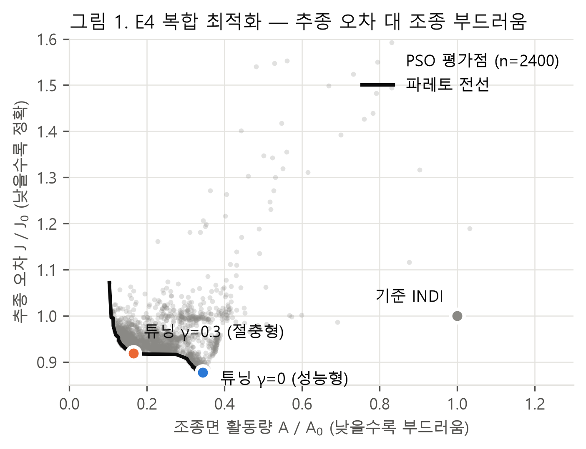
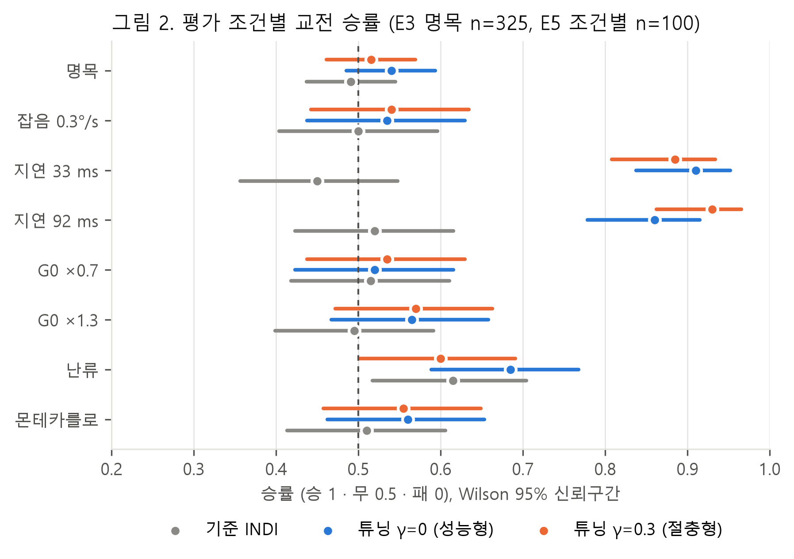
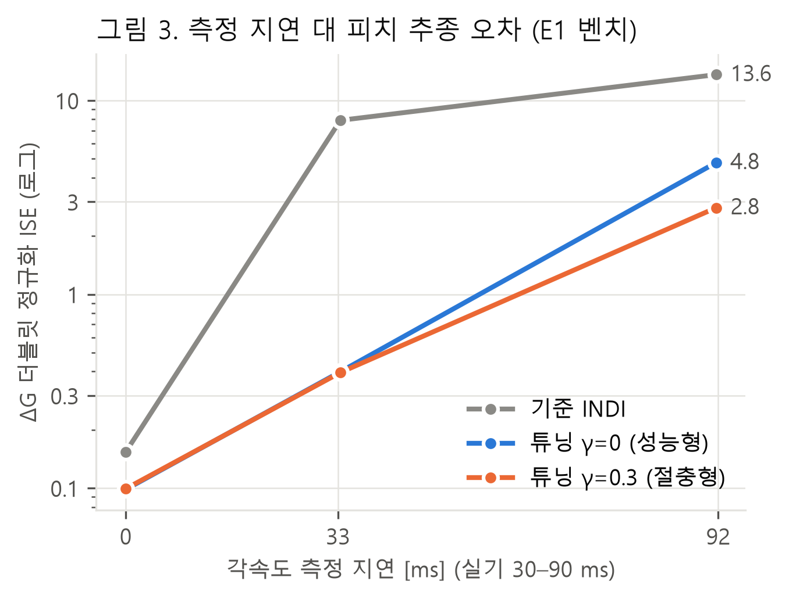
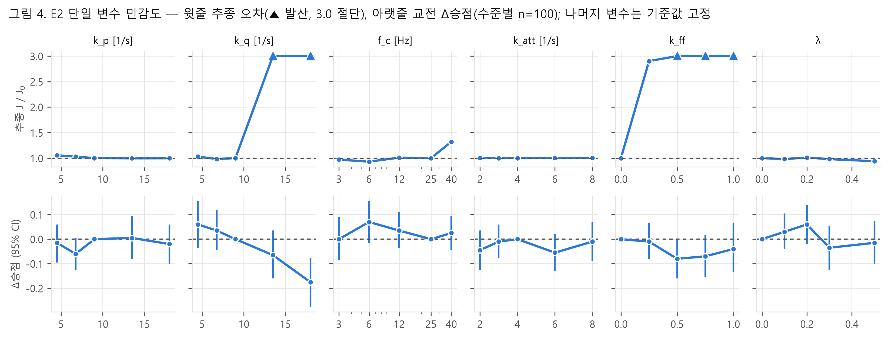
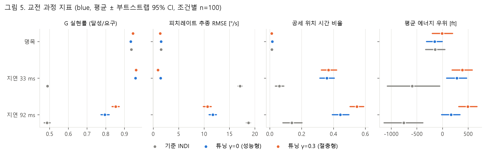
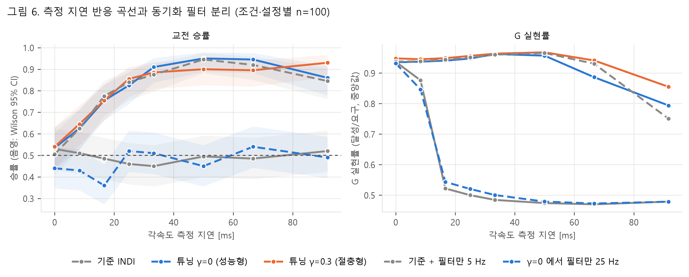

# INDI 제어기 파라미터 튜닝이 F-16 근접 공중전에 미치는 영향 — 본론

> 본 문서는 논문의 본론(연구 방법, 실험 설계, 실험 결과, 고찰)이다. 서론과 결론의 초안은 `draft.md`, 문헌 분석과
> 설계 결정은 `paper.md`, 모든 수치의 원자료는 `results/indi/summary.md`와 `results/indi/*.json`에 있다.
> 그림은 `research/indi/figures.py`로, 표의 통계량은 `research/indi/analyze.py`로 재생성할 수 있다.

---

## 2. 연구 방법

### 2.1 교전 시뮬레이션 환경

교전 환경은 JSBSim 1.3.1 기반 F-16 6자유도 비행역학 위에 5계층 제어 스택을 구성한 것이다(표 1). 전술 행위트리(L1)가
추격 유형과 G 사용 수준, 조준점 기하를 결정하면, BFM 가이던스(L2)가 이를 교범 기반의 G 조절, 리프트벡터 배치,
추력 명령으로 변환한다. 제어 계층(L3)은 목표 자세를 쿼터니언 형태로 받아 각속도 명령으로 바꾸고, 기체 한계
리미터를 통과시킨 뒤 INDI 각속도 제어기로 조종 명령을 계산한다. 모든 계층은 120 Hz 물리 주기의 정수 분주로
동기화되며, 난수원은 전부 시드로 고정되어 같은 조건의 교전은 비트 단위로 재현된다.

**표 1.** 교전 스택의 계층 구성

| 계층 | 주기 | 역할 |
|---|---|---|
| L1 전술 행위트리 | 20 Hz | 추격 유형, G 버스트, 조준점 기하 선택 |
| L2 BFM 가이던스 | 60 Hz | 교범 기반 G 조절, 리프트벡터 배치, 추력 |
| L3 제어 | 120 Hz | 쿼터니언 자세 변환 → 한계 리미터 → INDI 각속도 제어 |
| L4 비행역학 | 120 Hz | JSBSim F-16 (내장 비행제어계 FLCS 포함) |
| L5 기록 | — | 읽기 전용 교전 기록 |

INDI의 출력은 조종면 편향이 아니라 FLCS의 명령 입력이다. 따라서 본 연구의 INDI는 FLCS 동특성을 포함한 증강 기체를
제어 대상으로 한다. 제어 효과행렬 G₀는 트림점에서 각 조종 입력을 ±0.02만큼 섭동시킨 중앙차분으로 식별하고,
비행 중에는 동압 비례로 스케줄한다(G = (q̄/q̄_ref)·G₀).

### 2.2 INDI 제어 법칙과 튜닝 변수

각속도 명령 ω_sp에 대한 INDI 제어 법칙은 다음과 같다.

  ν = K(ω_sp − ω_f) + k_ff · d(ω_sp,f)/dt
  Δu = (GᵀG + λ·diag(GᵀG))⁻¹ Gᵀ (ν − ω̇_f)
  u = u_f + Δu

여기서 아래첨자 f는 2차 Butterworth 동기화 필터(차단주파수 f_c)를 통과한 신호를 뜻하며, 각속도, 각가속도,
조종 명령에 같은 필터를 적용해 위상을 맞춘다. 정칙화 항 λ는 Levenberg–Marquardt 형태로 채널별 스케일을 두었다.
단일 스칼라로 정칙화하면 제어 효과가 큰 롤 채널이 스케일을 지배해, 효과가 작은 요 채널이 목표값에 수렴하지
못함을 합성 플랜트에서 확인하였기 때문이다.

튜닝 변수는 선행연구[2–5]에서 공통으로 조절된 변수를 본 스택에 대응시켜 6개로 정하였다(표 2). 요 각속도 게인과
제어 주기는 고정하였다. 요 채널은 자세 추종이 아니라 감쇠만 담당하며, 120 Hz 샘플링은 강체 항공기에 충분하다는
이론적 근거[5]가 있고 비행역학 적분 주기와 결합되어 있다.

**표 2.** 튜닝 변수와 탐색 범위

| 변수 | 의미 | 기준값 | 탐색 범위 | 근거 |
|---|---|---|---|---|
| k_p | 롤 각속도 게인 [1/s] | 9 | 4–20 | [2][5] |
| k_q | 피치 각속도 게인 [1/s] | 9 | 4–20 | [2][5] |
| f_c | 동기화 필터 차단주파수 [Hz] | 25 | 3–40 (로그 척도) | [2][4][5], 비행시험 3.2 Hz[G] |
| k_att | 자세 게인 [1/s] | 4 | 2–8 | [2] |
| k_ff | 각속도 명령 피드포워드 이득 | 0 | 0–1 | [2][4] |
| λ | 조종 증분 정칙화 | 0 | 0–0.5 | [3][4] |

### 2.3 F-16 물리 한계

기체 한계는 F-16 교범[6] §4.6.5.2의 기술을 속도의 함수로 정식화하였다. 교범은 최대 받음각·최대 G에서의 선회반경이
170–330 KCAS에서 거의 일정하고, 최대 G는 440 KCAS에서 도달한다고 기술한다. 선회반경이 일정한 구간에서는 가용 G가
속도의 제곱에, 선회율이 일정한 구간에서는 속도에 비례하므로 가용 G 한계는 다음과 같다.

  G_max(V) = 6.75 (V/330)²  (V < 330 KCAS)
           = 9 V/440       (330 ≤ V < 440 KCAS)
           = 9             (V ≥ 440 KCAS)

이 식은 350 KCAS에서 7.16 G를 주며, 교범의 EEGS 조준기 가정(350 KCAS에서 최대 7.3 G)과 부합한다. 음의 한계는
−3 G, 롤레이트 한계는 220°/s로 두었다. 리미터는 이 한계로 각속도 명령을 제한하고, 한계 기록기가 **달성** 하중배수
Nz를 매 틱 감시한다. 구조 한계(+9/−3 G)를 넘거나 가용 G 한계를 0.5 G 이상 넘은 설정은 실격으로 처리하였다.

### 2.4 비행 모델의 결함 식별과 수정

초기 실험에서 기준 제어기조차 가용 G 한계를 36기체 중 28회 초과하였고, 최대 10.7 G에 도달하였다. 원인을 추적한
결과, 공개 JSBSim F-16 모델(pip 배포판 1.3.1 및 2026년 9월 기준 공식 저장소)의 flaperon 혼합식이 좌측을
−tef − ail, 우측을 +tef − ail로 정의해 두 값의 합이 −2·ail이 되는 부호 결함을 확인하였다. 이 합이 대칭 양력 계수와
항력 계수의 입력으로 쓰이므로, 롤 명령이 곧 양력과 항력을 만든다. 5,000 ft, 400 KCAS에서 승강타를 고정하고
에일러론만 조작하면 우측 롤에서 −2.1 G, 좌측 롤에서 +4.1 G가 발생하였다.

기준 공력 데이터(NASA TP-1538[N]을 원전으로 하는 Stevens & Lewis 및 NASA TM-2003-212145의 F-16 모델)에서 수직력
계수는 받음각, 옆미끄럼각, 승강타, 피치레이트의 함수이며 에일러론 항을 포함하지 않는다. 이에 우측 에일러론의
부호를 반전해 에일러론 기여가 좌우에서 상쇄되도록 수정한 연구용 모델(f16fix)을 사용하였다. 원본 모델에서도
후연 플랩 기여는 좌우 상쇄로 0이었으므로, 수정 모델은 롤 입력이 없을 때 원본과 동일한 물리를 가진다. 수정 후
롤레이트는 좌우 ±84.7°/s로 대칭이 되었고(원본 85.8/85.3°/s), 기준 제어기의 한계 초과는 60기체·경기 중 0회,
최대 Nz는 7.83 G였다. 저속(250 kt 미만)에서의 후연 플랩 양력은 원본과 마찬가지로 반영되지 않으나, 교전이
주로 이루어지는 코너속도대(330–440 KCAS) 밖이므로 영향은 작다.

### 2.5 센서 모델

각속도 측정에는 백색잡음을 더하고 각가속도는 필터를 거친 차분으로 추정하였다. 명목 잡음 수준은 σ = 0.1°/s로,
Citation II 비행시험에서 보고된 자이로 잡음(52 Hz에서 0.036°/s)[G]을 120 Hz로 환산한 약 0.055°/s의 두 배이다.
잡음을 두지 않고 참값 각가속도를 쓰면 동기화 필터 차단주파수를 8–40 Hz에서 바꿔도 추종 결과가 완전히 같아,
필터와 정칙화가 조정하는 잡음과 지연의 상충 관계가 사라진다. 따라서 잡음 모델은 튜닝 변수의 효과를 관측하기
위한 필수 조건이다. 측정 지연은 틱 단위(1틱 = 8.3 ms)로 부여하였다.

---

## 3. 실험 설계

### 3.1 실험 구성

실험은 문헌에서 공통으로 수행된 실험 설계를 본 연구에 대응시켜 구성하였다(표 3).

**표 3.** 실험 구성

| 실험 | 목적 | 방법 | 근거 |
|---|---|---|---|
| E1 추종 벤치 | 제어 품질 | 6 운용점(250/350/450 KCAS × 15,000/25,000 ft) × 4 시험(뱅크 더블릿 ±60°, 롤레이트 3211 60°/s, ΔG 더블릿 ±2 G, ΔG 스텝 +4 G) | [3][4][5] |
| E2 단일 변수 민감도 | 변수별 효과 | 변수당 5수준, 나머지는 기준값 고정, 추종 + 교전 대응 비교 | [2] |
| E3 교전 비교 | 핵심 질문 | 기준 대 튜닝 제어기, 명목 조건 | [1][3] |
| E4 복합 최적화 | 파레토 | PSO, 비용 J/J₀ + γ·A/A₀ | [4] |
| E5 강건성 | 모델 오차·외란 | 잡음 강화, 측정 지연, 효과행렬 오차 ±30 %, 난류, 몬테카를로 | [2][5] |
| E6 선행연구 조건 | 비교 가능성 | 선행연구[1]의 교전 개시 조건을 모든 교전 배터리에 포함 | [1] |

E1의 추종 품질 J는 시험별로 명령 진폭으로 정규화한 제곱오차의 시간 평균(정규화 ISE)을 운용점과 시험에 걸쳐
평균한 값이다. 조종면 활동량 A는 틱 간 조종 명령 변화량 절댓값의 평균이다. 오차의 기준은 리미터를 통과한 후의
명령으로 삼아, 리미터에 의한 절단이 제어기 오차로 계상되지 않게 하였다.

E4의 비용함수는 Henkenjohann 등[4]의 "추종 비용 + γ·부차 비용" 구조를 따르되, 부차 비용으로 조종면 활동량을
사용하였다. 원래 계획한 한계 위반량은 수정 모델에서 기준 제어기도 0이어서 파레토 전선을 형성하지 못하였기
때문이며, 한계 위반은 실격 벌점(+10)으로 반영하였다. 최적화는 입자 20개, 30세대의 PSO로 γ ∈ {0, 0.1, 0.3, 1}에
대해 수행하였고, 필터 차단주파수는 로그 척도에서 탐색하였다.

### 3.2 교전 조건과 판정

교전은 300 s 동안 진행하며, 무기 교전 영역(WEZ)은 기수 기준 30° 원뿔, 거리 500–3,000 ft이다. 조준 오차 2° 이내에서
초당 50 HP를 주고, 30°까지 단계적으로 계수를 낮춘다. 고도 1,000 ft 이하로 내려가면 즉시 패배한다. 시나리오는 정면
교차, 공세 개시, 수세 개시, 중립, 그리고 선행연구[1]의 교전 개시 조건(고도 5,000–20,000 ft, 속도 300–450 kt,
거리 2,000–3,000 ft) 5종이다.

blue의 전술 트리는 고정하고 INDI 설정만 바꾸었으며, red는 서로 다른 전술을 가진 대항군 5종으로 구성하고 모두 기준
INDI를 사용하였다. 평가 조건(잡음, 지연, 효과행렬 오차, 난류)은 양측에 동일하게 적용하였다.

### 3.3 평가 지표

본 연구의 질문은 튜닝이 교전에 영향을 주는가, 준다면 어떤 경로로 주는가이다. 승패는 전술층의 영향이 크고 표본
변동이 커서 제어기의 효과를 가리기 쉽다. 따라서 교전을 세 층위로 나누어 측정하였다(표 4).

**표 4.** 교전 평가 지표의 층위

| 층위 | 지표 | 정의 |
|---|---|---|
| 명령 추종 | 실효 응답 지연 | 교전 중 각속도 명령과 실제 각속도의 상호상관이 최대가 되는 시간차(0–500 ms) |
| | 각속도 추종 RMSE | 한계 통과 후 명령 대비 실제 롤·피치레이트 오차 |
| | G 실현률 | L2의 요구 G가 3 G 이상인 구간에서 달성 Nz / 요구 G의 중앙값 |
| | 조종면 활동량 | 에일러론·승강타 명령 변화량 |
| 기동 결과 | 공세·수세 위치 비율 | 자기 ATA < 60°이고 상대 ATA > 120°인 시간 비율(수세는 반대) |
| | 에너지 우위 | 비에너지(h + V²/2g) 차이의 시간 평균 |
| | WEZ 체류 | WEZ 안에 상대를 둔 시간 |
| 교전 결과 | 승점, HP 차, 격추 | 승 1, 무 0.5, 패 0 / 최종 HP 차 / HP 0에 의한 승리 |

교전 과정 기록기는 제어 신호를 읽기만 하며, 같은 시드의 교전 결과가 기록기 도입 전후로 정확히 일치함을 확인하였다.

### 3.4 통계 설계

모든 교전 비교는 대응 설계로 수행하였다. 같은 (대항군, 시나리오, 시드) 조합에서 기준 설정과 튜닝 설정의 교전을
모두 치르고, 초기조건·자이로 잡음열·난류 시드를 공유하여 차이가 설정에서만 비롯되도록 하였다. 승점 차이는
부호 검정과 부트스트랩 95 % 신뢰구간, HP 차이는 Wilcoxon 부호순위 검정, 격추 여부는 McNemar 정확 검정을
사용하였다. 교전 과정 지표는 조건·설정마다 12개 지표를 한 가족으로 보고 Holm 방법으로 다중 비교를 보정하였다.
승률의 구간 추정에는 Wilson 신뢰구간을 사용하였다.

---

## 4. 실험 결과

### 4.1 복합 최적화와 응답 특성

PSO는 γ별로 600회, 총 2,400회 평가하였으며 한계 실격은 한 건도 없었다(표 5). 모든 γ의 최적해가 기준 설정보다
추종 오차와 조종면 활동량이 동시에 작았다(그림 1). 즉 기준 설정은 파레토 전선에서 멀리 떨어져 있으며, 두 목표
사이의 절충 없이도 개선할 여지가 있었다.

**표 5.** γ별 최적해 (J₀ = 0.2289, A₀ = 0.04206)

| γ | J/J₀ | A/A₀ | k_p | k_q | f_c [Hz] | k_att | k_ff | λ |
|---|---|---|---|---|---|---|---|---|
| 0 | 0.877 | 0.344 | 20.0 | 12.1 | 5.1 | 8.00 | 0.03 | 0.14 |
| 0.1 | 0.919 | 0.237 | 18.5 | 10.2 | 7.9 | 3.05 | 0.25 | 0.33 |
| 0.3 | 0.919 | 0.165 | 6.5 | 10.0 | 4.3 | 2.42 | 0.28 | 0 |
| 1 | 0.936 | 0.135 | 4.9 | 9.6 | 3.4 | 2.00 | 0.42 | 0 |

**그림 1.** E4 복합 최적화의 평가점과 파레토 전선. 기준 INDI(회색)는 전선에서 멀리 떨어져 있으며, 이후 교전 실험에서
사용한 성능형(γ = 0, 파랑)과 절충형(γ = 0.3, 주황) 최적해를 표시하였다.

파레토 전선은 두 갈래로 나뉘었다. 고게인 갈래는 k_p와 k_att가 탐색 상한에 닿으며 추종 오차를 12 % 줄였고,
저게인·피드포워드 갈래는 추종 오차를 8 % 줄이면서 조종면 활동량을 84 % 줄였다. 이후 교전 실험에는 두 갈래를
대표하는 γ = 0(성능형)과 γ = 0.3(절충형)을 사용하였다. 동기화 필터 차단주파수는 모든 해에서 3–8 Hz로 수렴하였다.
이는 기준값 25 Hz의 1/3–1/8이며, Citation II 비행시험에 사용된 3.2 Hz[G]와 같은 범위이다.

성능형 해의 k_p와 k_att가 탐색 상한에 닿았으므로, 범위를 k_p 4–40, k_att 2–16으로 넓혀 γ = 0에 대해 600회를 다시
탐색하였다. 새 최적해(k_p 30.8, k_att 12.9, f_c 7.9 Hz)의 J/J₀는 0.882로 기존 해(0.877)와 같은 수준이었고, 교전
결과도 같은 양상이었다. 상한 접촉은 성능을 제약하지 않았으며, 게인 방향으로 성능이 이미 평탄해진 구간이었다.

추종 오차(ISE)와 응답 속도는 서로 다른 성능 축이었다(표 6). 튜닝 설정은 G 스텝의 오버슈트를 23.2 %에서
9.9–15.5 %로 줄였으나, 뱅크 스텝의 ±5 % 정착시간은 0.89 s에서 1.64–2.09 s로 길어졌다. 성능형은 뱅크
오버슈트도 2.3 %에서 8.3 %로 늘었는데, 이는 높은 롤·자세 게인에 의한 것이다.

**표 6.** E1 스텝 응답 특성 (6개 운용점 평균, 정착시간은 3 s 내 미정착 시 3 s로 계상)

| 설정 | 뱅크 정착시간 [s] | 뱅크 오버슈트 | G 스텝 정착시간 [s] | G 스텝 오버슈트 |
|---|---|---|---|---|
| 기준 | 0.89 | 2.3 % | 2.23 | 23.2 % |
| 성능형 (γ = 0) | 2.09 | 8.3 % | 2.06 | 15.5 % |
| 절충형 (γ = 0.3) | 1.64 | 1.1 % | 1.95 | 9.9 % |

### 4.2 교전 결과: 명목 조건과 강건성 조건

명목 조건(잡음 0.1°/s, 지연 없음)에서 325개 대응 쌍의 교전 결과는 표 7과 같다. 성능형의 승점 차이는 +0.049로
부트스트랩 신뢰구간 하한이 0을 겨우 넘었으나 부호 검정은 유의하지 않았다(p = 0.172). 절충형은 +0.025로
유의하지 않았다. 격추는 성능형에서 8건에서 15건으로 늘었으나 McNemar 검정은 유의하지 않았다(p = 0.118).
명목 조건에서 튜닝의 교전 결과 효과는 방향은 일관되지만 크기가 작다.

**표 7.** 명목 조건 교전 결과 (325 대응 쌍)

| 튜닝 설정 | 승률 기준 → 튜닝 | Δ승점 [95 % CI] | 개선/악화 쌍 | p(부호) | ΔHP [95 % CI] | 격추 | p(McNemar) |
|---|---|---|---|---|---|---|---|
| 성능형 | 0.491 → 0.540 | +0.049 [+0.002, +0.095] | 60/45 | 0.172 | −0.1 [−3.4, +3.2] | 8 → 15 | 0.118 |
| 절충형 | 0.491 → 0.515 | +0.025 [−0.020, +0.069] | 59/47 | 0.285 | +2.3 [−0.8, +5.4] | 8 → 10 | 0.727 |

강건성 조건별 결과는 그림 2와 표 8에 정리하였다. 효과가 가장 뚜렷한 조건은 측정 지연이었다. 33 ms 지연에서
승률은 0.45에서 0.885–0.91로, 92 ms에서는 0.52에서 0.86–0.93으로 높아졌으며 모두 p < 0.001이었다. 33 ms
조건에서 기준 설정은 100경기 중 한 번도 격추하지 못했으나 성능형은 10회 격추하였다(McNemar p = 0.002).
잡음 강화, 효과행렬 과대추정, 난류, 몬테카를로 조건에서는 승률 차이가 유의하지 않거나 경계선이었으나,
절충형의 HP 차이는 +8.2–12.3으로 모두 유의하였다(p ≤ 0.005).

**그림 2.** 평가 조건별 교전 승률과 Wilson 95 % 신뢰구간. 측정 지연 조건에서 튜닝 설정과 기준 설정의 차이가 두드러진다.

**표 8.** 강건성 조건별 교전 결과 (조건별 100 대응 쌍, 굵게 = p < 0.05)

| 조건 | 설정 | 승률 기준 → 튜닝 | Δ승점 [95 % CI] | p(부호) | ΔHP [95 % CI] | p(Wilcoxon) | 격추 |
|---|---|---|---|---|---|---|---|
| 잡음 0.3°/s | 성능형 | 0.500 → 0.535 | +0.035 [−0.060, +0.125] | 0.511 | +3.7 [−2.9, +10.7] | 0.347 | 3 → 3 |
| | 절충형 | 0.500 → 0.540 | +0.040 [−0.050, +0.130] | 0.430 | **+12.3** [+5.6, +19.2] | **0.002** | 3 → 3 |
| 지연 33 ms | 성능형 | 0.450 → **0.910** | **+0.460** [+0.360, +0.565] | **<0.001** | **+22.2** [+13.8, +31.0] | **<0.001** | **0 → 10** |
| | 절충형 | 0.450 → **0.885** | **+0.435** [+0.340, +0.535] | **<0.001** | **+18.6** [+12.4, +25.5] | **<0.001** | **0 → 6** |
| 지연 92 ms | 성능형 | 0.520 → **0.860** | **+0.340** [+0.220, +0.450] | **<0.001** | **+12.3** [+4.7, +20.3] | **0.004** | 10 → 16 |
| | 절충형 | 0.520 → **0.930** | **+0.410** [+0.300, +0.515] | **<0.001** | **+12.7** [+5.3, +19.8] | **0.003** | 10 → 18 |
| G₀ × 0.7 | 성능형 | 0.515 → 0.520 | +0.005 [−0.085, +0.090] | 0.728 | +6.4 [−0.2, +13.2] | 0.132 | 3 → 2 |
| | 절충형 | 0.515 → 0.535 | +0.020 [−0.075, +0.115] | 0.749 | +6.5 [+0.4, +12.8] | 0.097 | 3 → 3 |
| G₀ × 1.3 | 성능형 | 0.495 → 0.565 | +0.070 [−0.020, +0.160] | 0.487 | +1.1 [−4.7, +6.9] | 0.925 | 4 → 3 |
| | 절충형 | 0.495 → 0.570 | +0.075 [−0.020, +0.170] | 0.143 | **+8.2** [+2.0, +13.9] | **0.005** | 4 → 4 |
| 난류 | 성능형 | 0.615 → 0.685 | +0.070 [−0.005, +0.150] | **0.043** | **+7.6** [+1.4, +13.7] | **0.020** | 4 → 4 |
| | 절충형 | 0.615 → 0.600 | −0.015 [−0.100, +0.070] | 1.000 | **+10.2** [+4.5, +16.2] | **0.001** | 4 → 3 |
| 몬테카를로 | 성능형 | 0.510 → 0.560 | +0.050 [−0.040, +0.140] | 0.215 | +2.5 [−3.0, +8.0] | 0.211 | 2 → 6 |
| | 절충형 | 0.510 → 0.555 | +0.045 [−0.060, +0.155] | 0.568 | **+11.1** [+5.9, +17.0] | **<0.001** | 2 → 3 |

명목 조건과 강건성 조건을 합한 약 4,300경기 전체에서 한계 실격은 한 건도 발생하지 않았다.

### 4.3 지연 강건성의 제어 수준 원인

지연 조건에서 나타난 차이의 원인을 확인하기 위해, E1 추종 벤치를 측정 지연 아래에서 반복하였다(그림 3, 표 9).
기준 INDI는 33 ms 지연만으로 피치 채널이 진동하여 ΔG 더블릿 추종 오차가 0.154에서 7.907로 약 51배 커졌다.
반면 튜닝 설정은 0.098–0.099에서 0.395–0.399로 약 4배 증가에 그쳤다. 92 ms에서도 기준 설정의 오차는 13.6으로,
튜닝 설정(2.8–4.8)의 3–5배였다.

**그림 3.** 각속도 측정 지연에 따른 ΔG 더블릿 추종 오차(로그 척도). 기준 INDI는 33 ms에서 급격히 발산한다.

**표 9.** 측정 지연에 따른 E1 추종 성능

| 지연 | 설정 | J | ΔG 더블릿 ISE | ΔG 스텝 ISE | 조종면 활동량 A |
|---|---|---|---|---|---|
| 0 | 기준 | 0.229 | 0.154 | 0.056 | 0.0421 |
| 0 | 성능형 / 절충형 | 0.201 / 0.210 | 0.098 / 0.099 | 0.025 / 0.025 | 0.0145 / 0.0069 |
| 33 ms | 기준 | 2.752 | 7.907 | 2.382 | 0.1597 |
| 33 ms | 성능형 / 절충형 | 0.310 / 0.286 | 0.399 / 0.395 | 0.043 / 0.037 | 0.0330 / 0.0135 |
| 92 ms | 기준 | 4.398 | 13.608 | 3.208 | 0.1268 |
| 92 ms | 성능형 / 절충형 | 1.642 / 1.014 | 4.781 / 2.797 | 0.797 / 0.458 | 0.0715 / 0.0461 |

### 4.4 단일 변수 민감도

변수별 5수준의 추종 품질과 교전 효과를 수준별 100 대응 쌍으로 측정하였다(그림 4, 표 10). 추종 품질이 3배 이상
악화된 경우는 발산으로 보고 3.0으로 절단하였다.

**그림 4.** 단일 변수 민감도. 윗줄은 추종 품질 J/J₀(▲는 발산, 3.0 절단), 아랫줄은 기준 대비 교전 승점 차이와 95 % 신뢰구간이다.

**표 10.** 단일 변수 민감도 (수준별 100 대응 쌍)

| 변수 | 수준 | J/J₀ | Δ승점 | ΔHP |
|---|---|---|---|---|
| k_p | 4.5 / 6.75 / 13.5 / 18 | 1.05 / 1.03 / 1.00 / 1.00 | −0.015 / −0.060 / +0.005 / −0.020 | −0.6 / −3.1 / +2.8 / +0.2 |
| k_q | 4.5 / 6.75 / 13.5 / 18 | 1.03 / 0.98 / 3.0 / 3.0 | +0.060 / +0.035 / −0.065 / **−0.175** | +5.7 / +1.5 / −6.1 / **−11.0** |
| f_c [Hz] | 3 / 6 / 12 / 40 | 0.97 / 0.93 / 1.01 / 1.32 | 0.000 / +0.070 / +0.035 / +0.025 | +3.7 / +2.9 / +1.1 / +2.3 |
| k_att | 2 / 3 / 6 / 8 | 1.00 / 1.00 / 1.00 / 1.01 | −0.045 / −0.010 / −0.055 / −0.010 | +2.4 / +0.3 / −2.5 / −3.2 |
| k_ff | 0.25 / 0.5 / 0.75 / 1 | 2.9 / 3.0 / 3.0 / 3.0 | −0.010 / −0.080 / −0.070 / −0.040 | +1.1 / −0.3 / −4.7 / −2.0 |
| λ | 0.1 / 0.2 / 0.3 / 0.5 | 0.98 / 1.01 / 0.98 / 0.94 | +0.030 / +0.060 / −0.035 / −0.015 | −1.2 / +1.4 / −1.1 / +1.7 |

피치 게인 k_q는 추종과 교전 모두를 지배하는 변수였다. 기준의 1.5배 이상에서 잡음 증폭으로 추종이 발산하였고,
2배(18)에서는 승률이 0.53에서 0.355로 떨어졌다(Δ승점 −0.175, 95 % CI [−0.275, −0.075], p = 0.001). 이는 24개
수준 중 교전 효과가 유의한 유일한 경우이며 Bonferroni 보정(α = 0.05/24)도 통과한다. 동기화 필터는 6 Hz에서
추종 품질이 7 % 좋아졌고 40 Hz에서 32 % 나빠져, E4의 3–8 Hz 수렴과 일치하였다. 피드포워드 k_ff는 단독으로는
해로웠다. 기준 필터(25 Hz)에서는 60 Hz로 계단처럼 갱신되는 명령의 미분이 넓은 대역을 그대로 통과해 추종 오차가
3배 이상 커졌다.

명목 조건에서 k_q 과대를 제외한 단일 변수 변화의 교전 효과는 ±0.08 이내였고 신뢰구간이 모두 0을 포함하였다.
수준별 50쌍으로 수행한 예비 실행에서는 세 수준(k_q 4.5, f_c 6 Hz, λ 0.2)의 신뢰구간이 0을 벗어났으나(+0.14–0.15),
100쌍에서는 +0.06–0.07로 줄어 유의성이 사라졌다. 작은 표본에서는 교전 효과가 과대 추정되기 쉽다.

### 4.5 교전 과정에 미치는 영향

교전 결과의 차이가 어떤 경로로 생기는지 확인하기 위해 표 4의 과정 지표를 조건별 100 대응 쌍에서 측정하였다
(그림 5, 표 11).

**그림 5.** 조건별 교전 과정 지표의 평균과 부트스트랩 95 % 신뢰구간. 측정 지연 조건에서 기준 INDI의 G 실현률이
0.49로 떨어지고, 공세 위치 비율과 에너지 우위를 잃는다.

**표 11.** 교전 과정 지표 (조건별 100 대응 쌍, 굵게 = Holm 보정 p < 0.05)

| 층위 | 지표 | 명목: 기준 → 성능형 / 절충형 | 지연 33 ms | 지연 92 ms |
|---|---|---|---|---|
| 명령 추종 | 롤 응답 지연 [ms] | 133 → **127** / 130 | 129 → 150 / **152** | 102 → **171** / **123** |
| | 피치 응답 지연 [ms] | 66 → 72 / 64 | 116 → **99** / **59** | 142 → 145 / 115 |
| | 롤레이트 추종 RMSE [°/s] | 16.5 → **31.3** / **12.4** | 25.4 → **53.2** / **15.0** | 36.9 → **64.6** / **26.7** |
| | 피치레이트 추종 RMSE [°/s] | 1.55 → 1.54 / **1.37** | 17.1 → **1.47** / **0.94** | 18.7 → **11.7** / **10.7** |
| | G 실현률 | 0.937 → 0.934 / **0.946** | 0.488 → **0.959** / **0.962** | 0.486 → **0.796** / **0.855** |
| 기동 결과 | 공세 위치 비율 | 0.013 → 0.015 / 0.012 | 0.060 → **0.358** / **0.369** | 0.139 → **0.443** / **0.547** |
| | 수세 위치 비율 | 0.030 → 0.029 / 0.028 | 0.106 → **0.012** / **0.013** | 0.166 → **0.015** / **0.011** |
| | 에너지 우위 [ft] | −144 → −152 / −7 | −589 → **+280** / **+388** | −753 → **+168** / **+493** |
| | WEZ 체류 [s] | 1.12 → 1.12 / 1.15 | 0.44 → **1.11** / **0.86** | 1.19 → 1.34 / 1.31 |
| 교전 결과 | 승률 | 0.53 → 0.535 / 0.54 | 0.45 → 0.91 / 0.885 | 0.52 → 0.86 / 0.93 |

명목 조건에서 튜닝은 명령 추종 층위를 유의하게 바꾸었으나, 그 변화는 기동 결과와 교전 결과로 이어지지 않았다.
절충형은 롤·피치 추종 오차를 각각 25 %, 11 % 줄이고 G 실현률을 0.9 %p 높였으며, 조종면 활동량을 83–88 % 줄였다
(Holm 보정 후 p < 0.001). 응답 지연의 −3 ms, −2 ms 차이는 비보정 검정에서는 유의하였으나 보정 후에는 유의하지
않았다(p = 0.17, 0.18). 성능형은 롤 응답 지연을 줄였으나 롤레이트 추종 오차가 약 두 배로 커졌고 에일러론 활동량이
86 % 늘었다. 높은 롤·자세 게인이 교전 중 과도한 롤 추종을 유발한 것으로, 표 6의 뱅크 정착시간 증가와 같은
현상이다. 공세 위치 비율, 에너지 우위, WEZ 체류는 두 설정 모두 기준과 차이가 없었다.

측정 지연 조건에서는 명령 추종에서 기동 결과를 거쳐 교전 결과로 이어지는 경로가 드러났다. 기준 INDI는 피치
추종 오차가 명목 조건의 약 11배로 커지면서 요구 G의 절반(0.49)만 실현하였고, 그 결과 공세 위치 비율이 6–14 %에
머물고 590–750 ft의 에너지 열세에 빠졌다. 튜닝 설정은 G 실현률을 0.80–0.96으로 유지하여 공세 위치 비율
36–55 %와 170–490 ft의 에너지 우위를 확보하였고, 이것이 승률로 이어졌다.

실효 응답 지연 하나만으로는 성능을 판단할 수 없었다. 지연 조건에서 튜닝 설정의 롤 응답 지연은 오히려
길어졌으나(저대역 동기화 필터의 위상 지연), 교전 결과는 크게 좋았다. 진동하는 제어기는 상호상관상 짧은
지연으로 나타날 수 있으므로, 응답 지연은 추종 오차와 G 실현률과 함께 해석해야 한다. 최초 WEZ 진입 시각은 모든
조건에서 22–23 s로 교전 개시 기하가 결정하였고, 조준 오차 2° 이내의 체류는 발생 빈도가 낮아(0–0.03 s) 비교
지표로 부적합하였다.

### 4.6 측정 지연 반응 곡선과 동기화 필터 분리

측정 지연을 0, 8, 17, 25, 33, 50, 67, 92 ms의 8수준으로 바꾸고, 원인을 분리하기 위해 두 설정을 추가하였다
(그림 6, 표 12). 필터 정방향 분리 설정(filt5)은 기준 INDI에서 동기화 필터만 25 Hz에서 5 Hz로 바꾼 것이고,
역방향 분리 설정(g0_f25)은 성능형 해에서 필터만 5.1 Hz에서 25 Hz로 되돌린 것이다.

**그림 6.** 측정 지연에 따른 교전 승률(왼쪽, 음영은 Wilson 95 % 신뢰구간)과 G 실현률(오른쪽). 점선은 필터 분리
설정이다. 필터만 5 Hz로 바꾼 기준 설정(회색 점선)은 튜닝 설정과 같은 곡선을, 튜닝 설정에서 필터만 25 Hz로
되돌린 설정(파랑 점선)은 기준 설정과 같은 붕괴를 보인다.

**표 12.** 측정 지연에 따른 G 실현률과 승률 (지연·설정별 100 대응 쌍)

| 설정 | 지표 | 0 | 8 | 17 | 25 | 33 | 50 | 67 | 92 ms |
|---|---|---|---|---|---|---|---|---|---|
| 기준 | G 실현률 | 0.94 | 0.88 | 0.52 | 0.50 | 0.48 | 0.47 | 0.47 | 0.48 |
| | 승률 | 0.53 | 0.51 | 0.49 | 0.46 | 0.45 | 0.50 | 0.49 | 0.52 |
| 성능형 | G 실현률 | 0.94 | 0.94 | 0.94 | 0.95 | 0.96 | 0.96 | 0.89 | 0.79 |
| | 승률 | 0.54 | 0.63 | 0.76 | 0.83 | 0.91 | 0.95 | 0.95 | 0.86 |
| 절충형 | G 실현률 | 0.95 | 0.95 | 0.95 | 0.96 | 0.96 | 0.97 | 0.94 | 0.86 |
| | 승률 | 0.54 | 0.65 | 0.76 | 0.86 | 0.89 | 0.90 | 0.90 | 0.93 |
| filt5 | G 실현률 | 0.94 | 0.94 | 0.94 | 0.95 | 0.96 | 0.97 | 0.93 | 0.75 |
| | 승률 | 0.51 | 0.63 | 0.78 | 0.84 | 0.88 | 0.95 | 0.92 | 0.85 |
| g0_f25 | G 실현률 | 0.93 | 0.85 | 0.54 | 0.52 | 0.50 | 0.48 | 0.47 | 0.48 |
| | 승률 | 0.44 | 0.43 | 0.36 | 0.52 | 0.51 | 0.45 | 0.54 | 0.49 |

기준 INDI는 8 ms에서 G 실현률이 0.88로 저하되기 시작하였고 17 ms에서 0.52로 붕괴하였다. 붕괴 임계는 8–17 ms
사이이며, 이는 비행시험에서 보고된 측정 지연(30–90 ms)[G][S]보다 훨씬 짧다. 튜닝 설정의 승률이 지연과 함께
높아지는 것은 같은 지연을 받는 red(기준 INDI)가 무너지기 때문이다.

필터 분리 실험은 지연 강건성의 원인이 동기화 필터 대역임을 보여 준다. 필터만 바꾼 filt5는 50 ms까지 튜닝
설정과 G 실현률과 승률이 사실상 같았다. 반대로 튜닝 설정에서 필터만 되돌린 g0_f25는 기준 설정과 함께 17 ms에서
붕괴하였다. 즉 낮은 필터 대역은 지연 강건성의 충분조건이자 필요조건이며, 나머지 다섯 변수는 필터 없이 지연
강건성을 만들지 못한다. 다만 92 ms의 큰 지연에서는 G 실현률이 절충형 0.86, 성능형 0.79, filt5 0.75 순이었다.
큰 지연에서는 저게인과 피드포워드의 조합이 지연 여유를 추가로 넓힌다.

### 4.7 일반화

**전술 트리.** 주 실험의 blue 전술 트리(energy_fighter) 외에 두 트리(textbook_headon, starter)에 대해 명목 조건과
33 ms 지연 조건을 50 대응 쌍씩 반복하였다(표 13). 세 트리 모두에서 같은 양상이 재현되었다. 명목 조건에서는
교전 결과 차이가 없었고, 명령 추종 층위에서는 유의한 변화가 있었다(절충형의 롤·피치 추종 오차 감소는 세 트리
모두 Holm 보정 p ≤ 0.001). 지연 조건에서는 기준 설정의 G 실현률이 0.47–0.53으로 붕괴하고 튜닝 설정은 0.96–0.98을
유지하였다. 승점 효과의 크기는 트리에 따라 +0.22에서 +0.52로 달랐다.

**표 13.** 전술 트리별 결과

| blue 전술 트리 | 조건 | 승률 기준 → 성능형 / 절충형 | Δ승점 성능형 / 절충형 (p 부호) | G 실현률 기준 → 성능형 / 절충형 |
|---|---|---|---|---|
| energy_fighter | 명목 | 0.53 → 0.535 / 0.54 | +0.005 / +0.010 (n.s.) | 0.94 → 0.93 / 0.95 |
| | 지연 33 ms | 0.45 → 0.91 / 0.885 | +0.46 / +0.435 (< 0.001) | 0.49 → 0.96 / 0.96 |
| textbook_headon | 명목 | 0.34 → 0.33 / 0.35 | −0.010 / +0.010 (n.s.) | 0.89 → 0.88 / 0.91 |
| | 지연 33 ms | 0.59 → 0.83 / 0.81 | +0.24 (0.023) / +0.22 (0.052) | 0.47 → 0.96 / 0.96 |
| starter | 명목 | 0.46 → 0.48 / 0.50 | +0.020 / +0.040 (n.s.) | 0.96 → 0.96 / 0.97 |
| | 지연 33 ms | 0.40 → 0.92 / 0.88 | +0.52 / +0.48 (< 0.001) | 0.53 → 0.98 / 0.98 |

**양측 튜닝.** 대항군도 성능형 튜닝 INDI를 사용하는 조건에서 비교하였다(표 14). 명목 조건에서는 blue의 튜닝
여부와 무관하게 승률이 대등하였다. 33 ms 지연 조건에서는 튜닝하지 않은 기준 blue의 승률이 0.27로 떨어졌고,
튜닝한 blue는 0.52–0.57로 대등한 수준을 회복하였다. 튜닝의 이득은 상대를 압도하는 제어 성능이 아니라,
지연 조건에서 불안정해지는 취약성을 제거하는 데 있다.

**표 14.** 양측 튜닝 조건 (red = 성능형 INDI, 조건별 100 대응 쌍)

| 조건 | blue 설정 | 승률 | Δ승점 [95 % CI] | p(부호) |
|---|---|---|---|---|
| 명목 | 기준 | 0.560 | — | — |
| | 성능형 | 0.535 | −0.025 [−0.110, +0.070] | 0.265 |
| | 절충형 | 0.545 | −0.015 [−0.095, +0.070] | 1.000 |
| 지연 33 ms | 기준 | 0.270 | — | — |
| | 성능형 | 0.515 | +0.245 [+0.140, +0.355] | < 0.001 |
| | 절충형 | 0.565 | +0.295 [+0.165, +0.410] | < 0.001 |

**한계 준수.** 음의 G 기동이 많은 textbook_headon 트리에서는 명목 조건에서 기준 설정과 튜닝 설정 모두 −3 G를
0.03–0.22 G 잠깐 넘는 교전이 있었다(기준 3/50, 성능형 4/50, 절충형 1/50). 리미터가 각속도 명령만 제한하고
달성 하중을 직접 제한하지 않는 구조에 기인하며, 튜닝과는 무관하다. 측정 Nz를 되먹임해 명령 상한을 낮추는
보호 기능을 켜고 해당 12경기를 다시 수행하자 11건이 해소되었다(최저 Nz −2.3 G). 남은 1건은 지연 조건에서
발산하는 기준 제어기(최대 +10.2 G)로, 제어 루프 자체가 불안정하면 보호 기능으로도 한계를 지킬 수 없다.

---

## 5. 고찰

**튜닝의 영향은 층위에 따라 다르게 나타난다.** 튜닝은 모든 조건에서 명령 추종 층위를 유의하게 바꾸었다. 그러나
명목 조건에서는 공세 위치, 에너지, WEZ 체류, 승패에 차이가 없었다. 기준 제어기의 추종 품질이 이미 전술층의
요구를 충족하여, 추가 개선이 기동 결과를 바꾸지 못한 것으로 해석된다. 반대로 기준 제어기가 요구 G의 절반밖에
실현하지 못하는 측정 지연 조건에서는 추종 층위의 차이가 기동 결과와 교전 결과로 그대로 이어졌다. 따라서
"INDI 튜닝이 도그파이트에 영향을 주는가"라는 질문의 답은 층위마다 다르다. 제어 층위에서는 항상 영향을 주며,
기동과 결과 층위에서는 기준 제어기의 실현 능력이 전술의 요구에 못 미칠 때 영향을 준다.

**지연 강건성은 동기화 필터 대역으로 결정된다.** 기준 INDI는 8–17 ms의 짧은 측정 지연에서 붕괴하였고, 필터 분리
실험은 낮은 필터 대역이 지연 강건성의 필요충분조건임을 보였다. 이는 INDI의 궁극 경계가 동기화와 지연에 의한
특이 섭동 여유에 좌우된다는 이론[5], 그리고 높은 대역의 제어기가 지연 아래에서 불안정해진다는 관찰[2]과
일치한다. 복합 최적화는 지연 조건 없이 잡음이 있는 측정만으로 최적화했음에도 필터를 25 Hz에서 4–5 Hz로 낮추는
방향으로 수렴하였다. 잡음 아래에서 추종 품질과 부드러움을 함께 최적화한 결과 지연 여유가 함께 확보된 것이다.
설계 지침은 단순하다. 측정 잡음이 허용하는 범위에서 동기화 필터 대역을 구동기 대역 수준으로 낮추어야 한다.
6변수 최적화의 추가 가치는 큰 지연에서의 여유 확대와 명목 조건의 추종 품질 및 부드러움 개선에 있다.

**추종 성능의 개선이 교전 결과로 이어지는 관계는 비선형이다.** 명목 조건에서 추종 오차 8–12 % 개선은 승점
+0.05 수준에 그쳤다. 계층형 강화학습 연구[3]에서 보고된 큰 효과(승률 −53 %p)는 게인 스케줄이 없는 PID와의
비교였다. 동압 스케줄과 동기화 필터를 이미 갖춘 INDI를 미세 조정할 때 한계효용이 작은 것은 자연스럽다. 그러나
기준 제어기가 불안정 경계에 가까워지는 조건에서는 같은 튜닝이 승패를 좌우하였고, 양측 튜닝 실험에서 튜닝하지
않은 쪽의 승률은 0.27로 떨어졌다. 따라서 제어기 튜닝의 가치는 명목 성능보다 운용 조건 변화에 대한 여유로
평가해야 한다.

**부드러운 제어는 교전력을 잃지 않는다.** 절충형 해는 조종면 활동량을 84 % 줄이고도 명목 조건의 교전 성과가
기준 이상이었으며, 강한 잡음, 효과행렬 과대추정, 난류, 몬테카를로 조건에서는 HP 차이가 유의하게 컸다
(+8.2–12.3, p ≤ 0.005). 교범이 브레이크 턴에서 "9 G를 덥석 잡아채기보다 신속함과 부드러움을 혼합하라"고 권하는
것[6]과 같은 방향의 결과이며, 조종면 활동량 감소는 구동기 부하와 피로 측면에서도 이점이다.

**변수 간 상호작용이 크다.** 피드포워드는 기준 필터와 함께 쓰일 때 추종 오차를 3배 이상 키웠으나, 복합 최적화는
피드포워드 0.28을 필터 4.3 Hz와 함께 선택하였다. 단일 변수 스윕[2]만으로는 이 조합에 도달할 수 없으며,
복합 최적화[4]가 필요한 이유이다. 반면 피치 게인은 단독으로도 추종과 교전을 지배하였다.

**물리 한계 준수.** 주 실험 트리의 약 4,300경기와 벤치 평가 약 3,000회에서 교범 한계 실격은 없었으며, 튜닝은
리미터가 보장하는 한계 안에서 교전 성과를 개선하였다. 다만 음의 G 기동이 많은 전술에서는 각속도 명령 제한만으로
구조 한계를 완전히 보장할 수 없었고, 달성 하중 되먹임 보호가 필요하였다. 또한 이 결론은 수정 모델에서 얻은
것이다. 원본 공개 모델에서는 롤 명령이 만드는 대칭 양력 때문에 기준 제어기도 한계를 넘었으므로, 공개 모델을
사용하는 교전 연구는 이 결함을 점검해야 한다.

**연구의 한계.** 첫째, 전술 트리는 세 종류에서 결과를 확인하였으나 효과의 크기는 트리에 따라 달랐다(Δ승점
+0.22–0.52). 둘째, INDI 명령이 FLCS를 거치는 구조이므로 조종면을 직접 명령하는 구조에서는 결과가 다를 수 있다.
셋째, 단일 변수 민감도의 수준별 100 대응 쌍은 ±0.08 미만의 교전 효과를 검출하기에 검정력이 부족하다. 넷째,
탐색 범위는 문헌을 근거로 정하였으며, 상한을 넓혀도 개선되지 않음을 확인하였다. 다섯째, 모든 결과는 시뮬레이션에서
얻은 것이다.

---

## 참고문헌

[1] 이민석 외, "공대공 전투 모의를 위한 규칙기반 AI 교전 모델 개발," 한국군사과학기술학회지, 25(6), 2022.
[2] S. Sun et al., "A Comparative Study of Nonlinear MPC and Differential-Flatness-Based Control for Quadrotor Agile Flight," IEEE Transactions on Robotics, 2022.
[3] J. Chai et al., "A Hierarchical Deep Reinforcement Learning Framework for 6-DOF UCAV Air-to-Air Combat," 2022.
[4] M. Henkenjohann et al., "Parameter Tuning Approach for Incremental Nonlinear Dynamic Inversion-Based Flight Controllers," Actuators, 13(5):187, 2024.
[5] X. Wang et al., "Stability Analysis for Incremental Nonlinear Dynamic Inversion Control," Journal of Guidance, Control, and Dynamics, 42(5), 2019.
[6] USAF, MCH 11-F16 Vol.5, F-16 Combat Aircraft Fundamentals, Ch.4, 1996.
[G] F. Grondman et al., "Design and Flight Testing of Incremental Nonlinear Dynamic Inversion-Based Control Laws for a Passenger Aircraft," AIAA 2018-0385.
[S] R. Steffensen et al., "Filter and Sensor Delay Synchronization in Incremental Flight Control Laws," Aerospace Systems, 6:285–304, 2023.
[N] L. T. Nguyen et al., NASA TP-1538, 1979; B. L. Stevens and F. L. Lewis, Aircraft Control and Simulation, 1992; F. R. Garza and E. A. Morelli, NASA TM-2003-212145, 2003.
