# F 정식 명세 — 1:1 WVR 도그파이트를 이기는 함수형 규칙

정본 실행형: `agents/champion128.yaml` (이 문서와 짝, 생성기 `research/gen_champion_yaml.py`)
성적: 상대 64종 × 양 진영 **128판 128승 0무 0패** (격추승 124 · 판정승 4, HPΔ 평균 +33.3 · 최소 +0.3)

> ⚠️ **적용 범위 정정 (2026-07-20).** 위 성적은 **초기조건 하나**(headon, 15,000ft,
> 350kt, 정면 대칭, 지터 없음)에서만 성립한다. 초기조건을 20종으로 흔들면 승률이
> 65.2% 로 떨어지고, **문장을 전부 끈 기저(70.2%)보다 나쁘다**(3,000판 대응표본,
> McNemar z=−7.12). 방어 국면(`perch_defense`)에서는 표본 3판 전패다.
> 이 문서의 "일반해"는 **상대 유형에 대한 일반화**를 뜻하며, 초기조건에 대한
> 일반화는 **반증됐다**. 실측·기전·처방은 [IC_ROBUSTNESS.md](IC_ROBUSTNESS.md).
> ⚠️ **G 봉투 교정 반영 (2026-07-20).** 리미터가 ±9G 대칭이라 실기에 존재할 수 없는
> −9G 밀기가 허용되고 있었다(유도층 감사 로그에는 −16.25G 명령). F-16 의 음의 한계는
> 기골 설계 하중 −3.0G 다. 이를 교정하자 **정본 IC 성적이 142승 4무 0패 → 136승 4무
> 10패** 로 내려갔다 — 정본이 그만큼 비물리적 여유에 기대고 있었다는 실측이다.
> 아래 수치는 **교정 이전** 값이므로 그대로 인용하지 말 것.

## 읽기 전에 — 전체 파이프라인을 말로 풀면

아래 그림을 이해하는 데 필요한 개념을, 조종사가 0.1초에 한 번 하는 판단을 따라가며
풀어 쓴다. (용어 정의만 필요하면 §0 표기법으로 건너뛰어도 된다.)

**1. 관측 $o_t$ — 엔진이 매 틱 건네주는 "지금 보이는 것".**
매 틱 엔진은 두 기체의 기하를 준다: 거리, 내 기수가 적에서 벗어난 각(ATA), 적 기수가
나에게서 벗어난 각, 양측 고도·속도, 접근율 같은 것들이다. 전부 **그 순간의 스냅샷**
이고, 과거는 담겨 있지 않다. 특히 **적의 남은 체력(HP)은 주지 않는다** — 룰북의 정보
정책이다.

**2. 기억 $m_t$ 와 갱신 $M$ — 스냅샷만으로는 알 수 없는 것을 스스로 적어 두기.**
"내가 지금까지 얼마나 맞혔나", "적이 요즘 계속 나를 쫓고 있나" 같은 질문은 순간
스냅샷으로 답할 수 없다. 그래서 조종사는 자기만의 노트를 유지한다 — 이것이 기억
$m$ 이고, 구성은 셋이다(§0 의 장부·창·래치): **장부**(사격 판정을 스스로 재계산해
적 HP 를 부기), **창**(최근 12초 관측 버퍼), **래치**(한 번 켜지면 유지되는 스위치).
"갱신 $M$"은 이 노트를 매 틱 한 줄씩 이어 쓰는 절차다: $m_t = M(m_{t-1}, o_t)$ —
"새 기억 = (직전 기억, 방금 관측)을 반영해 갱신". 이 게임은 주사위가 없어서 이
부기가 실제 값과 결정론적으로 일치한다.

**3. 좌표 사상 $\varphi$ 와 좌표 $x_t$ — 판단에 쓰기 좋은 16개 숫자로 바꾸기.**
관측과 기억을 그대로 쓰지 않고, 승패를 가르는 것으로 검증된 16개 함수값으로 요약한다.
예: $race = $ (적 조준각) − (내 조준각) — "조준 경쟁에서 누가 앞서나" 한 숫자.
$hp_{lead}$ = 장부 기준 점수차. $es_{rel}$ = 고도+속도를 한 통화로 환산한 에너지 차.
이 변환이 좌표 사상 $\varphi$("사상"= 함수라는 뜻의 수학 용어)이고, 결과 16-벡터가
좌표 $x_t$ 다. **이후의 모든 판단은 오직 이 16개 숫자만 본다.**

**4. F — 16개 숫자를 보고 "이번 0.6초의 기동"을 고르는 함수.**
F 는 이 문서의 주인공이다. 좌표 $x_t$ 가 들어오면 기동 하나를 내놓는다. 내부는
조각별이다: 먼저 **문장 $f_1..f_{12}$**(특정 위기 국면의 국소 해 — $x_t$ 가 자기
구간 상자에 들어오면 발화)를 우선순위대로 확인하고, 아무 문장도 해당 없으면 **기저
$g$**(게이트 → 하드덱 → 다이브대응 → $f_{gun}/f_{lead}$ 의 일반해)가 답한다.
실측상 96개 승리판은 기저만으로 이기고, 문장은 기저가 지는 32개 국면에서만 발화한다.

**5. 명령 $a_t$ 와 L2 유도 — "무엇을"과 "어떻게"의 분업.**
F 의 출력은 "브레이크 선회", "기수-온 추적" 같은 **기동 종류+파라미터**(명령)까지다.
그 기동을 실제로 나는 것 — 어디를 조준하고 몇 G 로 당길지의 연속 제어 — 는 전 참가자
공통의 L2 BFM 유도층이 맡는다(같은 기체·같은 비행술·다른 두뇌가 대회 규칙). 그 아래
L3(자동조종)·L4(물리)가 조종면과 공기역학을 계산하고, 그 결과가 다음 틱의 관측이
되어 그림의 점선처럼 되돌아온다.

요약하면: **보고($o$) → 적고($m$) → 요약하고($x$) → 고르고($F$) → 실현한다(L2)**
— 이 루프가 초당 10번 돈다.

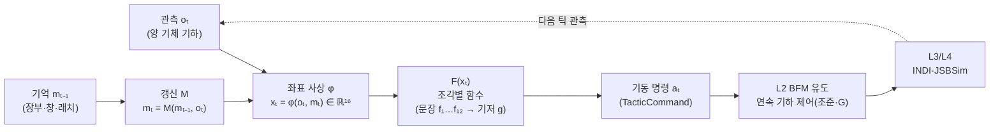

---

## 0. 표기법 — 이 문서의 기호·첨자·약자

### 첨자 (subscript)

| 첨자 | 뜻 | 예 |
|---|---|---|
| $(\cdot)_t$ | 시각 $t$ 의 값 (결정틱 10Hz) | $x_t$ = 지금 틱의 좌표, $m_{t-1}$ = 직전 틱의 기억 |
| $(\cdot)_{me}$ | **아군기**(champion) 의 양 | $h_{me}$ = 내 고도, $v_{me}$ = 내 속도 |
| $(\cdot)_{en}$ | **적기**(enemy) 의 양 | $h_{en}$, $v_{en}$, $\theta_{en}$ = 적 피치각 |
| $(\cdot)_i$ | 문장 번호 $i \in \{1..12\}$ | $B_i$ = $i$번 문장의 상자, $a_i$ = 그 행동 |
| $(\cdot)_k$ | 좌표축 이름 ($rng$, $race$, …) | $l_{i,k}, h_{i,k}$ = $i$번 문장 $k$축의 하한·상한 |
| $i^*$ | 이번 틱에 선택된 문장 번호 (최소 우선순위) | $a_{i^*}$ = 그 문장의 행동 |
| $(\cdot)_{rel}$ | 관계형(아군−적 차이) 파생량 | $es_{rel}$ = 비에너지 차 |
| $(\cdot)_a$ | 전술(action) 별 | $s_a$ = 전술 $a$ 의 점수 함수 |

### 수학 기호

| 기호 | 뜻 |
|---|---|
| $o_t$ | 관측(observation) — 엔진이 매 틱 주는 양 기체 기하(거리·각·속도·고도) |
| $m_t$ | 기억(memory) — 장부·창·래치 등 누적 상태. $M$ 은 그 갱신 함수 |
| $x_t$ | 좌표 벡터 — 관측+기억에서 계산한 상황 함수 16종의 값. $\varphi$ 는 그 사상 |
| $F,\ g$ | 전체 정책 함수 / 기저(문장 밖 일반해) 함수 |
| $f_i$ | $i$번 문장(국소 해) · $f_{gun}, f_{lead}$ = 기저의 2대 함수 |
| $B_i,\ K_i$ | $i$번 문장의 상자(구간 교집합) / 그 문장이 구속하는 축의 집합 |
| $a_i,\ \tau_i$ | 문장의 행동(기동 명령) / 발화 유지시간(6s) |
| $u_i,\ d_i$ | 발화 종료시각(미발화 $\varnothing$) / 소진 플래그(1회성) |
| $c_t,\ \theta,\ \lambda$ | 적 다이브-커밋 감쇠 적분 / 그 발화 임계(0.4) / 감쇠율(0.999) |
| $\sigma,\ s_a$ | 시그모이드 함수 / 전술 $a$ 의 $\sigma$-점수 함수 (다이브 대응은 $\arg\max_a s_a$) |
| $G$ | 점수-장부 게이트 — "이 교환을 받으면 지는가" 불리언 판정 |
| $\mathbf{1}[\cdot]$ | 지시함수 — 괄호 안이 참이면 1, 거짓이면 0 |
| $\prod_k [l,h]$ | 구간들의 곱집합 = 여러 축 조건의 **동시 성립**(교집합) |
| $\mathbb{R}^{16}$ | 16차원 실수 좌표공간 (§1 의 함수 16종) |
| $\land, \lor, \lnot$ | 그리고 / 또는 / 아님 (논리) |
| $\lVert \cdot \rVert$ | 벡터 길이 (거리) |

### 도메인 약자

| 약자 | 원어 | 뜻 |
|---|---|---|
| WVR | Within Visual Range | 시계내 공중전 (이 게임의 교전 형태) |
| WEZ | Weapon Engagement Zone | 사격 유효 구역 — 기수 30° 원뿔 × 거리 500~3,000ft. 정조준일수록 데미지 계단 상승 |
| ATA | Antenna Train Angle | 내 기수와 적 방향 사이 각. $eata$ = 적 기준 같은 각 (enemy ATA) |
| AA | Aspect Angle | 적 꼬리 기준 내 위치 각 ($eata = 180° - AA$) |
| HP | Hit Points | 체력 100 시작, WEZ 피격으로 감소, 0 = 즉시 패배 |
| BFM | Basic Fighter Maneuvers | 기본 전투 기동 (교리 유도층의 이름) |
| BT / DSL | Behavior Tree / Domain-Specific Language | 행동 트리 / 그것을 쓰는 YAML 문법 |
| L1~L5 | Layer 1~5 | 전술 판단 / BFM 유도 / 자동조종(INDI) / 물리(JSBSim) / 기록 |
| kcas | knots calibrated airspeed | 보정 대기속도 [kt] |
| kt / fps / kft | knot / feet per second / kilofeet | 속도·수직속도·거리 단위 (1kft = 1,000ft) |
| lag / lead / pure | — | 추격 조준점: 꽁무니 뒤 / 앞질러 요격점 / 적 현재 위치 |
| LOFO | Leave-One-Family-Out | 가족-제외 교차검증 — 한 상대 가족을 학습에서 빼고 이월력 측정 |
| AUC | Area Under ROC Curve | 판별력 지표 (1.0 = 완벽 분리, 0.5 = 무정보) |

### 기억 $m$ 의 세 구성요소 — 장부·창·래치

문서 곳곳의 "기억 $m$ (장부·창·래치)"는 이 셋을 말한다:

| 용어 | 무엇 | 왜 필요한가 | 여기서 나오는 좌표 |
|---|---|---|---|
| **장부** (ledger) | 매 틱 사격 판정(거리 밴드×조준각 계단)을 스스로 재계산해 "내가 입힌 데미지"를 회계 장부처럼 결정론 부기 | 적 HP 는 룰북상 **관측 불가** — 부기로만 추정 가능 | $fdmg$, $hp_{lead}$ |
| **창** (sliding window) | 최근 12s 관측만 담는 이동 창 버퍼 | "지금 쫓기는가"가 아니라 "**요즘 계속** 쫓기는가"를 물어야 순간 노이즈에 안 속는다 | $pursue$ |
| **래치** (latch) | 한 번 켜지면 해제 조건·시간까지 유지되는 기억 스위치 (전자회로 용어) | 경계에서 조건이 진동해도 기동이 오락가락하지 않게(채터링 방지) — 커밋의 일관성 | 문장 발화 유지 $u_i$, 게이트 거부 유지, 다이브-커밋 $c_t$ |

### 상대 표기

`C3_Lufbery_06/red` = 가족(C3)·아키타입(Lufbery)·변형(06) 상대와의 판에서 **챔피언이
red 진영**에 앉음. 64종 × 양 진영 = 128판. 가족 문자: A=추격계, B=에너지계,
C=선회계, D=회피/기만계, E=적응/소극계, anchor=기준 4종.

---

## 1. 변수의 정체 — 좌표 함수 $x_t = \varphi(o_t, m_t)$

문장에 등장하는 변수는 셋 중 하나다. **원시 관측**(그 순간 센서값), **관계형**(아군−적
의 차이 — 두 값을 빼서 만든 파생 함수), **적분형**(과거를 누적해야만 아는 값 — 순간
관측으로는 존재하지 않아 상태 기억 $m$ 이 필요). 이 구분이 중요한 이유: 관계형·적분형
변수는 엔진이 주는 관측 목록에 **없고**, 우리가 매 틱 계산해서 만든 좌표다.

아래 표에서 아래 첨자 $(\cdot)_{me}$ 는 아군기, $(\cdot)_{en}$ 은 적기다.

| 함수 | 정의 | 성격 | 단위 |
|---|---|---|---|
| $rng$ | 두 기체 거리 $\lVert p_{en} - p_{me} \rVert$ | 원시 관측 | ft |
| $ata$ | 내 기수↔적 방향 각 (0=정조준) | 원시 관측 | deg |
| $eata$ | 적 기수↔내 방향 각 (0=적이 나를 정조준) | 원시 관측 | deg |
| $race$ | $eata - ata$ | **관계형** — 조준 경쟁. $+$면 내 코가 더 빨리 돌아가 있음 | deg |
| $agap$ | $h_{me} - h_{en}$ (고도차) | 관계형 | ft |
| $es_{rel}$ | $\left(h + \tfrac{v^2}{2g}\right)_{me} - \left(h + \tfrac{v^2}{2g}\right)_{en}$ | **관계형** — 비에너지 차(고도+속도를 한 통화로) | ft |
| $clos$ | $-\tfrac{d}{dt}\,rng$ | 원시 관측(관계 성격) — $+$면 가까워짐 | kt |
| $hp_{lead}$ | $HP_{me} - \widehat{HP}_{en}$ | **관계형+적분형** — 적 HP 는 관측 불가라 WEZ 부기로 결정론 재구성(장부) | hp |
| $pursue$ | $\tfrac{1}{W}\int_{t-W}^{t} \mathbf{1}[eata < 60°]\,d\tau$, $W{=}12\text{s}$ | **적분형** — 적이 나를 계속 쫓는가(무장 후 창) | 0~1 |
| $hotrun$ | $eata < 45°$ 연속 지속 시간 | **적분형** — 위협의 지속성(순간 hot 과 구분) | s |
| $fdmg$ | 내가 가한 누적 데미지(장부) | **적분형** | hp |
| $eclimb$ | 적 수직속도 $= v_{en}\sin\theta_{en}$ | 원시 관측 | fps |
| $dalt$ | 내 고도변화율 $\tfrac{d}{dt}h_{me}$ | 관측 미분 | fps |
| $kcas$ | 내 속도 $v_{me}$ | 원시 관측(절대축 — 예외 문장만 사용) | kt |
| $alt$ | 내 고도 $h_{me}$ | 원시 관측(절대축 — 예외 문장만 사용) | ft |
| $t$ | 경기 경과 시간 | 시간 | s |

표는 정확히 16줄 = $\mathbb{R}^{16}$ 의 16축이다. (참고: $vdiff = v_{me} - v_{en}$ 도
후보로 계산되지만 판별력 미달로 **좌표에서 탈락** — AUC 0.282, 문턱 $|{AUC}-0.5| \geq 0.25$
미달. 덤프에는 분석용으로만 남는다.)

예로 문장 $f_5$ (§3 표)를 다시 읽으면: $rng$(원시)·$clos$(원시)·$dalt$(관측 미분)·
$race$(관계형: 조준 경쟁에서 내가 밀리지 않음)·$hp_{lead}$(관계형+적분형: 장부상 내가
앞섬)의 **동시 성립**이다. 즉 "지금 각도가 몇 도냐"가 아니라 "**경쟁 관계와 누적
전황이 이 구간에 들어온 국면이냐**"를 묻는다. 관계형·적분형 축을 쓰는 이유는 실측이다:
절대축($kcas$·$alt$)은 상대 가족마다 값대가 달라 일반화가 나빴고(루프29 관계형 전환),
$race$ 는 승패 판별력 AUC 0.997 로 전 지표 중 최강이었다(루프31).

---

## 2. F 의 수학적 정의 — 정의·정리 형식

각 블록은 **직관(자연어) → 공식 → 공식 속 기호를 문장으로 풀이** 순서다.

---

> **정의 1 (좌표와 기억 갱신).**
> *직관*: 매 결정틱(0.1초)마다 조종사는 "지금 보이는 것"($o_t$)과 "여태 적어 둔
> 노트"($m_t$)를 합쳐, 판단에 쓰는 16개 숫자 한 줄로 요약한다.
>
> $$x_t = \varphi(o_t,\, m_t) \in \mathbb{R}^{16}, \qquad m_t = M(m_{t-1},\, o_t)$$
>
> *기호 풀이*: 아래첨자 $t$ 는 "시각 $t$ 의 값"이다. $x_t$ = 지금 틱의 좌표
> 16-벡터, $o_t$ = 지금 틱의 관측, $m_{t-1}$ = **직전** 틱까지의 기억(첨자
> $t{-}1$ = 한 틱 전). $M$ 은 기억 갱신 절차("새 노트 = 옛 노트에 방금 관측을
> 반영"), $\varphi$ 는 좌표 사상(§1 의 16개 함수를 한꺼번에 계산하는 함수),
> $\mathbb{R}^{16}$ 은 "실수 16개짜리 벡터"라는 뜻이다.

---

> **정의 2 (상황 상자 $B_i$).**
> *직관*: $i$번 문장이 담당하는 "상황"이란, **몇 개의 함수값이 동시에 각자의
> 구간 안에 들어온 국면**이다. 상황 = 구간들의 교집합.
>
> $$B_i \;=\; \prod_{k \in K_i} \big[\, l_{i,k},\ h_{i,k} \,\big]$$
>
> *기호 풀이*: 첨자 $i$ 는 **문장 번호**(1~12), $k$ 는 **좌표축 이름**($rng$,
> $clos$, $race$ …)이다. $K_i$ = "$i$번 문장이 실제로 확인하는 축들의 집합"
> (평균 4.6개). 이중 첨자 $l_{i,k}$ 는 "**$i$번 문장의 $k$축 하한**",
> $h_{i,k}$ 는 그 상한 — 첫 첨자가 어느 문장인지, 둘째 첨자가 어느 축인지를
> 가리킨다. $\prod$(곱집합)은 "나열된 구간 조건이 **전부 동시에** 성립"이라는
> 뜻이다.
>
> *대입 예 ($i=5$, §3 의 $f_5$)*: $K_5 = \{rng, clos, dalt, race, hp_{lead}\}$ 이고
> $l_{5,rng}{=}4910,\ h_{5,rng}{=}6082$ 등이어서
> $$B_5 = [4910, 6082]_{rng} \times [-479, -320]_{clos} \times [603, 631]_{dalt}
> \times [-1, 21]_{race} \times [1, 10]_{hp_{lead}}$$
> — "거리 4.9~6.1kft **이고** 멀어지는 중 **이고** 내가 급상승 **이고** 조준
> 경쟁 비열세 **이고** 장부 우위"인 국면 전체가 $B_5$ 다.

---

> **정의 3 (문장 = 국소 해).**
> *직관*: 문장은 "이 상황이면 이 기동"이라는 한 줄 처방이다.
>
> $$f_i:\ x \in B_i \ \mapsto\ a_i \qquad (\tau_i = 6\text{s 유지, 경기당 1회})$$
>
> *기호 풀이*: $x$ 가 상자 $B_i$ 에 들어오면 행동 $a_i$($i$번 문장의 기동 명령 —
> break·dive 등)를 내고, $\tau_i$(타우, 유지시간) 동안 붙잡는다. "$\mapsto$"는
> "…를 …로 보낸다(대응시킨다)"는 사상 기호다.

---

> **정의 4 (발화 의미론 — 방아쇠·타이머·1회용 안전핀).**
> *직관*: 문장은 상자에 **처음 진입하는 순간** 한 번 격발되고(방아쇠), 6초 동안
> 유지되며(타이머), 만료 후엔 그 경기에서 다시 쏠 수 없다(1회용).
>
> $$\text{active}_i(t) = \big[\, u_i \neq \varnothing \ \land\ t < u_i \,\big], \qquad
> \text{fire}_i(t) = \big[\, \lnot d_i \ \land\ u_i = \varnothing \ \land\ x_t \in B_i \,\big]$$
>
> *기호 풀이*: $u_i$ = "$i$번 문장의 발화 **종료시각**"(아직 발화 전이면 빈값
> $\varnothing$). $d_i$ = 소진 플래그(한 번 쓰고 나면 1). active("유지 중") =
> 종료시각이 정해져 있고 아직 그 전. fire("지금 격발") = 안 쓴 문장($\lnot d_i$)
> 이 미발화 상태($u_i{=}\varnothing$)에서 좌표가 상자에 들어옴($x_t \in B_i$).
> 격발되면 $u_i \leftarrow t + \tau_i$ 로 타이머가 걸린다.

---

> **정리 1 (선택 규칙 — F 는 전 상태공간의 총함수).**
> *직관*: 이번 틱의 기동은 "유지 중이거나 지금 격발되는 문장 중 **가장 앞
> 번호**"의 처방이고, 해당 문장이 하나도 없으면 기저 $g$ 가 답한다. 기저의
> 마지막 두 줄이 조건 없이 나머지 전부를 덮으므로, **어떤 상황에도 F 는 반드시
> 기동 하나를 낸다**(총함수).
>
> $$F(x_t) = \begin{cases}
> a_{i^*} & i^* = \min\{\, i \mid \text{active}_i(t) \lor \text{fire}_i(t) \,\} \text{ 존재} \\[4pt]
> g(x_t) & \text{그 외}
> \end{cases}$$
>
> *기호 풀이*: $i^*$("아이-스타") = 조건을 만족하는 문장 번호들 중 **최솟값** —
> 위 첨자 별($*$)은 "선택된 것"을 뜻하는 관례다. $a_{i^*}$ = 그 선택된 문장의
> 행동. YAML 의 selector 가 위에서부터 묻는 것이 곧 이 $\min$ 이다.

---

> **정의 5 (기저 $g$ — 문장 밖 일반해 캐스케이드).**
> *직관*: 위에서부터 첫 성립 조건이 답한다 — ①지는 교환이면 거부, ②땅에
> 가까우면 상승, ③적이 다이브를 걸어오면 대응 전술 중 최고점, ④저고도 정면
> 국면이면 순수추격, ⑤조준 원뿔 안이면 건 추적, ⑥그 외엔 리드 선회.
>
> $$g(x) = \begin{cases}
> \text{거부실현}(x) & G(x, m) = 1 \\
> \text{CLIMB} & alt < 1300 \\
> \arg\max_{a} s_a(x) & c_t \geq \theta \\
> \text{PURE\_PURSUIT} & \text{HEADON} \land alt < 4500 \land rng < 7000 \\
> \text{GUN\_TRACK} & ata < 20° \quad (f_{gun}) \\
> \text{LEAD\_TURN} & \text{그 외} \quad (f_{lead})
> \end{cases}$$
>
> *기호 풀이*: $G$ = 점수-장부 게이트("이 교환을 받으면 지는가"의 불리언 판정 —
> §4.3 상태기계). $\arg\max_a s_a(x)$ = "전술 $a$ 별 점수 함수 $s_a$(아래첨자
> $a$ = 어느 전술의 점수인지)를 모두 계산해 **가장 점수 높은 전술을 고른다**
> ($s_a$ 는 시그모이드 $\sigma$ 조합의 연속 함수). $c_t$ = 적 다이브-커밋의
> 감쇠 적분(아래), $\theta$(세타) = 그 발화 임계 0.4.
>
> *대응 전술 4종 — 적이 급강하(다이브)로 도망치거나 파고들 때 고를 수 있는 답들*:
>
> | 전술 $a$ | 무엇을 하나 | 점수 $s_a$ 가 높아지는 조건 (기본 점수 배율) |
> |---|---|---|
> | GUN (건 추적) | 사격창에 물고 쏜다 | 이미 가깝고(3kft 안) 조준각이 작을 때 — 잡을 수 있으면 최우선 (×4) |
> | LAG (후방 재배치) | 적 꽁무니 뒤를 조준해 속도를 죽이며 따라붙는다 | 너무 빨리 접근해 지나칠 위험(고접근율+근거리+작은 각)일 때 (×2) |
> | HEADON (정면 수용) | 정면 교차를 받아들이고 마주 본다 | 서로 마주 보며 붙는 중일 때 (×1.5) |
> | DIVE (따라 강하) | 같이 내리꽂아 고도를 속도로 바꿔 추격한다 | 위 셋이 안 설 때의 기본값 — 도망치는 다이브를 놓치지 않는 안전망 (×1) |
>
> 배율(4 > 2 > 1.5 > 1)이 곧 우선순위다: "잡을 수 있으면 잡고, 지나칠 것 같으면
> 뒤로 돌고, 정면이면 받아주고, 다 아니면 따라 내려간다."
>
> *배율의 근거(정직 표기)*: 값 자체는 조상 정책(구 연구 exp_e53 계열)에서 손으로
> 튜닝돼 계승된 상수다. **서열**은 BFM 교리(사격 > 오버슈트 방지 > 정면 수용 >
> 추격 강하)로 방어되고, **정확한 값의 민감도는 낮음이 실측**됐다 — 배율을 무시한
> 순수 임계값-사다리로 바꿔도 실현 궤적 1.8만여 틱 중 6틱만 달라진다($\sigma$
> 전이 밴드 안). 신 룰북에서의 배율 절제 실험은 미실시(알려진 갭).
>
> $$c_t = \begin{cases} 1 & \text{점화(적 강하 지속} \geq 1.5\text{s} \land aa > 50°) \\
> \lambda\, c_{t-1} & \text{그 외} \end{cases} \qquad (\lambda = 0.999)$$
>
> *기호 풀이*: 점화되면 1로 차고, 아니면 직전 값 $c_{t-1}$ 에 감쇠율
> $\lambda$(람다, 1보다 살짝 작음)를 곱해 서서히 식는다 — "최근에 적이 다이브를
> 걸었다"는 기억이 잔열처럼 남는 구조다.

---

> **정리 2 (무간섭 — 실측 명제).**
> *직관*: 기저만으로 이기는 96개 판에서는 **어떤 문장도 발화하지 않는다** —
> 문장은 도움이 필요한 32개 판에만 개입한다.
> *근거*: 문장을 전부 켠 실전 구성으로 128판을 돌려 발화 기록을 전수 확인 —
> 발화가 있었던 판의 집합이 기저-패배 32판과 정확히 일치. (구성 원리: 상자를
> **승리 자취**와 겹치지 않을 때까지만 키우는 엄격분리 — 아래 그림. "승리
> 자취"란 이긴 96개 판이 좌표공간에 남긴 모든 순간의 점들을 말한다.)

---

**왜 "구간의 교집합"이 상황의 올바른 정의인가 — 상자가 만들어지는 3단계.**

이 게임은 결정론이라 같은 국면은 같은 결과를 낳는다. 그래서 "이기는 개입
지점"은 좌표공간의 **영역**으로 존재하고, 그 영역은 다음 절차로 찾는다:

1. **점(·) 찍기 — 이긴 판들의 흔적**: 기저만으로 이긴 96개 판을 전부 돌려,
   0.1초마다의 좌표 $x_t$ 를 점으로 찍는다. 이 점들 전체가 **승리 자취**다 —
   "잘 되고 있던 모든 순간"의 목록이므로, 새 문장이 여기서 발화하면 잘 되던
   판을 망칠 수 있다. 그래서 침범 금지 구역이다.
2. **별(★) 찾기 — 지는 판의 되감기 실험**: 기저가 **지는** 판 하나를 골라
   여러 시점으로 되감고, 각 시점에서 특정 기동(예: break)을 강제한 뒤 끝까지
   다시 돌려본다. 강제했더니 **승리로 뒤집힌 시점**이 있으면, 그 순간의 좌표를
   별로 찍는다 — 이것이 **되감기 증인**이다. 즉 ★ 하나 = "지던 이 판, 이
   좌표의 순간에 break 를 시작했더니 이겼다"는 실행된 증거.
3. **상자 만들기**: ★들을 전부 담는 가장 작은 상자에서 시작해, **· 을 건드리기
   직전까지만** 사방으로 키운다(엄격분리). 완성된 상자가 곧 문장의 조건 $B_i$ —
   "★ 근방이면서 · 과는 절대 안 겹치는 구간"이다.

$f_5$ 의 실제 두 축($clos$–$race$ 평면)으로 단면을 그리면:

```
   race ▲     [범례]  · = 승리 자취의 한 순간 (이긴 96판의 0.1초 스냅숏 하나)
   [deg]│            ★ = 되감기 증인 (지던 판을 이 순간에 break 로 뒤집은 증거)
        │            ┌─┐ = 문장의 상자 B₅ (★를 담고 · 직전에서 멈춘 구간)
    +20 │  ·  ·   ·    ·   ·
        │ ·  ┌────────────┐  ·
        │    │            │       ← 상자를 더 키우면 오른쪽 · 을 침범
        │ ·  │  ★    ★   │ ·        → 여기서 팽창 중단 (엄격분리)
     0  │    │     ★     │
        │  · └────────────┘  ·
        │      ·    ·  ·
    −20 │  ·      ·      ·   ·
        └──────────────────────────▶ clos [kt]
            −479          −320
```

이기고 있는 96판에서는 어떤 문장도 절대 발화하지 않음이 실측으로 보증된다(발화
기록 = 정확히 기저-패배 32판). 구간 경계 근처는 머리카락 하나 차이로 결과가
뒤집히는 영역이라(이 문서에서 "동전던지기 지대"라 부른다) 구간은 항상 여유
폭을 두고, 발화 후 6초 유지가 경계에서의 오락가락(채터링)을 막는다.

**· 과 ★ 이 겹치면 어떻게 되나 — 엄격분리의 한계와 다음 단계.** 주의할 점:
· 이 보증하는 것은 "여기서 **기저 행동을 이어가면** 이긴다"이지, "여기서 break
를 해도 이긴다"가 아니다. 좌표는 16차원 요약이라 같은 좌표가 이기던 판과 지던
판 양쪽에서 나타날 수 있고, 겹침 지점에서 발화하면 이기던 판의 진행이 바뀐다 —
그래서 검증 없는 겹침 포함은 도박이고, 엄격분리는 그 도박을 비용 0으로 차단하는
보수 원칙이다. 다만 겹침 지점에서 **break 역시 이긴다는 것을 롤아웃으로 검증**
할 수 있다면(결정론이라 확정 판정 가능), 그 겹침은 "맥락 무관하게 그 행동이
답인" 더 일반적인 해 영역이다 — 상자를 자취 안으로 키우되 새로 덮이는 승리판의
보존을 재채점으로 검증하는 **검증된 팽창**이 엄격분리의 다음 단계이며, 분리
불가능 케이스에 한해 이미 같은 원리(공동발화 쌍둥이의 승리-보존 검증)를 쓰고
있다.

---

## 3. 문장 $f_1 \sim f_{12}$ — 어떤 상황의, 무엇에 대한 해인가

행동의 실현(→ L2 유도가 연속 제어로 수행): `break` = 후방 1,000ft 조준 lag + 최대G
(급선회 재배치) · `extend` = 후방 6,000ft lag(완만 이탈·재정렬) · `dive` = 조준점
−15,000ft 순수추적(언로드 강하 — 고도→속도 환전) · `gun_pure` = 기수-온 안정 추적
(lead 오프셋 제거 — 사격각 계단 최상단).

| # | 구간(자연어) | 해 | 왜 이기는가 (피복 상대) |
|---|---|---|---|
| $f_1$ | 초근접 교차(1.1~2.3kft, 급격 이탈 중 $clos\approx-700$), 서로 기수 이탈($ata$ 134~164°), 적이 줄곧 쫓아옴($pursue$ .48~.78), 장부 근소 우위 | gun_pure | 교차 직후 재조준 경쟁 — lead 없이 기수만 빨리 돌리는 쪽이 사격각 계단을 먼저 밟는다 (C3 뢰프베리 2판) |
| $f_2$ | 중거리 재접근 시작(5.6~6.7kft, $clos$ +32~150), 내가 급상승 중($dalt$ +525~705), 장부 근소 우위 | extend | 상승 관성으로 각이 죽는 국면 — 한 박자 이탈해 에너지·각도를 재정렬 후 재진입 (E1_06/blue 의 2단 개입 중 후단) |
| $f_3$ | 근거리(2.3~2.6kft)에서 적이 상승 이탈($eclimb$ +153~177, $eata$ 128~158), 추격 없음 | dive | 적 상승 = 속도 죽는 중 — 아래로 파고들어 에너지 우위로 재교전 (E1_03/red) |
| $f_4$ | 원거리(6.3~7.0kft) 정체($clos$ −11~+67), 내 급상승, 각 열세($ata$ 62~85) | break | 부양 정체 국면 — 최대G 재배치로 각 회복 (anchor_ace/blue) |
| $f_5$ | 중거리(4.9~6.1kft) 상호 이탈($clos$ −479~−320), 조준 경쟁 비열세($race$ −1~+21), 장부 우위 | break | 이탈-레이스 — 내가 경쟁에서 안 밀릴 때만 급선회로 먼저 코를 돌린다 (E1 쌍의 전단) |
| $f_6$ | 광역 이탈(3.6~7.6kft, $clos$ −741~−412), 적이 안 쫓음($pursue\approx 0$) | gun_pure | **소극 상대 전용**(E2_Passive 4판+E1_03/blue) — 도망만 가는 적은 순수 기수-온 추격이 최적 |
| $f_7$ | 원거리(5.9~7.1kft)에서 적 급강하 이탈($eclimb$ −484~−310, $clos$ −761~−649), 장부 우위 | dive | 시저스 이탈 국면 — 같이 강하해 고도를 속도로 바꿔 따라잡는다 (D3_Scissors 3판) |
| $f_8$ | 원거리 고속 접근(6.0~7.1kft, $clos$ +361~386), 에너지 우위($es_{rel}$ +668~+1154), 적 상승 중 | break | 헤드온 재머지 직전 — 정면 교환 대신 최대G 선회로 각 전투 전환 (B1·C3·E1 11판 최대 피복) |
| $f_9$ | 고속 접근 + 내가 크게 위($agap$ +1.3~4.1kft), 양측 상승 | break | 수직 분리 재머지 — 위에서 미리 선회 진입 (C1/C2 선회전 6판) |
| $f_{10}$ | 원거리 저속 접근($clos$ +10~37), 적 급상승($eclimb$ 409~427) | break | 적 줌-클라임 대응 — 따라 오르지 않고 선회 재배치 (E1_11/red·anchor) |
| $f_{11}$ | 중원거리(5.6~6.4kft) 접근, 양측 상승, 장부 우위 | gun_pure | 상승 추격전 — lead 빼고 기수-온으로 사격각 선점 (E1_11/blue) |
| $f_{12}$ | 중거리(4.2~5.2kft), 적 상승($eclimb$ 225~376), 나는 수평($dalt\approx 0$), 장부 우위 | dive | 우위 현금화 — 수평 대치에서 아래로 꽂아 폐색 강제 (D1_Reactive 3판) |

읽는 법: **각 문장은 "기저의 일반해가 못 푸는 특정 국면"의 국소 해**다. 96개 승리판
에서는 어떤 문장도 발화하지 않고 기저만으로 이긴다(발화 기록 실측). 문장의 피복
상대가 가족 단위인 것은 우연이 아니다 — 같은 가족은 같은 기동 병리를 갖고, 그 병리가
좌표공간의 같은 영역에 나타난다.

### 문장별 실측 그림 — 그 판에서 실제로 무슨 일이 있었나

아래 12개 블록의 그림은 개념도가 아니라 **정본 녹화(canon 128판)에서 그 문장이
실제 발화한 판의 궤적**이다(생성: `research/gen_fspec_figs.py`). 네 패널 읽는 법:

- **좌상(평면 궤적)**: 위에서 내려다본 경로 — 복잡한 고리를 풀기 위해 **발화
  전후 60초만 잘라**, 색을 시간에 따라 밝음→어둠으로 칠했다(파랑 계열=챔피언,
  빨강 계열=상대). 15초마다 시각 라벨, **주황 굵은 구간 = 문장이 조종한 6초**,
  ★=발화 순간, ✕=격추 순간.
- **우상(고도–시간)**: 수직 기동 패널. 주황 음영 = 발화 창, 검은 파선 = 격추.
- **좌하(에너지–시간)**: 양측의 비에너지 $E_s = h + v^2/2g$ (고도+속도를 한
  통화로) 곡선과, 그 **차이 es_rel(초록, 우측 축)**. 초록선이 0 위로 벌어지는
  것 = 에너지 우위를 벌었다는 뜻이고, 많은 문장의 승리 기전이 "발화 창에서
  초록선을 벌린 뒤 점수로 환전"으로 이 패널에 그대로 나타난다.
- **우하(점수차–시간)**: 장부 점수차(내 HP − 적 HP). **0선 위에서 끝나면 승리.**
  계단처럼 튀는 곳이 유효 사격 구간이다.

한 가지 주의 — **명령과 궤적 사이엔 관성이 있다**: 발화 순간 기체가 이미 급기동
중이면, 6초 창은 방향을 꺾는 데 쓰이고 기동의 효과(강하·사격)는 창 직후에
나타나는 경우가 많다. $f_7$ 이 좋은 예다(피치 +76° 줌 상승 한복판에서 발화 →
창 안에서는 상승이 꺾이고, 강하-현금화와 사격은 창이 끝난 뒤 실현).

#### $f_1$ — 초근접 교차 재조준 (gun_pure)
서로 스쳐 지나가며 기수가 크게 벗어난 초근접 국면(1.1~2.3kft), 게다가 적이 12초
내내 나를 쫓아온 끈질긴 상대다. 여기서 요격점(lead)을 계산하면 조준이 오히려
늦는다 — 순수하게 기수만 최단으로 돌리는 쪽이 사격각 계단을 먼저 밟는다.
장부가 근소 우위일 때만 발화(경쟁 수용의 안전 조건).

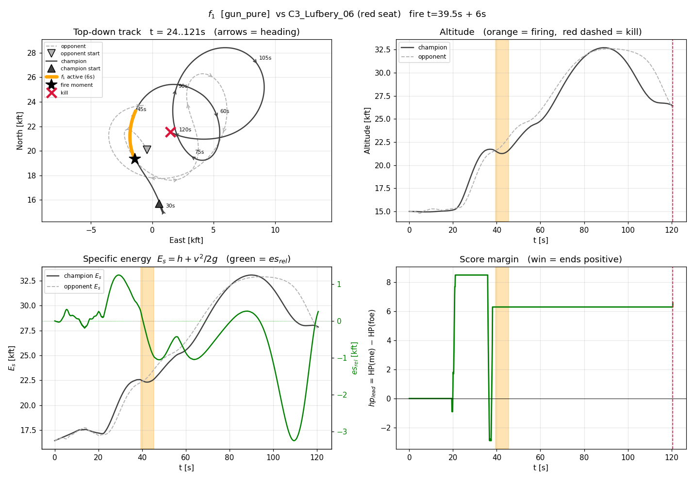

#### $f_2$ — 상승 관성 재정렬 (extend)
중거리에서 다시 접근이 시작되는데 나는 급상승 관성(+525~705fps)에 실려 있다 —
이대로 붙으면 각이 죽은 채 교환한다. 한 박자 물러나(후방 6kft 조준) 에너지와
각도를 재정렬한 뒤 재진입한다. E1_06 판에서 $f_5$(브레이크)가 1단, 이 문장이
2단으로 이어지는 순차 개입의 후단이다.

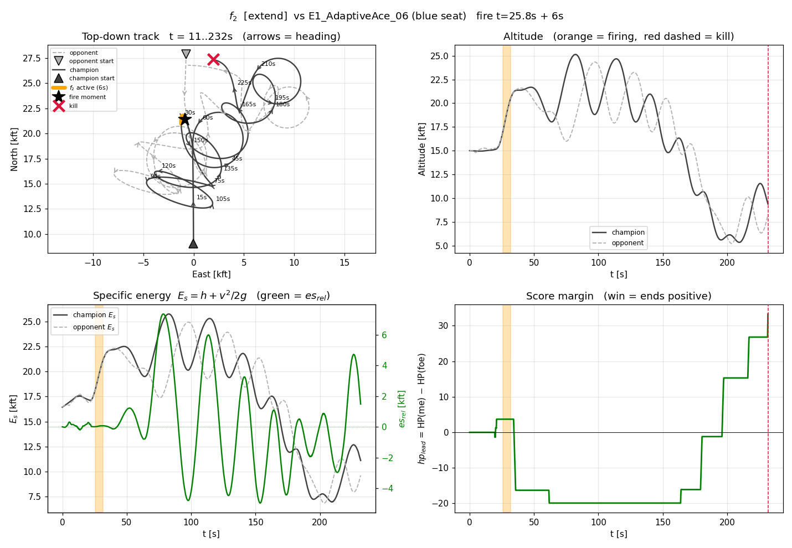

#### $f_3$ — 상승 이탈 추격 (dive)
근거리에서 적이 위로 도망친다(적 상승률 +153~177fps) — 상승은 속도를 태우는
기동이라 적은 지금 느려지는 중이다. 아래로 파고들어 속도를 벌고, 느려진 적을
에너지 우위로 다시 문다.

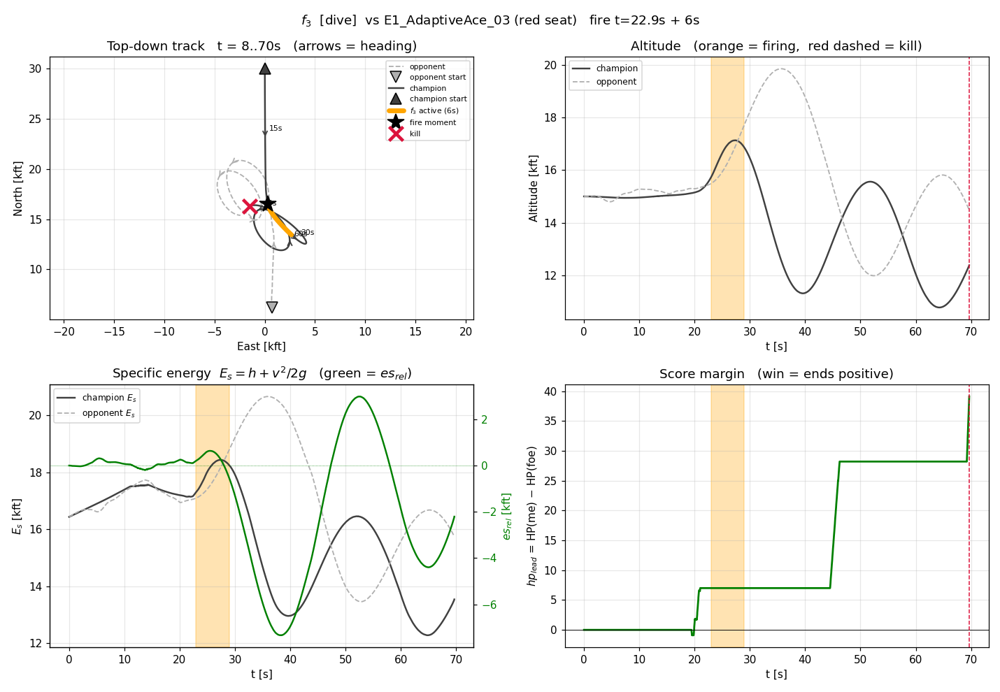

#### $f_4$ — 부양 정체 타개 (break)
원거리에서 접근도 이탈도 아닌 정체(clos −11~+67), 나는 각 열세(ata 62~85°)로
떠 있다. 시간을 끌수록 불리한 국면 — 최대G 급선회로 기하를 강제로 재배치해
각을 회복한다 (anchor_ace 판의 해).

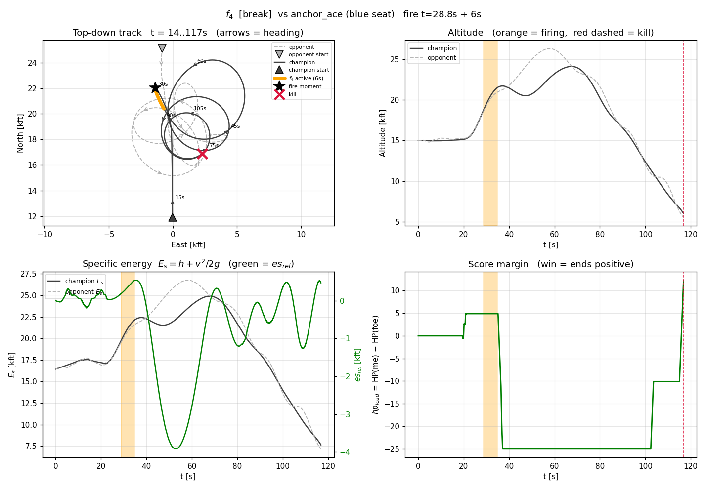

#### $f_5$ — 이탈-레이스 선제 선회 (break)
서로 멀어지는 중(clos −479~−320)인데 조준 경쟁은 내가 밀리지 않는다(race −1~+21°).
둘 다 언젠가 되돌아 조준하러 온다 — 경쟁에서 안 밀릴 때 먼저 급선회로 코를
돌리면 재조우 때 내가 먼저 겨눈다. race 축이 문장 조건에 직접 들어간 대표
사례: "**경쟁 우위일 때만** 선제"라는 안전핀이다.


#### $f_6$ — 소극 상대 전담 추격 (gun_pure)
적이 전혀 쫓아오지 않고(pursue≈0) 광역으로 도망만 다니는 국면(E2_Passive 계열).
위협이 없으므로 방어 기동이 낭비다 — 순수 기수-온 추격이 최적 해가 된다.
"상대가 싸우지 않으면 기하 게임은 단순 추격 문제로 퇴화한다"의 문장화.

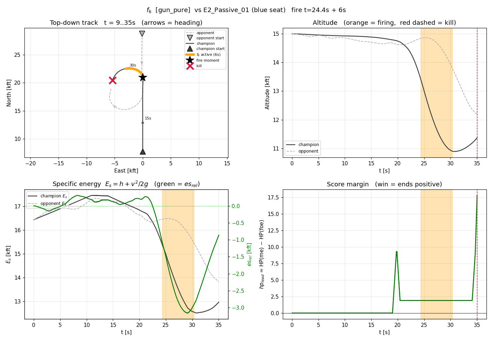

#### $f_7$ — 시저스 이탈 동반 강하 (dive)
적이 급강하로 시저스를 끊고 도망친다(적 강하 −484~−310fps, 급격 분리). 고도는
통화다 — 같이 내리꽂아 고도를 속도로 환전해야 따라잡는다. 위 관성 사례:
발화가 줌 상승 정점 직전이라 창 안에서는 상승을 꺾고, 창 직후 강하-재교전으로
45초경 승부가 난다(오른쪽 패널의 HP 도약).

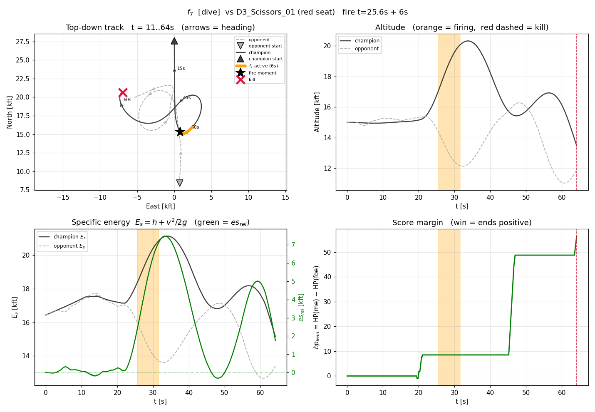

#### $f_8$ — 재머지 회피 선회 전환 (break)
원거리에서 고속으로 다시 정면 충돌 코스(clos +361~386), 나는 에너지 우위
(es_rel +668~+1154). 정면 교환은 동전던지기라 우위를 걸 이유가 없다 — 최대G
선회로 각 전투로 전환해 에너지 우위를 각 우위로 바꾼다. 11판 최대 피복 문장.

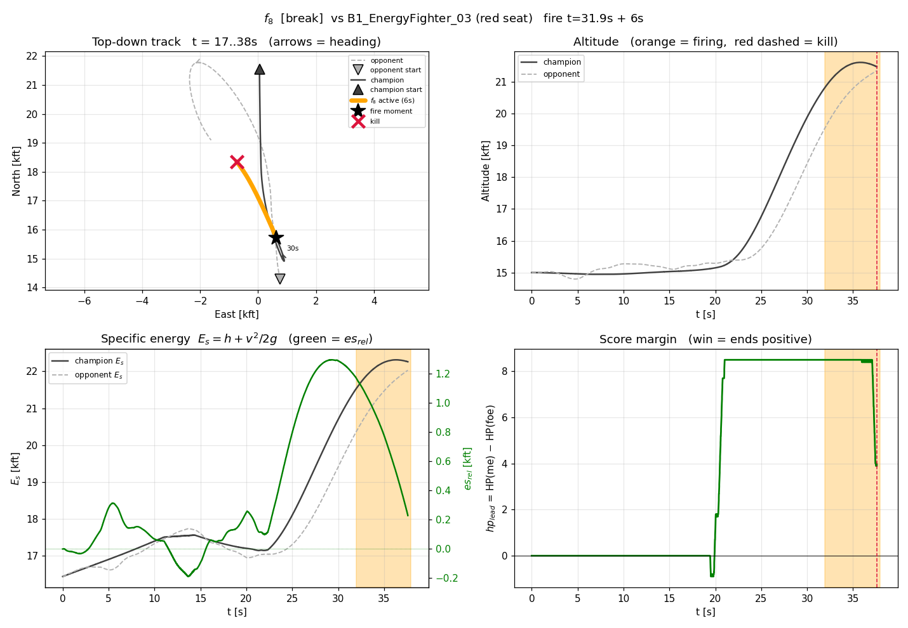

#### $f_9$ — 수직 분리 선제 진입 (break)
고속 접근인데 내가 1.3~4.1kft 위에 있다. 위에 있는 쪽이 먼저 선회에 들어가면
중력이 선회를 돕고, 아래쪽은 올려다보며 각을 잃는다 — 재머지 전에 미리 선회
진입 (C1/C2 선회전 가족 6판의 공통 해).

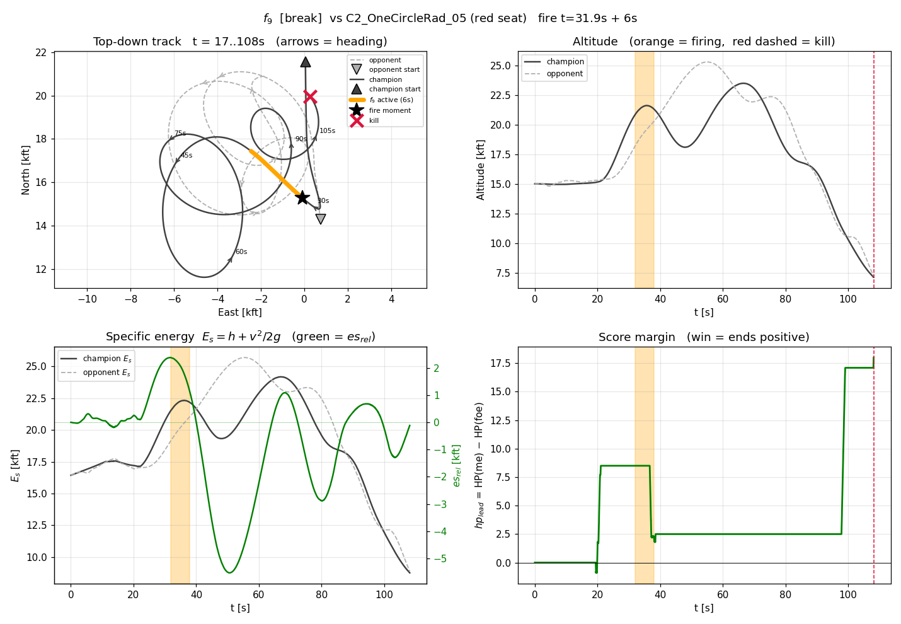

#### $f_{10}$ — 줌-클라임 비동조 (break)
적이 급상승으로 유인한다(적 상승 +409~427fps). 따라 오르면 둘 다 느려져 적의
게임이 된다 — 오르지 않고 수평 선회로 재배치해, 정점에서 느려진 적이 내려올
때를 노린다.

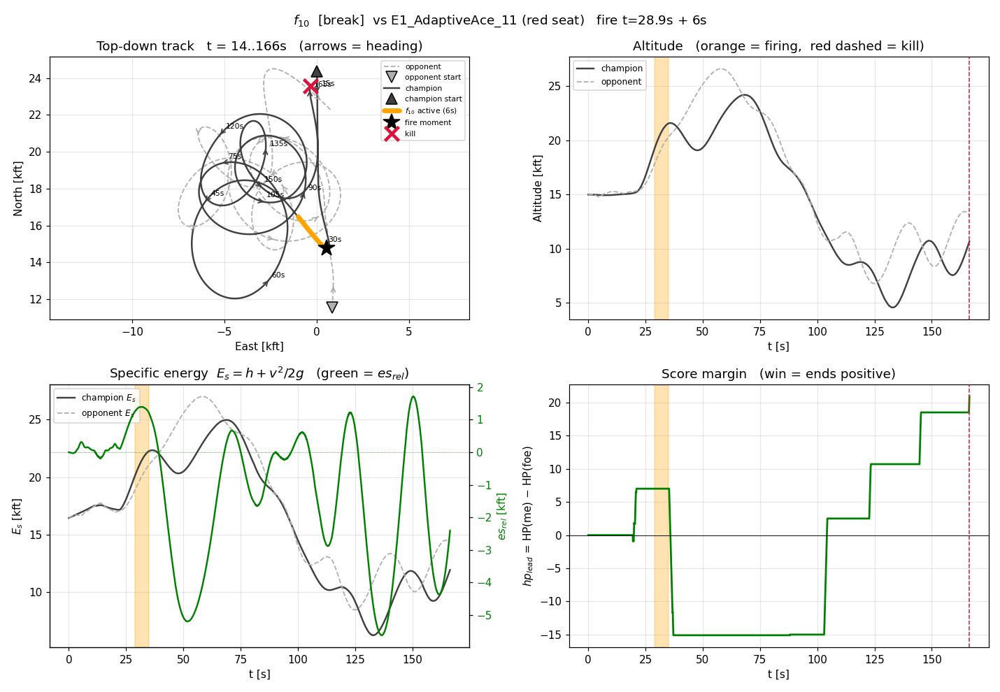

#### $f_{11}$ — 상승 추격전 기수 선점 (gun_pure)
양측 상승 중의 추격전. 상승 중에는 요격점 계산(lead)이 코를 위로 끌어올려
조준을 늦춘다 — lead 를 끄고 기수-온으로 붙이면 사격각 계단을 먼저 밟는다.

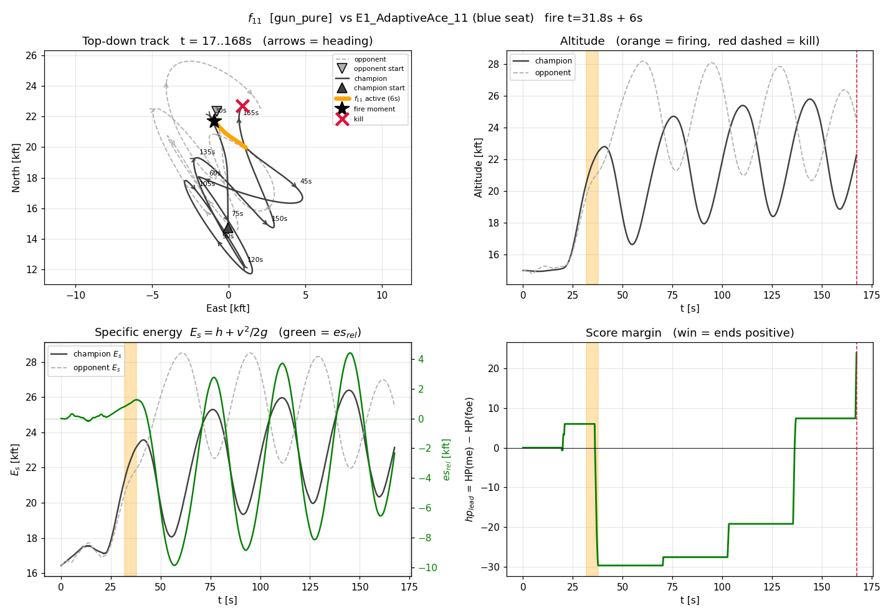

#### $f_{12}$ — 우위 현금화 강하 (dive)
중거리 수평 대치에서 나는 장부 우위(+5.5~11.5), 적은 상승 중. 시간을 끌면
우위가 희석된다 — 아래로 꽂아 교전을 강제하고 우위를 격추로 바꾼다
(D1_Reactive 가족 3판의 해).

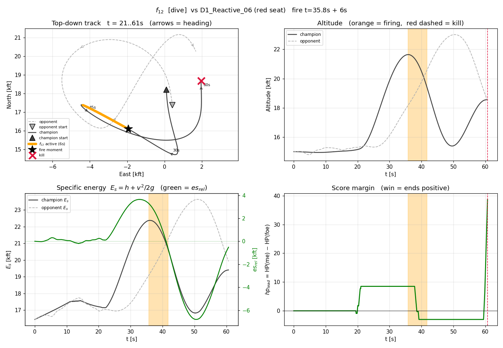

---

## 4. YAML 은 왜 이렇게 생겼나 — 실행 의미론 (control flow / event-driven)

### 4.1 왜 custom node 인가

순정 DSL 조건 20종은 전부 **그 순간 값**만 본다. 그러나 F 의 좌표 절반이 적분형
(장부 $hp_{lead}$·$fdmg$, 창 $pursue$, 지속 $hotrun$)이라 **기억 없이는 계산 자체가
불가능**하다. 엔진이 이미 상태 보유 노드(commit/cooldown)를 갖고 있으므로, 같은
원리의 사용자 정의 노드(custom)로 좌표 계산·문장·기저를 구현했다. 순정 action 노드가
아니라 `ctx.set_command()` 를 쓰는 이유도 같다 — 문장의 해(break 등)는 파라미터가
정해진 기동 명령(TacticCommand)이고, action 문법이 표현하는 것과 동일한 종류의
출력이다.

### 4.2 control flow — 한 틱의 흐름 (selector = 우선순위 폴링)

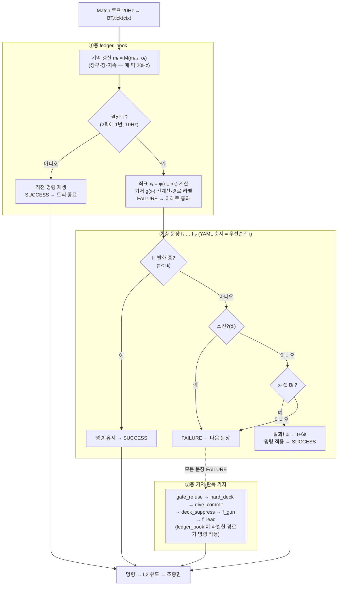

selector 는 위에서부터 묻고 처음 SUCCESS 에서 멈춘다 — 이것이 곧 F 정의의
$\min\{i \mid \cdots\}$ 다. **앞순위 문장이 뒷순위 문장의 발화 중에도 새로 발화해
선점할 수 있다**(수리 문장을 선두에 두는 이유 — 나중에 배운 교정이 우선한다).

### 4.3 event-driven 으로 읽으면 — 문장과 게이트의 상태기계

**먼저 용어 둘.** *event-driven*(사건 구동)이란 "매 순간 모든 것을 다시 계산"이
아니라 "**의미 있는 사건이 일어나는 순간에만 상태가 바뀌는**" 설계를 말한다.
4.2 의 control flow 는 매 틱 위에서부터 묻는 폴링이지만, 그 질문의 답이 바뀌는
순간 — 상자 진입, 타이머 만료, 피격 누적 — 은 드물게 일어나는 사건이고, 시스템의
실질 동작은 이 사건들이 결정한다. *상태기계*(state machine)는 그 설계를 그리는
표준 도구다: 동그라미 = 머무를 수 있는 상태, 화살표 = 사건이 일으키는 전이,
화살표 위 글자 = 그 사건의 조건. 한 시점에 정확히 한 상태에만 있다.

**문장 $f_i$ 의 생애 — 3상태.** 문장 하나는 "방아쇠 달린 1회용 타이머"다:

- **휴면**: 아직 안 쓴 상태. 매 결정틱 좌표 $x_t$ 가 자기 상자 $B_i$ 에 들어
  왔는지만 지켜본다(§2 정의 4 의 fire 조건). 96개 승리판에서는 경기 내내 이
  상태로 끝난다 — 그것이 무간섭(정리 2)이다.
- **발화중**: 상자 진입이라는 사건이 일어난 순간 전이. 타이머 $u_i = t + 6$s 가
  걸리고, 6초 동안 이 문장의 기동 $a_i$ 가 조종을 점유한다. 경계에서 좌표가
  들락거려도(동전던지기 지대) 이미 발화중이므로 흔들리지 않는다 — 래치의 역할.
- **소진**: 타이머 만료로 전이. 이후 경기 끝까지 다시 쏠 수 없다(1회성).
  왜 1회성인가: 같은 상자를 재진입할 때마다 재발화하면 "개입→복귀→재개입"의
  무한 진동이 가능하고, 우리 증인은 "**한 번의** 개입으로 이긴다"만 증명했기
  때문이다 — 증명된 만큼만 행동한다.

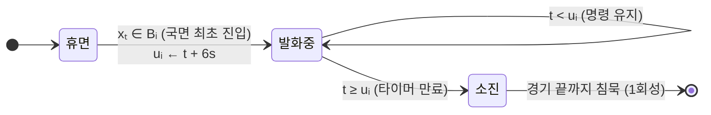

**게이트 $G$ 의 생애 — 자기교정 폐루프.** 게이트는 문장보다 상태가 많다.
"지는 교환을 거부한다"는 판단이 **상대에 따라 틀릴 수도 있어서**, 자기 판단의
효능을 실측하고 철회하는 회로가 붙어 있기 때문이다:

- **비무장 → 무장**: 첫 머지 교환(WEZ 밴드 진입 후 이탈)이 끝나야 게이트가
  켜진다. 이유: 접근 단계의 기하는 아직 정보가 없고, 첫 교환은 승리 경로의
  일부라 건드리지 않는 것이 실측상 옳았다(문장의 armed-가드와 같은 원리).
- **무장 → latch(거부 유지)**: "지는 교환" 사건 감지 — 명백히 지는 조준
  레이스(각도 차 12° 이상 열세)거나, 리드를 쥔 채 받는 자살성 정면 재돌입.
  latch 된 동안 교전 대신 거부 기동(이탈·상승 등)을 유지한다.
- **latch → 무장 (정상 해제)**: 위협이 소멸하면 — 적 기수가 크게 벗어나거나
  (60° 초과) 거리가 벌어지면(6,000ft 초과) — 평시로 복귀.
- **latch → 쿨다운 (효능 실패)**: 핵심 회로. 거부하는 **동안에도** 4hp 넘게
  맞았다면, 이 상대에게 거부가 통하지 않는다는 실측 증거다(추격-처벌형 상대).
  판단을 철회하고 15초간 게이트를 재우는 이유: 같은 오판을 즉시 반복하지
  않기 위해.
- **쿨다운 → 영구해제**: 실패가 2회 쌓이면 남은 경기 내내 게이트를 끈다 —
  "이 상대에겐 교전이 정답"이라는 상대-적응. (이 자기교정 회로가 없던 초기
  버전은 추격형 상대에게 거부→처벌→재거부의 악순환으로 전멸했다 — 실측이
  이 상태들을 만들었다.)

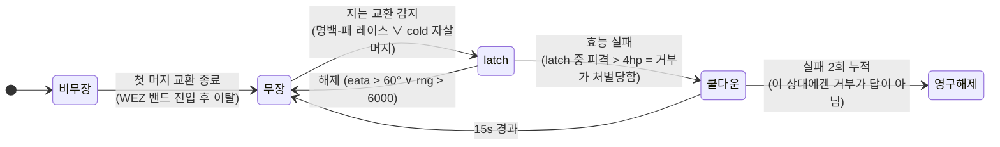

**사건 목록표.** 아래 표가 이 절의 요약이다 — 왼쪽 열이 "무슨 일이 일어나면",
가운데가 "누가 그것을 알아차리고"(감지 주체 = 그 사건의 조건을 계산하는 노드/
회로), 오른쪽이 "시스템이 어떻게 반응하는가"다:

| 이벤트 | 감지 주체 | 반응 |
|---|---|---|
| 결정틱 도래 (0.1s 주기) | ledger_book | 좌표 재계산, 기저 선계산 |
| **국면 진입** $x_t \in B_i$ 최초 성립 (edge) | sentence $f_i$ | 1회 발화 — 6초 점유 시작 |
| 점유 만료 ($t \geq u_i$) | sentence $f_i$ | 소진 마킹, 제어권 반환 |
| 교환 열세 감지 (게이트 latch) | ledger_book($G$) | 거부 실현으로 전환 |
| 거부가 처벌당함 (latch 중 피격 > 4hp) | 게이트 효능 폐루프 | latch 포기·쿨다운 15s (자기교정) |
| 적 다이브-커밋 ($c_t \geq \theta$ 점화) | 감쇠 적분 $c_t$ | off-함수 argmax 로 전술 전환 |

즉 YAML 은 "수학 함수 F 의 조각별 정의"를 **우선순위 폴링 + 엣지-트리거 래치**로
실행하는 기계다. 이산 선택(F)이 기동 종류·조준점을 고르면, 그 아래 공통 L2 유도가
연속 기하 제어(조준·G 조절)로 실현한다 — 이기는 것은 이 2단 합성이다:
F 가 **올바른 국면에서 올바른 기동을 고르고**, 유도가 그 기동을 교범대로 수행한다.

### 4.4 왜 이렇게 바뀌었나 (변경 이력 한 줄씩)

- 트리(joblib 158리프) → **$f_{gun}/f_{lead}$ 함수 2개**: 실측상 트리는 리프 28개만
  쓰고 출력의 97.7%가 2진이었다. 함수 2개 + 수리 문장 1개가 같은 128-0-0 을 내며
  (루프32), 일반화 순효과(이월−회귀)는 +18 로 트리판(+17)보다 낫다.
- 문장 12축 전폭 → **구속 축만(평균 4.6)**: 축 제거는 전 발화 기록(2차 발화 포함)
  불변을 증명한 것만 허용(slim_rules). 사람이 "함수값 구간"으로 읽게 하기 위함.
- 상수 27종을 YAML 에 표시하되 **로드 시점에 정본 값과 일치 단언** — 표시와 실행이
  어긋나는 순간 즉시 실패한다(문서-코드 드리프트 원천 차단).

---

## 5. 검증 성적 (전부 결정론 재현 가능)

| 항목 | 값 |
|---|---|
| 전적 | 128판 **128승 0무 0패** (연구 런타임과 전판 HPΔ 일치) |
| 격추/판정 | 격추승 124 · 판정승 4 (도주형 상대 시간종료, HP 압도) |
| HPΔ | 평균 +33.3 · 중앙 +29.2 · 최소 +0.3 (B1 계열) · 최대 +77.1 |
| 격추 시각 | 평균 69s · 중앙 44s (경기 300s) |
| 무간섭 | 96개 승리판에서 문장 발화 0 (발화 기록 실측) |
| 일반화(LOFO) | 이월 18/32 = 56.3% · 회귀 0 (트리 기저 정본: 19/32 · 회귀 2 — 순효과 +18 vs +17) |

재현: `python scripts/run_match.py --blue agents/champion128.yaml --roster roster/all_128.txt`
녹화 정본: `replays/canon/roster_f32_final_128_0/` (판당 .acmi + 복기 그래프; 단판 예시
`replays/canon/f32_vs_anchor_ace.acmi`)
