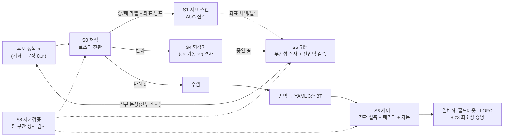
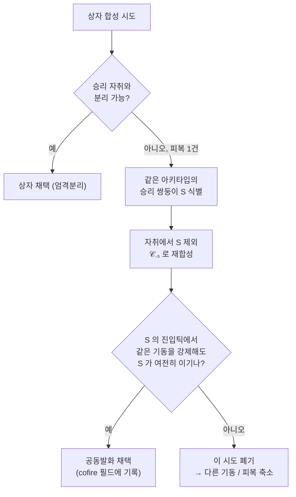
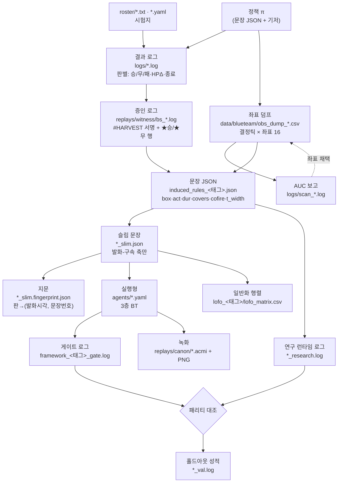
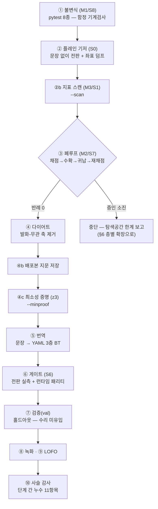

# 방법론 정식 명세 — 교전 데이터에서 전승 정책 $F$ 를 자동 도출하는 프레임워크

> 원리 · 산출물 사슬 · 설계 선택의 근거 · 연구적 가치

정본 실행형: `research/framework.py` (단일 진입점)
산출물: 함수형 규칙 $F$ 와 그 실행형 BT — [docs/F_SPEC.md](F_SPEC.md)
전신 문서: `AUTOMATION_PLAN.md`(설계 계획, 2026-07-18) — **이 문서에 흡수됨**
실증: 문장 0 에서 시작해 사람 개입 없이 **128판 전승**까지 완주(§12)

**이 문서를 읽는 두 가지 길**
- *"어떻게 돌리나"* 만 필요하면 → §9 실행 의미론 → §14 재현
- *"왜 이렇게 만들었나"* 가 궁금하면 → §1 원리 → §11 설계 선택의 근거 → §13 연구적 가치

---

## 읽기 전에 — 파이프라인을 말로 풀면

F_SPEC 이 "완성된 조종사가 어떻게 판단하는가"라면, 이 문서는 **"그 조종사를 무엇이
만들었는가"** 다. 한 바퀴(라운드)를 따라가며 필요한 개념을 풀어 쓴다.

**1. 채점 — 지금 정책이 어디서 지는지 전수로 본다.**
후보 정책을 로스터(상대 목록) 전판에 돌린다. 주사위가 없어서 같은 명령이면 항상
같은 결과다 — "이 상대에게 진다"가 통계가 아니라 **사실**이다. 진 판이 다음 단계의
작업 목록(반례)이 된다.

**2. 지표 스캔 — 승패를 가르는 좌표가 무엇인지 기계가 고른다.**
사람이 "각도가 중요할 것 같다"고 정하는 대신, 수백 개 후보 지표를 승/패 라벨에
대해 전수 채점(AUC)해 **판별력 있는 축만** 남긴다. 채택·탈락은 사전등록된 문턱이
결정한다.

**3. 되감기 — 진 판을 여러 시점으로 되감아 다른 수를 실제로 둬 본다.**
상상 대신 시뮬레이션을 되감아 기동을 강제하고 끝까지 재실행한다. 결과가 뒤집히면
그 순간 좌표를 **증인**으로 기록한다. 증인은 의견이 아니라 **실행된 증거**다.

**4. 귀납 — 증인들이 공유하는 "상황"을 구간으로 압축한다.**
증인들을 담되 **이미 이기고 있던 순간들(승리 자취)은 건드리지 않는** 최대 구간을
찾는다(엄격분리). 분리가 불가능하면 겹침을 **검증하고** 허용하는 예외 경로가 있다
(§4 — 이 방법론에서 가장 미묘한 부분).

**5. 검증·폐루프 — 만든 문장을 배포해 다시 채점한다.**
반례 0 이면 수렴, 남으면 다음 라운드의 반례. 사람이 아니라 데몬이 이 루프를 돈다.
수렴 못 하면 **왜 못 했는지**(증인 소진)를 남기고 멈춘다.

**6. 일반화·증명 — 남에게도 통하는지, 더 줄일 수는 없는지.**
훈련에 안 쓴 상대(홀드아웃)·통째로 뺀 가족(LOFO)으로 재고, z3 로 "이 의미론
하에서 문장 수 하한"을 형식 증명한다.

요약: **재고 → 축을 고르고 → 되감고 → 압축하고 → 배포해 다시 재고 → 일반화·증명.**



---

## 0. 표기법 — 용어와 기호

### 파이프라인 용어

| 용어 | 뜻 |
|---|---|
| **로스터** | 상대 목록 = 시험지. `roster/*.yaml` + 판 목록(`<상대>/<내 진영>` 줄) |
| **반례** | 현재 정책이 이기지 못한 판 — 다음 라운드의 작업 목록 |
| **되감기** | 진 판을 $t_0$ 로 되돌려 기동 $a$ 를 $\tau$ 초 강제하고 끝까지 재실행 |
| **증인** | 되감기에서 **결과가 뒤집힌** $(t_0, a, \tau)$ 와 그 순간의 좌표 |
| **승리-시간창** | 한 반례에서 증인이 되는 $t_0$ 들의 최장 연속 구간 폭 — 강건성 지표 |
| **증인 소진** | 증인이 전부 탈락하고 재수확도 빈손 — "현 탐색 공간에 답 없음"(답이 없음의 증명은 아님) |
| **승리 자취** | 이기던 판들이 좌표공간에 남긴 모든 순간의 점 — 침범 금지 구역 |
| **엄격분리** | 상자를 승리 자취에 닿기 직전까지만 키우는 원칙 → 무간섭을 비용 0 으로 보장 |
| **공동발화**(cofire) | 분리 불가 시 특정 승리판과의 겹침을 **승리 보존 검증 후** 허용하는 예외 |
| **절대예외** | 관계형 좌표로 분리 안 되는 케이스에 절대축(고도·속도)을 허용하는 2단 사다리 |
| **진입틱 검증** | 상자에 그 판이 **처음 진입하는 시각**에 발화시켜 재롤아웃 — 통과분만 채택 |
| **지문**(fingerprint) | 어느 판 몇 초에 어느 문장이 발화했는지 전수 기록 — 회귀 검출 기준선 |
| **폐루프** | 채점→수확→귀납→재채점 자동 반복(CEGIS) — 사람 개입 0 |
| **훈련/검증 분리** | 상대를 층화 무작위 추첨으로 가르고, 검증 상대는 **수리에 절대 미유입** |
| **LOFO** | Leave-One-Family-Out — 한 가족을 재료에서 통째로 빼고 재귀납해 이월력 측정 |
| **캠페인** | 태그 하나로 격리된 한 번의 전 과정 실행 |

### 기호

| 기호 | 뜻 |
|---|---|
| $R,\ R_{tr},\ R_{va}$ | 로스터 / 훈련 분할 / 검증(홀드아웃) 분할 |
| $\pi_n$ | $n$ 라운드 시점의 정책(기저 + 문장 $n$ 개) |
| $L(\pi, R)$ | $\pi$ 가 $R$ 에서 이기지 못한 판의 집합(반례) |
| $W(c)$ | 반례 $c$ 의 증인 집합 $\{(t_0, a, \tau, x)\}$ |
| $\mathcal{C}$ | 승리 자취 · $\mathcal{C}_{-S}$ = 집합 $S$ 를 제외한 자취 |
| $B_i,\ f_i,\ \tau$ | 문장 상자 / 문장 / 유지시간(6s) — F_SPEC §2 와 동일 |
| $t_e$ | 진입틱 = 그 판이 상자에 처음 들어오는 시각 |
| $\Delta$ | 승리-시간창 폭 [s] |

---

## 1. 원리 여섯 — 무엇을 지키기로 했고, 왜 그것인가

앞의 넷은 설계 시점에 세운 것(구 `AUTOMATION_PLAN` §0), 뒤의 둘은 **실패가 가르쳐
추가된 것**이다.

### 원리 1 — 전수(BROAD): 가설·검산·처방을 병렬 다중으로

가설은 K개+경쟁+귀무를 함께, 검산은 반례 전수에 대해, 처방은 포트폴리오로 낸다.

*왜*: "처음 그럴듯한 것"이 채택되는 경로를 **구조적으로** 막기 위해서다. 실측
근거가 있다 — 한 진단(tier 판별자)에서 곧바로 전역 처방(파이퍼 창)으로 직행했다가
상충 레버로 반증됐고(+9/−5), 정답은 넓은 탐색이 찾은 **가족별 상이 처방**이었다.
깊이-우선은 빠르지만 커버리지를 보장하지 못한다.

### 원리 2 — 무간섭의 재귀: 잘 되던 것을 건드리지 않는다

문장이 승리 자취를 침범하면 안 되듯, 설명(기전)도 승리판을 "패배로 설명"하면 안
된다. 같은 규율이 층마다 반복된다.

*왜*: 회귀를 **사후 검출**이 아니라 **구성 단계에서 배제**하기 위해서다(§3 정의 5).
사후 검출은 매번 전판 재채점을 요구하지만, 구성 배제는 추가 비용이 0이다.

### 원리 3 — 사전등록: 임계값은 결과를 보기 전에 고정

채택/기각 문턱(AUC 0.25, 문장 수 상한, 이월률 하한 등)을 캠페인 시작 전에 정한다.

*왜*: 결과를 본 뒤 기준을 맞추면 어떤 결과든 "성공"이 된다. 이 규율의 값은
**위반했을 때 드러난다** — 실제로 두 번 완화했고(§12 한계), 그 사실이 기록에 남아
있다는 것이 규율이 작동하는 증거다.

### 원리 4 — 결정론 오라클 우선: 채택 도장은 시뮬레이터가 찍는다

상관·해석·직관은 **제안까지만** 하고, 최종 판정은 재롤아웃(개입 A/B)이 한다.

*왜*: 이 게임은 결정론이라 "그때 그렇게 했으면 이겼다"를 **실행으로 확정**할 수
있다(§2). 확정할 수 있는데 추정에 의존할 이유가 없다.

### 원리 5 — 제약은 전 층에 동시에 (armed-가드가 가르친 것)

새 제약(예: "문장은 첫 교환 이후에만 발화")을 런타임에만 넣으면, 수확은 제약을
우회하고 배포는 제약에 막히는 **자기모순**이 생긴다. 데몬은 영원히 못 쓸 증인을
캐고 무한 재수확에 빠진다.

*왜*: 실측이다(§6.2). 제약 하나를 넣으려면 수확 격자·좌표 덤프·귀납 필터·시뮬·
양 런타임 다섯 곳을 동시에 고쳐야 했다. **파이프라인은 제약에 대해 정합적이어야
한다.**

### 원리 6 — 단계 사이를 감사하라 (증인 재사용이 가르친 것)

각 단계가 자기 몫을 정상 수행해도, 넘겨받는 재료가 낡았거나 기준선이 다른 물건을
가리키면 실험 전체가 무의미해진다.

*왜*: 실측이다(§10.3). 어휘를 4→8종으로 넓힌 캠페인에서, 기존 증인 파일이 있는
케이스는 **조건 대조 없이 재사용**돼 구 어휘로 귀납되고 있었다 — 확장이 절반만
적용된 채 "확장 효과"를 측정할 뻔했다. 그래서 감사는 "각 단계가 성공했는가"가
아니라 **"연결이 성립하는가"** 를 묻는다.

---

## 2. 결정론이라는 전제 — 그리고 그것을 지키는 일

파이프라인 전체가 하나의 사실 위에 선다: **엔진에 난수가 없다.** 같은 초기조건에
같은 명령이면 소수점까지 같은 결과다(실측 확인). 이 전제가 셋을 공짜로 준다:

1. **반례가 확정적** — 한 판만 돌려도 결론이 선다(통계적 반복 불필요).
2. **되감기가 반사실 실험** — "그때 다르게 했다면"을 상상이 아니라 실행으로 답한다.
   이것이 증인의 인식론적 지위를 만든다.
3. **회귀 검출이 완전** — 전판 재실행 후 이전 결과와 대조하면 무엇이 깨졌는지
   빠짐없이 드러난다(HPΔ·종료시각까지).

### 이식 조건 — 노이즈 환경으로 가면

증인은 "여러 시드에서 평균적으로 뒤집는 개입", 반례는 "유의하게 지는 판"으로
완화돼야 한다. 골격(반사실 수집 → 구간 귀납 → 폐루프)은 남지만 표본 비용이 크게
늘고, 무간섭 보장은 확률적 진술로 약해진다.

### 결정론은 저절로 오지 않는다

우리 파이프라인은 한때 **자기 코드의 비결정성**에 오염돼 있었다. 귀납의 동률 처리가
파이썬 해시 무작위화에 종속돼, 같은 입력에서도 실행마다 다른 문장이 나왔다 —
역대 LOFO 이월 수치가 전부 씨드 추첨값이었다는 뜻이다. 정렬 고정 +
`PYTHONHASHSEED=0` 전파로 수리했고, **동일 입력 쌍둥이 실행의 결과 완전 일치**로
증명했다.

교훈: 결정론은 환경의 전제이자 **우리가 지켜야 할 불변식**이다. 그래서 자가검증
목록(§10)에 결정론 항목이 들어 있다.

---

## 3. 한 라운드의 수학 — 정의·정리 형식

각 블록은 **직관 → 형식 → 기호 풀이** 순서다(F_SPEC §2 와 같은 규율).

---

> **정의 1 (채점과 반례).**
> *직관*: 정책을 시험지 전체에 돌려, 이기지 못한 판을 모은다.
>
> $$L(\pi, R) \;=\; \{\, c \in R \;\mid\; \text{result}(\pi, c) \notin \text{OK} \,\}$$
>
> *기호 풀이*: $\pi$ = 지금 정책, $R$ = 로스터, $c$ = 한 판(상대×진영).
> $\text{OK}$ = 성공으로 인정하는 결과 집합 — 기본 $\{$승$\}$, "일반해의 하한은
> 불패"라는 기준을 쓰면 $\{$승, 무$\}$(`CD_ALLOW_DRAW=1`, §6.3). **이 한 줄이
> 파이프라인의 목표를 정의한다** — 목표를 바꾸고 싶으면 여기를 바꾼다.

---

> **정의 2 (지표 스캔 — 좌표의 자동 채택).**
> *직관*: 어떤 숫자가 승패를 가르는지 사람이 고르지 않는다. 후보를 전수 채점해
> 문턱을 넘는 것만 좌표로 승격한다.
>
> $$\text{채택}(k) \iff \big|\, \mathrm{AUC}\big(k;\ \text{승/패 라벨}\big) - 0.5 \,\big| \ \ge\ 0.25$$
>
> *기호 풀이*: $k$ = 후보 지표(좌표 축 × 집계 × 창 조합 — 수백 개). AUC 는 판별력
> (1.0 = 완벽 분리, 0.5 = 무정보). 문턱 0.25 는 **사전등록**된 값이다.
> 실적: $race$(조준 경쟁) 0.997 채택, $vdiff$(속도차) 0.282 탈락.
>
> *주의 — 결과-대리 배제*: 점수 부기에서 파생된 지표($hp_{lead}$ 류)는 AUC 가
> 높아도 "승리의 원인"이 아니라 **결과**다. 자동 표기하고 기전 후보에서 제외한다.
> 이것이 없으면 "이기고 있으면 이긴다"류 동어반복이 1위 판별자로 올라온다.

---

> **정의 3 (되감기와 증인).**
> *직관*: 진 판을 여러 시점으로 되감고 다른 기동을 강제해 실제로 다시 돌린다.
>
> $$W(c) = \big\{\, (t_0, a, \tau,\, x_{t_0}) \;\mid\; \text{result}\big(\pi \triangleleft (t_0, a, \tau),\, c\big) \in \text{OK} \,\big\}$$
>
> *기호 풀이*: $\pi \triangleleft (t_0, a, \tau)$ = "정책 $\pi$ 를 쓰되 구간
> $[t_0, t_0{+}\tau)$ 에서만 기동 $a$ 를 강제". $x_{t_0}$ = 그 순간의 좌표
> 16-벡터 — 상자의 재료다. 탐색 격자: $t_0 \in$ [무장 이후 창](§6.2),
> $a \in$ 기동 어휘 8종(`CD_ACTS`), $\tau \in \{2,4,8,12\}$s(`CD_DURS`).
>
> 개입은 **일시적**이다 — 창이 끝나면 정책이 스스로 이어서 조종한다. 그래서
> 증인은 "이 순간 이 방향으로 한 번 밀면, 나머지는 기존 정책이 감당한다"는
> 뜻이 된다(국소 개입의 충분성).

---

> **정의 4 (승리-시간창 — 증인의 강건성).**
> *직관*: 같은 판이라도 "28초에만 개입하면 이긴다"와 "22~40초 아무 때나 개입해도
> 이긴다"는 질이 다르다. 후자가 기전이 안정적이라는 뜻이다.
>
> $$\Delta(c) \;=\; \max_{a} \ \big|\, \text{최장 연속 구간}\{\, t_0 \mid (t_0,a,\cdot,\cdot) \in W(c) \,\} \,\big|$$
>
> *기호 풀이*: $\Delta$ = 승리-시간창 폭 [s]. 실측(34케이스): 중앙 15s, 최소 9s ~
> 최대 48s. **좁은 창(9~12s)은 E1·E2·B1 계열에 몰려 있고, 이들은 LOFO 이월 최약
> + 홀드아웃 잔여 패배가 나온 바로 그 가족들이다** — $\Delta$ 는 일반화의 예측
> 지표다.
>
> 그래서 증인 선택은 $\Delta$ 가 만드는 최장 구간 안에서 한다(`RI_ROBUST=1`).
> 폭은 문장 메타데이터 `t_width` 로 보존돼 YAML 주석("타이밍여유 12~48s")까지
> 전달된다 — 문장마다 **신뢰도 등급**이 붙는 셈이다. 도구: `framework timing`.

---

> **정의 5 (귀납 — 무간섭 상자 합성).**
> *직관*: 같은 기동의 증인들을 담되, 이기고 있던 순간들과는 겹치지 않는 최대
> 구간을 찾는다.
>
> $$B \;=\; \arg\max_{B \,\supseteq\, \text{hull}(X_a)} \operatorname{vol}(B)
> \quad \text{s.t.} \quad B \cap \mathcal{C} = \varnothing$$
>
> *기호 풀이*: $X_a$ = 기동 $a$ 로 뒤집은 증인 좌표, $\text{hull}$ = 그 점들을
> 담는 최소 상자, $\mathcal{C}$ = 승리 자취. 제약 $B \cap \mathcal{C} = \varnothing$
> 이 **엄격분리**이며, F_SPEC 정리 2(무간섭)를 **구성 단계에서** 보장한다.
> 구현은 축별로 조금씩 넓히다 자취에 닿기 직전 멈추는 탐욕 절차다.

---

> **정의 6 (진입틱 검증 — 채택 조건).**
> *직관*: 상자를 만들었다고 끝이 아니다. **배포되면 실제로 일어날 일**로 검증한다.
>
> $$t_e(c, B) = \min\{\, t \mid x^{(c)}_t \in B \,\}, \qquad
> \text{채택} \iff \forall c \in \text{covers}:\ \text{result}\big(\pi \triangleleft (t_e, a, \tau),\, c\big) \in \text{OK}$$
>
> *기호 풀이*: 증인의 $t_0$ 와 진입틱 $t_e$ 는 **다를 수 있다** — 상자가 넓어지면서
> 더 이른 순간이 조건을 만족하기 때문이다. 이 차이를 무시하면 "증인에서는 이겼는데
> 배포하면 지는" 문장이 생긴다. 실패한 케이스는 그 문장의 피복에서 빠지고 다음
> 라운드로 넘어간다.

---

> **정리 1 (CEGIS 폐루프 — 수렴 또는 정직한 실패).**
> *직관*: 라운드마다 반례를 줄이거나, 줄이지 못하면 **왜 못 줄이는지 남기고 멈춘다.**
>
> $$\pi_{n+1} = \pi_n \oplus \{f_{\text{new}}\}, \qquad
> \text{종료} \iff L(\pi_n, R) = \varnothing \ \lor\ \textstyle\bigcup_c W(c) = \varnothing$$
>
> *기호 풀이*: $\oplus$ = 신규 문장을 **선두 배치**하는 병합(나중 교정이 우선 —
> F_SPEC §4.2). 종료 조건 둘: 반례 0(**수렴**) 또는 증인 소진(**정직한 실패** —
> 탐색 공간의 한계를 보고하고 중단 → §6 층별 확장).
>
> *수렴 보장은 없다*. 이 루프는 완전성(모든 반례를 언젠가 푼다)을 증명하지 않는다 —
> 대신 **실패를 진단 가능한 형태로** 남긴다. 어느 반례가, 어느 어휘에서, 어느
> 단계(분리 실패 / 진입틱 검증 실패 / 수확 빈손)에서 막혔는지가 로그에 남는다.

---

> **정리 2 (일반화 측정 — 두 겹의 홀드아웃).**
> *직관*: "훈련 전승"은 암기로도 달성된다. 배운 적 없는 상대에서 재본다.
>
> $$\text{val} = \text{성적}\big(\pi,\ R_{va}\big), \qquad
> \text{LOFO}(F) = \text{이월}\big(\pi_{-F},\ R_F\big)$$
>
> *기호 풀이*: $R_{va}$ = 훈련에 쓰지 않은 상대(층화 추첨·시드 선언 — §6.4).
> $\pi_{-F}$ = 가족 $F$ 를 증인·자취·검증에서 **통째로 빼고** 재귀납한 정책,
> $R_F$ = 그 가족의 판. val 이 중간 강도, LOFO 가 극단 강도의 시험이다.
> 둘 다 필요한 이유: val 은 "비슷한 상대"에 대한 일반화, LOFO 는 "본 적 없는
> **유형**"에 대한 일반화를 잰다.

---

## 4. 겹침을 어떻게 다루나 — 엄격분리의 한계와 예외 경로

이 절이 방법론에서 가장 미묘한 부분이다. **"이기던 판과 지던 판이 좌표공간에서
겹칠 때"** 무엇을 하는가.

### 4.1 문제 — 좌표는 투영이다

좌표 $x$ 는 16차원 요약이라, 같은 $x$ 가 이기던 판과 지던 판 양쪽에서 나타날 수
있다. 그리고 **점(승리 자취)이 보증하는 것과 별(증인)이 보증하는 것이 다르다**:

- 점 · : "여기서 **기저 행동을 이어가면** 이긴다"
- 별 ★ : "여기서 **이 기동을 강제하면** 이긴다"

겹침 지점에서 문장을 발화시키면 지던 판은 고쳐지지만 **이기던 판의 진행이 바뀐다** —
그 판이 여전히 이긴다는 보증은 어디에도 없다. 엄격분리(정의 5)는 이 도박을 검증
비용 0 으로 차단하는 보수 원칙이다.

### 4.2 예외 1 — 공동발화(cofire): 검증된 겹침 허용

그러나 어떤 케이스는 **자기와 똑같이 생긴 승리 판**(같은 아키타입의 쌍둥이) 때문에
어떤 상자도 만들 수 없다. 이때 파이프라인은 포기하지 않는다:



형식으로 쓰면, 제외 집합 $S$ 에 대해

$$B \cap \mathcal{C}_{-S} = \varnothing
\quad \land \quad
\forall s \in S:\ \text{result}\big(\pi \triangleleft (t_e(s,B),\, a,\, \tau),\, s\big) \in \text{OK}$$

즉 **겹침을 허용하되 그 판에서도 승리가 보존됨을 롤아웃으로 증명**한다. 채택된
겹침은 문장의 `cofire` 필드에 남아 감사 가능하다.

이것이 "별은 우리가 아직 못 찾은 승리 영역의 일부일 수 있다"는 직관에 대한 현재의
답이다 — **검증된 겹침은 더 일반적인 해**이고, 검증 없는 겹침은 도박이다.

### 4.3 예외 2 — 절대예외: 좌표계 사다리

관계형 좌표(상대와의 차이)만으로 분리되지 않는 케이스가 있다. 이때 2단 사다리를
탄다: ①관계형 좌표로 전 반례 귀납 → ②미해결분에 한해 **절대축**(고도·속도)을
허용해 재귀납. 관계형이 일반화에 유리하다는 실측(§11) 때문에 관계형이 1순위이고,
절대축 문장은 "그 가족 전용 예외"로 남는다(현 정본 12문장 중 2개).

### 4.4 미구현 — 검증된 팽창 (합의된 다음 단계)

공동발화는 "분리 불가일 때"만 발동하는 국소 예외다. 이를 일반화하면:
**상자를 승리 자취 안으로도 키우되, 새로 덮이는 승리판마다 승리 보존을 재채점으로
검증해 통과분만 채택**하는 역-다이어트 패스가 된다. 결정론이라 판정은 확정적이고,
가설은 "팽창된 상자는 시간창이 넓어지고 홀드아웃 성적이 오른다"이다.

엄격분리(안전한 최소해)와 검증된 팽창(일반성 극대화)은 **단계적 세련화**로 화해한다:
무간섭을 공짜로 보장받고 시작해, 롤아웃 예산을 쓰는 만큼 일반성을 사들인다.

---

## 5. 산출물 사슬 — 무엇이 무엇으로 이어지는가

방법론의 실체는 **파일 하나가 다음 단계의 입력이 되는 사슬**이다. 각 화살표에는
지켜야 할 계약이 있고, 계약이 깨지면 실험 전체가 조용히 무의미해진다(원리 6).



### 5.1 데이터 계약 — 각 산출물이 지켜야 할 약속

| 산출물 | 계약 | 깨지면 |
|---|---|---|
| **판 목록** `roster/*.txt` | 각 줄 `<상대>/<진영>`, CRLF 금지 | 목록 일부가 조용히 누락돼 "전승"이 축소된 시험지의 전승이 됨 |
| **결과 로그** | 판마다 `상대/진영 결과 HPΔ 종료@시각` 한 줄 — 정규식 파싱 대상 | 반례 집합이 잘못 잡힘 |
| **좌표 덤프** | 헤더 = 런타임 `_DUMP_KEYS` 와 **정확히 일치**, 신규 축은 **말미 append** | 귀납이 다른 좌표계에서 상자를 만듦(가장 치명적) |
| **증인 로그** | 파일명 = 케이스 식별자(`bs_<stem>_<side>.log`), 첫 줄 = **수확 조건 서명** | 재사용 시 구 어휘·구 기준의 재료가 섞임 |
| **문장 JSON** | `covers`·`cofire`·`t_width` 보존(감사용), 신규 문장은 **선두** | 감사 불가·우선순위 붕괴 |
| **슬림 문장** | 문장 수 보존, 축은 **부분집합**, 메타데이터 전달 | 다이어트가 의미를 바꿈 |
| **지문** | **배포본(slim) 기준**으로 저장 | 회귀 기준선이 실제 배포물과 다른 것을 가리킴 |
| **세대 폴더** | 실행 **전** 확정, 덮어쓰기 금지(`claim_generation_dir`) | 이전 세대 산출물 소실 |

### 5.2 두 런타임, 하나의 진실 — 패리티 계약

같은 문장이 **두 곳**에서 실행된다: 연구 런타임(`proto_ledger_gate.py`, 빠른 실험용)과
제출 실행형(`agents/*.yaml` + 커스텀 노드, 대회 제출물). 둘이 어긋나면 "연구에서는
되는데 제출하면 안 되는" 최악의 상황이 된다.

그래서 게이트는 **같은 로스터를 양 런타임으로 돌려 전판 대조**한다 — 결과·HPΔ·
종료시각이 전부 일치해야 통과다. 이 계약이 실제로 잡아낸 사례가 있다: 명령
히스테리시스(`dwell`) 기본값 0.3초 때문에 YAML 판이 한 틱 늦게 전환돼, 면도날 판
하나가 뒤집혔다. `dwell_s: 0` 키를 신설해 해소했고, 이후 전 캠페인에서 불일치 0을
유지한다.

### 5.3 캠페인 격리 — 태그가 하는 일

`--tag <이름>` 하나로 그 캠페인의 모든 산출물이 격리된다: 문장 JSON·기저 로그·
덤프·데몬 작업 폴더·LOFO 행렬·게이트 로그가 전부 태그 접두를 갖는다.

*왜*: 실험을 돌릴 때마다 정본이 덮어써지면 비교가 불가능하고, 최악의 경우 검증된
정본이 미검증 실험 산출물로 조용히 교체된다. 태그 격리 + 세대 덮어쓰기 금지가
그것을 구조적으로 막는다.

---

## 6. 탐색 공간과 그 확장 — 막혔을 때 무엇을 넓히나

증인 소진(정리 1 의 둘째 종료)은 "답이 없다"가 아니라 **"지금 뒤지는 공간에 답이
없다"** 는 뜻이다. 공간은 네 축으로 넓히며, 비용 순서가 곧 시도 순서다.

| 층 | 무엇을 넓히나 | 스위치 | 실측 결과 |
|---|---|---|---|
| ① 어휘 | 강제할 기동 종류·지속 | `CD_ACTS` 4→8종, `CD_DURS` 2~12s | 미해결 18 → **8** (10건이 어휘 문제였음) |
| ② 실현 | 기동을 **상태의 함수**로(콜러블 액션) | `e_extend`·`unload` | 8 → 8 (**기각** — 에너지 단일 개입은 답 아님) |
| ③ 기준 | 무엇을 "성공"으로 셀지 | `CD_ALLOW_DRAW=1` + `CD_ROBUST=1` | **2라운드 수렴** (완승 요구가 병목이었음) |
| ④ 구조 | 개입의 형식 자체 | 순차 개입(라운드 누적)·기저 재유도·검증된 팽창 | 부분 적용 |

**이 표 자체가 파이프라인의 진단력이다** — 막힌 원인이 어휘인지 실현인지 기준인지
구조인지를 **실험으로 가른다**. "안 되네"에서 멈추지 않고 "무엇 때문에 안 되는지"를
층별로 분리해 답한다.

### 6.1 층 ①·② — 어휘와 실현

수확 어휘는 `ACTIONS` 사전이다. 정적 명령(break·dive·extend·gun_pure…)뿐 아니라
**콜러블**(관측을 받아 매 결정틱 재평가되는 함수)도 등록할 수 있다:

$$a(o) = \begin{cases}
\text{lag 이탈} + \text{하향 조준} & es_{rel}(o) < -500 \ \text{(에너지 열세)} \
\text{lag 이탈} + \text{상향 조준} & \text{그 외}
\end{cases}$$

이 확장은 F_SPEC 의 "문장의 해 $a_i$" 자체를 **상수에서 함수로 승격**시킨다 —
수확·귀납·양 런타임이 모두 콜러블을 해석한다. 실측에서는 기각됐지만(에너지 단일
개입이 8건 난제를 못 풀었다), 확장 경로 자체는 열려 있다.

### 6.2 armed-가드 — 개입 시점의 구조적 제약 (원리 5 의 사례)

홀드아웃 실험에서 **분포 밖 오발화**가 발견됐다: 훈련 분포에 없던 접근 프로파일
(먼 거리·정조준 접근)에서 문장이 잘못 발화해 완파당했다. 원인은 원리적이다 —
**엄격분리는 훈련 분포 안에서만 무간섭을 보장한다.**

처방은 실측 사실의 의미론 승격이었다: 전 문장의 실제 발화가 예외 없이 첫 교환
이후였으므로 **"문장은 armed(첫 머지 교환 종료) 이후에만 발화"** 를 전역 제약으로
넣었다. 그리고 원리 5 에 따라 **전 층을 동시에** 정합화했다:

| 단계 | 정합화 |
|---|---|
| 수확(S4) | 격자 하한을 armed 이후로(`BS_WIN` 22s~) |
| 좌표(S0) | `armed` 를 좌표 덤프의 열로 추가 |
| 귀납(S5) | `RI_ARMED_ONLY=1` — armed 이전 행을 표적·자취 양쪽에서 제외 |
| 시뮬 | 발화 기록 시뮬레이터도 동일 조건 |
| 런타임 | 연구·YAML 양쪽 문장 노드에 가드 |

결과: 홀드아웃 28-8 → **34-2**. 런타임에만 넣었을 때는 데몬이 수렴하지 못했다
(123승 플래토) — 자기모순이 실측으로 드러난 순간이다.

### 6.3 무승부-증인 — 성공 기준의 완화

"일반해라면 패배가 아니라 무승부가 나와야 한다"는 기준을 채택하면 $\text{OK}$ 가
$\{$승, 무$\}$ 로 넓어진다. 증인 조건(정의 3)과 수렴 조건(정리 1)에 **동시에**
반영된다(`CD_ALLOW_DRAW=1`).

실측: ①·②층에서 8건 소진으로 막히던 반례가 이 기준에서 **2라운드 만에 수렴**했다.
해석: 어떤 국면은 "이길 수는 없어도 안 질 수는 있고", 완승만 증인으로 인정하는
기준이 그 해들을 통째로 버리고 있었다.

### 6.4 훈련/검증 분리 — 무작위이되 재현 가능하게

```
framework split --seed 7 --holdout 0.25
```

- **상대 단위** 추첨(같은 상대의 blue/red 는 같은 버킷) — 기전 누출 방지
- **가족 층화** — 순수 랜덤이면 소수 가족이 훈련에서 통째로 빠져 LOFO 와 같아진다
- **시드 선언** — 무작위이되 기록돼 재현 가능(결정론 원칙과 양립)
- **검증 상대는 수리에 미유입** — val 패배를 고치기 시작하면 그것은 더 이상 검증이
  아니다. 대신 다음 라운드에서 **로테이션**(약점 상대를 훈련으로 승격, 같은 가족
  구성원과 자리 교환해 층화 유지)으로 처리한다.

### 6.5 상대 공급 — 시험지를 넓히는 4단 공급원

로스터가 좁으면 "전승"의 의미도 좁다. 공급원은 기전 신규성 오름차순으로:

| 단계 | 공급원 | 성격 |
|---|---|---|
| T1 | 공식 자산(예제·대항군·기본트리) + **역대 챔피언 세대** | 공짜. 챔프 간 대결이 최강급 시험 |
| T2 | 기존 아키타입의 시드 선언 변이(문턱 ±20%) | 보간 — 다양성↑, 신규 기전은 약함 |
| T3 | **뚫림 프로브 승격** — 레드팀 모드(`BS_TARGET=opp`)가 찾은 "우리를 이기는 수"를 상대 BT 로 | 우리 약점에서 역산된 새 기전(자가-대항 루프) |
| T4 | DSL 문법 공간 샘플링 + 역량 필터 | 분포 밖 다양성 |

생성 상대는 즉시 신뢰하지 않는다 — **역량 필터**(기본 트리 상대로 1판, 자명하면
탈락)를 통과한 것만 후보다. 도구: `gen_opponents make/filter`.

**판정 지표는 승수가 아니라 문장 수의 증가 곡선이다**: 상대를 늘릴 때 문장이 선형
으로 늘면 암기, 포화하면 일반해에 접근하는 것이다. T1 확장(64→75상대)에서 문장이
12→12 로 **증가하지 않은 것**이 현재까지의 유일한 포화 신호다.

---

## 7. 형식 증명 — 문장 수의 하한 (z3)

"문장 12개"가 최선인지 어떻게 아는가? 파이프라인은 SMT 솔버(z3)로 **하한을
증명**한다.

> **정리 3 (최소 문장 수 하한).**
> *직관*: 두 반례가 한 문장으로 함께 커버되려면 그 문장의 상자는 두 증인점을 모두
> 담아야 하고, 따라서 **두 점의 경계상자를 포함**해야 한다. 그 경계상자가 승리
> 자취를 침범한다면 두 반례는 **공동 피복 불가**(비호환)다. 서로 전부 비호환인
> 반례 집합의 크기는 필요한 문장 수의 하한이 된다.
>
> $$c \not\sim c' \iff \forall a,\ \forall (x,x') \in X_a(c)\times X_a(c'):\ \text{bbox}(x,x') \cap \mathcal{C} \neq \varnothing$$
> $$\text{최소 문장 수} \;\ge\; |\mathrm{MIS}(G_{\not\sim})|$$
>
> *기호 풀이*: $c \not\sim c'$ = 두 반례가 비호환. $G_{\not\sim}$ = 비호환 관계를
> 간선으로 갖는 그래프, $\mathrm{MIS}$ = 최대 독립집합(서로 전부 비호환인 최대
> 부분집합) — z3 로 정확해를 푼다.
>
> *건전성의 근거*: **증인-정박**(문장이 케이스를 피복하려면 그 케이스의 증인점을
> 포함해야 함) + **상자의 볼록성**(두 점을 포함하면 경계상자를 포함). 이 둘이
> 성립하는 의미론 안에서만 하한이 유효하다 — 즉 이것은 "이 합성 의미론 하의"
> 조건부 하한이지 절대적 최소가 아니다.

실측: 구 좌표계에서는 병합 불가 쌍이 다수여서 하한이 유의미했고(문장 수가 거의
최적임을 뒷받침), **f32 좌표에서는 호환쌍 496/496 → 하한 1** 로 떨어졌다.

해석: "F-좌표에서는 이론상 더 적은 문장으로 묶을 여지가 있다." 단 실제 병합에는
별개 장벽이 있다 — 진입틱 검증과 면도날 민감도. 즉 **하한이 낮아진 것은 기회의
존재를 말할 뿐 달성을 말하지 않는다.** 도구: `framework run --minproof`.

---

## 8. 아키텍처 — S0~S9 스테이지와 M1~M4 마일스톤

구 `AUTOMATION_PLAN` 의 아키텍처가 골격이다. 아래가 **계획 대비 현재 구현 상태**다.

```
        ┌────────────────────────────────────────────────────────┐
        │              S7 메타-드라이버 (무인 오케스트레이션)        │
        └────────────────────────────────────────────────────────┘
S0 채점 ──패배목록──▶ S1 지표스캐너 ──판별자──▶ S2 기전층 ──생존기전──▶ S3 처방
   ▲                                    (미착수)                    │ 어휘·특징 확장
   │                                                                ▼
   └── 문장 채택 ◀── S6 검증게이트 ◀── S5 귀납 ◀── S4 되감기 수확 ◀───┘
                    (전역 회귀 + 지문)      (전 반례 × 확장 어휘)
                          [S8 자가검증 + 사슬 감사가 전 구간을 감시]
```

| 스테이지 | 역할 | 구현 | 상태 |
|---|---|---|---|
| **S0** 채점 | 로스터 전판 재실행 → 결과 로그 + 좌표 덤프 | `proto_ledger_gate.py` | 완성 |
| **S1** 지표 스캐너 | 지표 은행 × AUC 전수 → 판별자 순위 | `metric_scanner.py` | **M3 완료** |
| **S2** 기전 층 | 가설 K개 병렬 생성 → 기전-피복 행렬 판정 | (없음) | **M4 미착수** |
| **S3** 처방 포트폴리오 | 행동 어휘·특징 은행 확장(실패-구동 사다리) | `CD_ACTS`·`CD_DURS`·`RI_FEATS` | 반자동 |
| **S4** 되감기 수확 | 반례 전수 × 어휘 격자 강제 롤아웃 | `branch_search.py` | 완성 |
| **S5** 귀납 | 무간섭 상자 합성 + 진입틱 검증 | `rule_induct.py` | 완성 |
| **S6** 검증 게이트 | 전수 재채점 + 회귀 0 + 발화-에코(지문) | `run_match --roster`·`pipeline_invariants` | 완성 |
| **S7** 메타-드라이버 | S0→…→S6→S0 무인 반복 | `cegis_daemon.py`·`framework.py` | **M2 완료** |
| **S8** 자가검증 | 함정 카탈로그 pytest 화 + 사슬 감사 | `test_pipeline_invariants.py`·`framework audit` | **M1 완료** |
| **S9** 상시 감사 | STL 병리 모니터(RTAMT) | (없음) | 선택 과제 |
| 부속 | 최소성 하한 증명 | `min_rules_bound.py` (z3) | 완성(§7) |

### 마일스톤 판정 실적

각 마일스톤의 판정 기준은 **착수 전에 고정**됐다(원리 3).

| 마일스톤 | 사전등록 판정 기준 | 결과 |
|---|---|---|
| **M1** 자가검증 | 함정 6종을 **일부러 주입하면 검출**되는가 | 통과 — 8테스트(주입 검사 포함). 이후 실결함 4+4건 적발(§10.3) |
| **M2** 메타-드라이버 | 문장 1개 인위 제거 → **무인 복구**(재귀납→128-0) | 통과 — 2라운드 복구. 이후 실전 수렴 5회 |
| **M3** 지표 스캐너 | tier 사례 소급: 스캐너가 tier 를 1위 판별자로 자동 보고 | 통과 — 이후 $race$ 채택(0.997)·$vdiff$ 탈락(0.282)을 이 문턱이 판정 |
| **M4** 기전 층 | 가설 4~5개 중 참 기전 자동 생존, 귀무·경쟁 기각 | **미착수** — 가설 생성은 아직 사람 몫 |

### 사람 몫의 최종 정의

자동화 후에도 남는 것 — 이것만 남기는 것이 목표다:

1. **승인 게이트 2곳** — 캠페인 시작(스코프·예산), 정본 교체(최종 채택)
2. **개념의 발명** — 좌표 후보 설계, 기저 함수 가설, 탐색 공간 확장 판단
   (M4 가 이 중 일부를 흡수할 대상)
3. **무엇을 물을 것인가** — 실험 자체의 가치 판단

현재 ②가 가장 큰 덩어리로 남아 있고, 이것이 §13 에서 "완전 자동화를 주장할 수
없는" 정직한 이유다.

---

## 9. 실행 의미론 — 단일 명령이 무엇을 하는가

```
python -m research.framework run --agent <yaml> --roster <train.txt> \
       --val <val.txt> --tag <이름> [--fresh] [--scan] [--minproof] [--lofo] [--replay] [--dry]
```



각 단계는 산출물 존재를 검사해 **완료분을 건너뛴다**(멱등). 중단돼도 같은 명령
재실행이 곧 재개이며, `--fresh` 가 전체 재실행이다. 캠페인은 `--tag` 로 격리된다.

### 단계별 계약

| 단계 | 도구 | 입력 → 출력 | 실패 시 |
|---|---|---|---|
| ① 불변식 | `test_pipeline_invariants.py` | 코드·데이터 → 8종 통과 | **즉시 중단**(오염 실험 방지) |
| ② 기저 | `proto_ledger_gate.py` | 로스터 → 결과 로그 + 좌표 덤프 | — |
| ②b 스캔 | `metric_scanner.py` | 로그+덤프 → AUC 순위 | 보고만 |
| ③ 폐루프 | `cegis_daemon.py` | 기저 → 문장 JSON | 증인 소진 시 중단·보고 |
| ④ 다이어트 | `slim_rules.py` | 문장 → 축 축소 문장 | 발화 기록 바뀌면 원복 |
| ④b 지문 | `pipeline_invariants` | 슬림 문장 + 덤프 → 지문 | — |
| ④c 증명 | `min_rules_bound.py` | 증인+자취 → 하한 $L$ | 보고만 |
| ⑤ 번역 | `gen_champion_yaml.py` | 문장 → `agents/*.yaml` | 로드 시 상수 단언 실패 |
| ⑥ 게이트 | `run_match --roster` | YAML → 성적 + 패리티 | 전승/패리티 미달 시 실패 |
| ⑦ 검증 | 〃 (val 로스터) | → 홀드아웃 성적 | 보고만(**수리 금지**) |
| ⑨ LOFO | `lofo_driver.py` | → 가족별 이월·회귀 행렬 | — |
| ⑩ 사슬 감사 | `framework audit` | 전 산출물 → 11항목 점검 | 실패 항목 보고(§10.2) |

### 보조 서브커맨드 (별도 스크립트 불필요)

| 명령 | 용도 |
|---|---|
| `split --seed N [--holdout r]` | 층화 무작위 train/val 분리(§6.4) |
| `stats --log <결과>` | 승/무/패·격추/판정·HPΔ 분포·격추 시각 |
| `diff --a <A> --b <B>` | 두 결과 로그 전판 대조 — 회귀 검사 표준 |
| `schedule --rules <json> --dump <csv>` | 전-발화 기록·문장별 발화 판·사문 후보 |
| `timing --witness <dir>` | 승리-시간창 폭 표(면도날 후보 자동 표시, §3 정의 4) |
| `audit --tag <이름>` | **산출물 사슬 감사** 11항목(§10.2) — `run` 말미 자동 실행 |
| `gen_opponents make/filter --seed N` | 상대 생성 + 역량 필터(§6.5) |

---

## 10. 자가검증 — 파이프라인이 자기를 감시하는 법

### 10.1 단계 내부: 불변식 8종 (S8/M1)

함정을 사후 디버깅으로 발견하던 것을 **주입 시험**으로 바꾼 것이 M1 이다. 각
불변식은 "일부러 위반을 주입하면 검출되는가"로 판정됐다.

| 불변식 | 무엇을 막나 |
|---|---|
| 좌표계 일치 | 덤프 생성기와 런타임 `_feats` 의 스키마 드리프트 |
| 실행 스위치 가드 | 문장 파일만 주고 스위치를 안 켠 채 "효과 없음"으로 오판 |
| 발화 기록 지문 | 순서·차폐 변화로 인한 조용한 회귀 |
| 문장 순서 불변식 | 후행 라운드 문장이 선두여야 함 |
| 증인 파일명 ↔ 실존 케이스 | 오타·유령 케이스 |
| CRLF 린트 | 줄끝 오염으로 인한 목록 파싱 실패 |
| 세대 덮어쓰기 방지 | 기존 산출 폴더에 쓰기 시도 시 중단 |
| 결정론(해시 시드) | 실행마다 다른 결과 |

### 10.2 단계 사이: 사슬 감사 11항목 (원리 6)

불변식이 **각 단계 내부**를 본다면, 사슬 감사는 **단계와 단계 사이**를 본다:
"앞 단계의 출력이 뒷 단계의 입력으로 **온전히** 들어갔는가". `run` 말미에 자동
실행되며 단독 호출도 가능하다(`framework audit --tag <이름>`).


| # | 감사 항목 | 무엇을 막나 |
|---|---|---|
| ① | 로스터 → 기저 판 수 | 목록 파싱 누락으로 일부 판이 조용히 빠지는 것 |
| ② | 덤프 헤더 = 런타임 `_DUMP_KEYS` | 좌표 계약 드리프트 |
| ③ | **증인 수확 조건 서명 일치** | 재사용 증인이 **구 어휘·구 기준**을 물어오는 것 |
| ④ | 데몬 최종 라운드 = 문장 정본 | 라운드 선택 오류(문자열 정렬 등) |
| ⑤ | 다이어트 문장 수 보존·축 부분집합·`t_width` 전달 | 축소 과정의 손실·메타데이터 유실 |
| ⑥ | 배포본 지문 존재·드리프트 0 | 회귀 기준선이 배포물과 어긋나는 것 |
| ⑦ | YAML ↔ 연구 런타임 패리티 | 번역 불일치 |
| ⑧ | 훈련/검증 교집합 0 · 검증 상대 증인 미유입 | **홀드아웃 오염**(일반화 수치가 부풀려지는 최악의 누수) |

### 10.3 실제로 이 감시망이 잡아낸 것들

**단계 내부(불변식)**

- **비결정성** — 귀납 동률 처리가 해시 무작위화에 종속 → 역대 LOFO 수치가 씨드
  추첨값. 정렬 고정 + 해시 시드 전파로 수리, 쌍둥이 실행 일치로 증명.
- **분포 밖 오발화** — 홀드아웃이 드러냄 → armed-가드로 구조적 제거(§6.2).
- **검사 무력화** — 폴더 재편으로 CRLF 검사 대상이 사라져 검사가 조용히 통과 →
  존재 단언 추가. *검사도 썩는다*.
- **좌표 스키마 드리프트** — 좌표축 추가 시 불변식이 즉시 실패해 파이프라인이
  스스로 멈춤 — 자기 변경 감시의 실증.

**단계 사이(사슬 감사)**

| 결함 | 증상 | 수리 |
|---|---|---|
| **증인 재사용의 신선도 부재** | 기존 증인 파일이 있으면 조건 대조 없이 복사 → 어휘·기준 확장(§6)이 **신규 수확분에만** 적용(실측: 재사용 케이스가 구 어휘 4종·무승부-증인 0건) | 증인 로그 첫 줄에 **수확 조건 서명**(`#HARVEST acts=… durs=… draw_ok=…`) → 데몬이 대조해 불일치 시 **자동 재수확** |
| **LOFO 로스터 크기 하드코딩** | 기저 파싱에 `== 128` 단언 → train/val 분리(112판) 캠페인에서 크래시 | 로스터 크기 동적화 |
| **배포본 지문 부재** | 데몬은 다이어트 **이전** 문장으로 지문 저장 → 실제 배포물에 회귀 기준선 없음 | 다이어트 직후 지문 재저장 단계 추가 |
| **라운드·덤프 문자열 정렬** | `r10` 이 `r2` 보다 앞서 정렬돼 잘못된 라운드 채택(잠복) | 숫자 정렬 |

**교훈**: 파이프라인의 결함은 단계 **안**이 아니라 단계 **사이**에서 더 조용히
자란다. 각 단계가 자기 몫을 정상 수행해도, 넘겨받는 재료가 낡았거나 기준선이 다른
물건을 가리키면 실험 전체가 무의미해진다. 그래서 감사는 "각 단계가 성공했는가"가
아니라 **"연결이 성립하는가"** 를 묻는다.

---

## 11. 설계 선택의 근거 — 왜 이것이고 저것이 아닌가

방법론의 각 선택에는 기각된 대안이 있다. 아래는 **무엇을 골랐고, 무엇 대신이며,
근거가 실측인지 원리인지**를 밝힌 표다.

| 선택 | 기각한 대안 | 근거 |
|---|---|---|
| **축-정렬 상자**로 상황을 표현 | 초평면·커널·신경망 판별자 | ①사람이 읽는다(구간은 "거리 4.9~6.1kft" 로 번역됨) ②엄격분리 판정이 기하적으로 단순 ③YAML DSL 로 기계 번역 가능 ④z3 하한 증명이 가능(경계상자 논증) — 표현력은 낮지만 **감사 가능성**을 산다 |
| **되감기 증인**으로 학습 신호 | RL(보상 최대화)·모방학습·정책 경사 | 결정론이 반사실을 **확정**해 준다(§2). 표본 효율이 압도적 — 한 판의 되감기 격자(수백 롤아웃)가 "이 국면에서 무엇이 통하는가"를 확정한다. RL 은 같은 결론에 수만 에피소드가 필요하고, 결과 정책이 감사 불가 |
| **관계형 좌표 우선**($race$·$es_{rel}$·$agap$) | 절대 좌표(고도·속도·시각) | 실측: 절대축은 상대 가족마다 값대가 달라 이월이 나빴다. 관계형은 "누가 앞서나"를 상대 불변으로 표현. 절대축은 **2단 예외**로만 허용(§4.3) |
| **1회성 발화**(경기당 한 번) | 조건 만족 시 매번 재발화 | 증인이 증명한 것은 "**한 번의** 개입으로 이긴다"뿐이다. 재발화는 증명 범위 밖이고, 개입→복귀→재개입 진동을 허용한다 — **증명된 만큼만 행동한다** |
| **6초 유지**(래치) | 매 틱 재판정 | 경계는 동전던지기 지대다(F_SPEC §2). 래치 없이는 경계에서 명령이 진동해 어느 기동도 완성되지 않는다. 기동의 물리적 완성 시간(선회 반주기)과도 맞다 |
| **신규 문장 선두 배치** | 후미 배치·점수 기반 중재 | 나중 라운드는 **이전 문장으로 안 풀린 반례**를 다룬다 — 나중 교정이 우선해야 의미가 맞다. 중재 함수는 새 하이퍼파라미터를 만들고 감사를 어렵게 함 |
| **엄격분리**(무간섭을 구성으로) | 사후 회귀 검출로 관리 | 사후 검출은 매 문장마다 전판 재채점이 필요하고, 회귀를 **발견**할 뿐 **예방**하지 못한다. 구성 배제는 비용 0 + 96승리판 무발화라는 강한 성질을 준다 |
| **CEGIS 폐루프** | 배치 학습(모든 반례를 한 번에) | 반례 유도가 탐색을 집중시킨다. 또 각 라운드가 **배포 구성에서** 재채점되므로, "검증에서는 되는데 배포하면 안 되는" 괴리가 라운드마다 걸러진다 |
| **홀드아웃 + LOFO 두 겹** | 하나만 | val 은 "비슷한 상대"에 대한 일반화(중간 강도), LOFO 는 "본 적 없는 **유형**"에 대한 일반화(극단). 둘의 값이 다르면 그 차이 자체가 정보다 |
| **z3 하한 증명** | "문장이 적으니 최소겠지"라는 논증 | 최소성은 의견이 아니라 **증명 대상**이다. 하한이 낮게 나오면(현 좌표계에서 1) "더 줄일 여지가 있다"는 것도 정직하게 드러난다 |
| **태그 격리 + 세대 덮어쓰기 금지** | 최신 결과로 덮어쓰기 | 비교 불가·정본 소실을 구조적으로 차단. 실제로 과거에 세대 폴더를 수동 이동하다 v2 세대를 잃은 사고가 있었다 |
| **두 런타임 패리티 강제** | 하나로 통일 | 연구 런타임은 빠른 실험, YAML 은 대회 제출물 — 둘 다 필요하다. 대신 **전판 대조**로 괴리를 원천 차단(§5.2) |

---

## 12. 검증 성적 — 파이프라인 자체의 실증

| 항목 | 결과 |
|---|---|
| **콜드스타트**(문장 0 → 무인 완주) | 불변식 → 기저 → 데몬 수렴 → 번역 → **128판 전승 + 패리티 0**(사람 개입 0) |
| 폐루프 수렴 실적 | f31 3라운드 · f32 2라운드 · 확장 로스터 3라운드 · 무승부 기준 2라운드 |
| 무간섭 보장 | 승리판 발화 0 — 구성 원리의 실측 확인 |
| 재현성 | 동일 입력·시드 → 동일 산출(쌍둥이 LOFO 행렬 완전 일치) |
| 일반화(홀드아웃) | 훈련 112판 전승 · 미학습 36판 **33승 2무 1패** |
| 일반화(LOFO) | 이월 18/32 = 56.2% · 회귀 0 |
| 확장 로스터 | 150판에서 구세대 140-4-6 → **145-4-1**(공식 대항군 구멍 8판 회수) |
| 신구 챔피언 대결 | 4판 전부 **무승부**(상호 격추) — 거울전의 특성 |
| 문장 수 포화 | 상대 64→75종 확장에도 문장 12→12(**증가 없음**) |

### 알려진 한계 (정직 표기)

- **초기조건 단일** — 전 결과가 headon 고정 IC 기준. 다른 IC 에서의 일반화 미측정.
- **상대 분포** — 로스터는 우리가 이식·생성한 상대들이다. 미지의 참가자 정책에
  대한 성적은 알 수 없다(공식 대항군 편입으로 일부 완화).
- **일반화 상한** — 좌표를 바꿔도 기저를 바꿔도 LOFO 이월이 56~59% 대에서 움직이지
  않았다. 상한은 표현층이 아니라 **기전층**에 있다는 것이 현재 결론 — M4 가 남은
  과제인 이유다.
- **M4 미착수** — 자동화된 것은 판정·수리·검증이며 **가설 생성은 아니다**. 좌표
  후보 설계, 기저 함수 가설, 탐색 공간 확장 판단은 사람 몫이다.
- **사전등록 게이트 완화 이력** — 문장 수 기준(≤10 에 11), LOFO 이월 기준
  (59.4% 에 56.3%)에서 미달을 "순효과 우세"로 채택했다. 기록에 남기며, 논문
  프레이밍에서는 원기준·결과·채택 논거를 병기해야 한다.
- **면도날 승리** — 최소 마진 +0.3 HP 같은 판이 존재한다. 섭동 하 강건성은
  정량화되지 않았다(승리-시간창 $\Delta$ 가 부분적 대리 지표).

---

## 13. 연구적 가치 — 무엇을 주장할 수 있고, 무엇을 주장할 수 없나

### 13.1 방어 가능한 기여 (레드팀 검토 통과분)

> **결정론적 교전 환경에서, 경기 로그로부터 (a) 반사실 되감기 증인 수확 →
> (b) 승리-궤적 무간섭 구간 귀납 → (c) 진입틱 검증 → (d) 무인 수리 수렴의 CEGIS
> 루프로 전승 정책을 도출하고, 이를 (e) 사람이 읽는 함수형 명세로 기계 번역하며
> (실행 동치 실측), (f) 일반화 상한이 표현층이 아니라 기전층에 있음을 좌표·기저
> 절제로 실측한 프레임워크.**

이 문장의 모든 절이 실측 증거를 갖는다:

| 절 | 증거 |
|---|---|
| (a) 반사실 증인 | 되감기 격자 전수 롤아웃, 증인 로그로 감사 가능 |
| (b) 무간섭 귀납 | 96승리판 발화 0(발화 기록 전수 확인) |
| (c) 진입틱 검증 | 배포 시점 재현으로 채택 — 검증/배포 괴리 차단 |
| (d) 무인 수렴 | 콜드스타트 완주(사람 개입 0) + 주입 복구 시험 |
| (e) 기계 번역 | YAML ↔ 연구 런타임 전판 HPΔ 불일치 0 |
| (f) 상한의 위치 | 좌표 절제(race 추가)·기저 절제(트리→함수 2개) 모두 LOFO 불변 |

### 13.2 주장할 수 없는 것 (그리고 왜)

- **"일반해를 찾았다"** — LOFO 이월 56%. 미지 유형의 절반가량만 이월된다.
  올바른 표현은 "**훈련 분포 전승 + 부분 이월**"이다.
- **"완전 자동"** — 가설 생성(좌표·기저·탐색 공간)은 사람이 한다. 자동화된 것은
  판정·수리·검증이다. 올바른 표현은 "**무인 수렴 루프를 갖춘 반자동 프레임워크**".
- **"최소 규칙"** — z3 하한은 특정 합성 의미론 하의 조건부 하한이다.
- **"실전 강건"** — 초기조건 단일·자체 제작 시험지·면도날 마진.

### 13.3 인접 연구와의 관계

| 분야 | 공통점 | 우리의 차이 |
|---|---|---|
| **CEGIS**(반례 유도 프로그램 합성) | 반례 → 후보 갱신 → 재검증 루프 | 검증자가 SMT 가 아니라 **시뮬레이터**다. 명세가 논리식이 아니라 "전판 승리"라는 실행 결과 |
| **반사실 설명**(XAI) | "무엇을 바꿨으면 결과가 달라졌나" | 설명이 아니라 **정책 합성**에 쓴다. 반사실이 가상이 아니라 **실행된 궤적** |
| **정책 증류**(distillation) | 복잡 정책 → 해석 가능 표현 | 교사 정책의 모방이 아니라 **교사가 지는 판의 국소 수리**. 무간섭 제약이 핵심 |
| **자기 대전**(self-play/PBT) | 상대 풀을 키우며 강화 | 상대 생성이 무작위 변이가 아니라 **우리 약점에서 역산**(뚫림 프로브 승격) |
| **하이브리드 오토마타·STL** | 이산 모드 + 연속 동역학, 시간 논리 명세 | 모드 전환 조건을 손으로 쓰지 않고 **데이터에서 귀납**. STL 모니터는 미착수(S9) |
| **프로그램 합성 일반** | 명세 → 프로그램 | 명세가 불완전(전승만 요구)하고, 산출물이 **읽히는 것**이 요구사항의 일부 |

### 13.4 이 방법론이 답할 수 있는 일반 질문

특정 게임을 넘어 이 프레임워크가 실증한 것:

1. **"결정론 환경에서 반사실 실험은 학습 신호가 될 수 있는가"** — 그렇다. 그리고
   그 신호는 감사 가능한 형태(증인 로그)로 남는다.
2. **"해석 가능한 규칙으로 강한 정책을 만들 때, 회귀를 어떻게 막는가"** — 구성
   단계에서 배제한다(엄격분리). 사후 검출보다 싸고 강하다.
3. **"자동화 파이프라인 자체의 신뢰성은 어떻게 확보하는가"** — 단계 내부(불변식
   주입 시험)와 단계 사이(사슬 감사) 두 층으로. 실제로 8건의 자기 결함이 이
   감시망에 잡혔다.
4. **"표현을 바꾸면 일반화가 좋아지는가"** — 우리 실측에서는 **아니다**. 좌표를
   바꿔도 기저를 바꿔도 이월률이 움직이지 않았다. 이 음성 결과가 "다음은 기전층"
   이라는 방향을 준 것이 오히려 기여다.

### 13.5 남은 연구 과제

| 과제 | 왜 필요한가 |
|---|---|
| **M4 기전 층** | 가설 생성의 자동화 — "완전 자동" 주장의 유일한 남은 조각 |
| **검증된 팽창**(§4.4) | 엄격분리의 보수성을 롤아웃 예산으로 교환 — 일반화 상한 시험 |
| **IC 섭동 스윕** | "전승"의 강건성 정량화(현재 초기조건 단일) |
| **자가-대항 루프 전면화**(T3) | 상대 공급을 자동화해 시험지 확장을 무인화 |
| **노이즈 환경 이식** | 결정론 전제 완화 시 방법의 생존 여부 — 일반성의 시험 |

---

## 14. 재현

```bash
# 전 과정 (문장 0 에서 전승까지) — 콜드스타트
python -m research.framework run --agent agents/my.yaml --roster roster/all_128.txt --fresh

# 훈련/검증 분리 프로토콜 + 지표 스캔 + z3 증명 + 일반화
python -m research.framework split --seed 7
python -m research.framework run --agent agents/my.yaml \
       --roster roster/train_s7.txt --val roster/val_s7.txt --tag s7 \
       --fresh --scan --minproof --lofo

# 성공 기준 완화(불패) + 시간창-강건 증인 + 확장 어휘
CD_ALLOW_DRAW=1 CD_ROBUST=1 CD_ACTS="gun_pure,dive,extend,break,climb,lag,unload,e_extend" \
CD_DURS="2,4,8,12" python -m research.framework run --agent agents/my.yaml \
       --roster roster/train_s8.txt --val roster/val_s8.txt --tag s8 --fresh

# 계획만 보기 / 진단 / 감사
python -m research.framework run --dry --lofo
python -m research.framework timing --witness research/campaigns/witness
python -m research.framework audit --tag s8 --roster roster/train_s8.txt --val roster/val_s8.txt
```

**산출물 위치**: 문장 `research/data/blueteam/induced_rules_<태그>*.json` · 실행형
`agents/*.yaml` · 로그 `research/campaigns/logs/` · 캠페인 작업분
`research/campaigns/daemon_<태그>/` · 일반화 `research/campaigns/lofo_<태그>/` ·
녹화 `replays/canon/`

**함께 읽을 문서**: [F_SPEC.md](F_SPEC.md)(산출물인 정책 $F$ 의 정식 명세) ·
[rollout_distillation_methodology.md](rollout_distillation_methodology.md)(전체 연구
서사와 실패 기록) · [ARCHITECTURE.md](ARCHITECTURE.md)(엔진 설계 결정)
