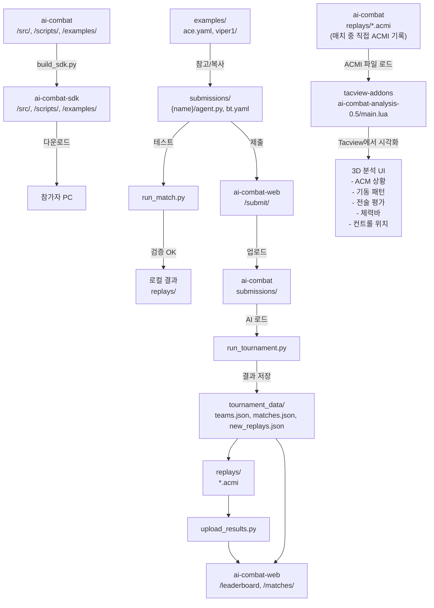
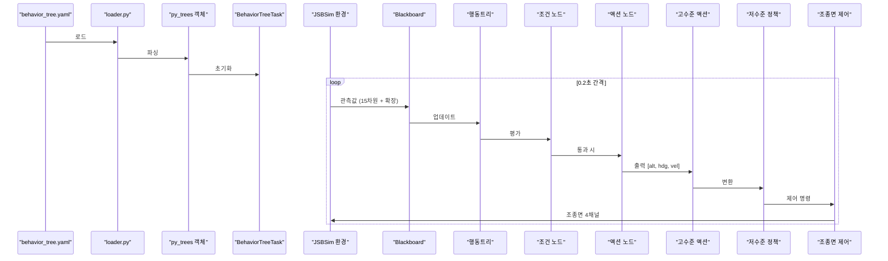
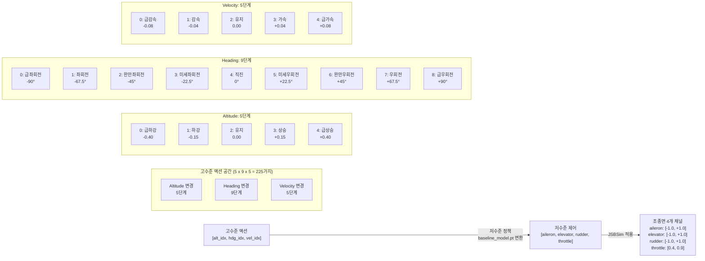
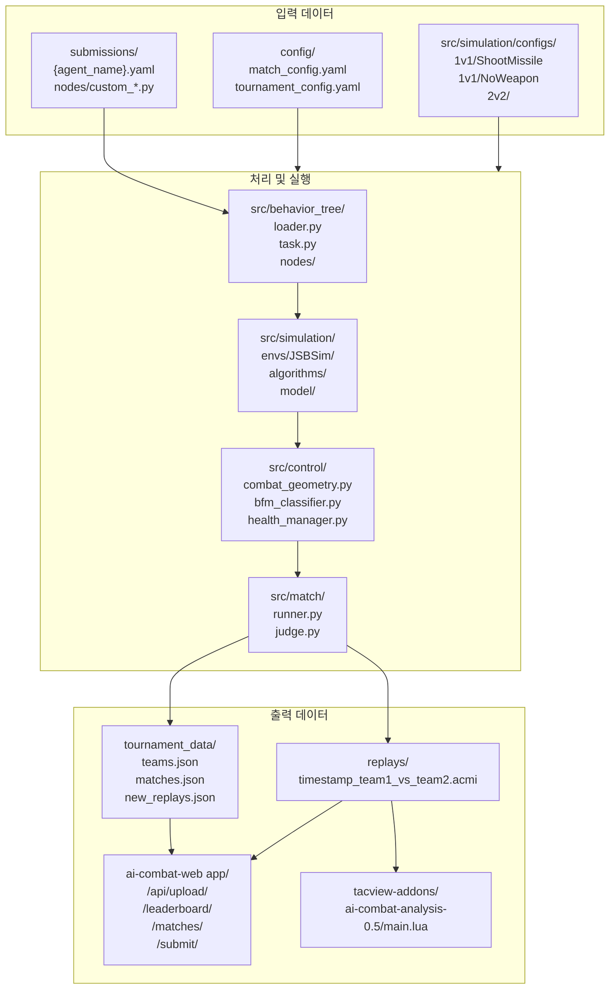
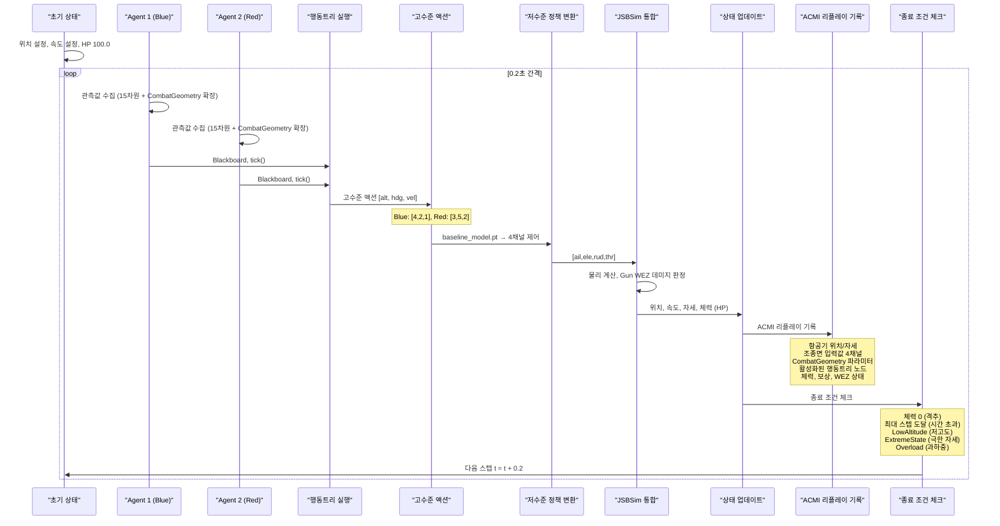
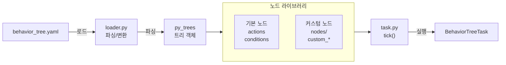
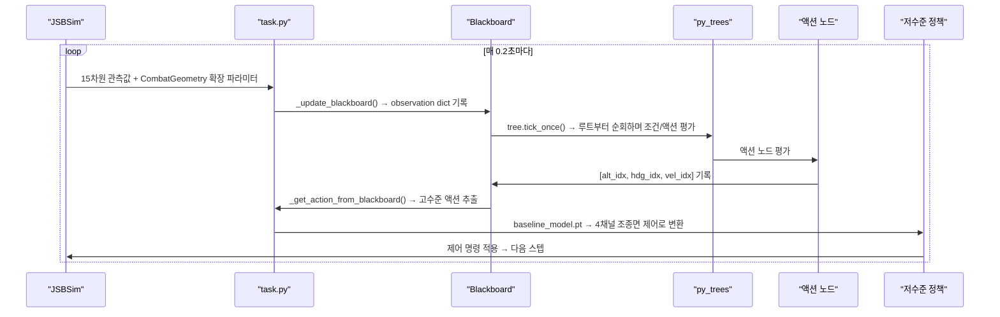

# AI Combat 프로젝트 전체 시스템 아키텍처

## 개요
AI Combat 프로젝트의 4개 핵심 워크스페이스에 있는 모든 구성 요소의 쓰임과 역할을 상세히 분석한 문서입니다.

---

## 1. ai-combat (메인 코어 시스템)

### 1.1 최상위 시스템 구조

#### **`src/`** - 핵심 소스 코드
- **`behavior_tree/`**: AI 의사결정 엔진
  - `nodes/`: 행동트리 기본 노드 (액션/조건)
  - `task.py`: BehaviorTreeTask 메인 클래스
  - `loader.py`: YAML 기반 트리 로더
- **`simulation/`**: JSBSim 기반 시뮬레이션 엔진 (1,049개 파일)
  - `envs/JSBSim/`: 핵심 시뮬레이션 환경
    - `core/`: 항공기 시뮬레이터 코어
    - `model/`: 기체 모델 및 RL 에이전트
    - `tasks/`: 단일 교전 태스크 정의
    - `configs/`: 시뮬레이션 시나리오 설정
      - `1v1/`: 1대1 교전 시나리오
        - `ShootMissile/`: 미사일 발사 교전
        - `DodgeMissile/`: 미사일 회피 교전  
        - `NoWeapon/`: 무기 없는 교전
      - `2v2/`: 2대2 팀 교전
    - `data/`: JSBSim 항공기 데이터
      - `aircraft/`: 다양한 항공기 모델 (F4N, B17, C130 등)
    - `reward_functions/`: 강화학습 보상 함수
    - `termination_conditions/`: 시뮬레이션 종료 조건
  - `algorithms/`: 강화학습 알고리즘
    - `ppo/`: Proximal Policy Optimization
    - `mappo/`: Multi-Agent PPO
    - `utils/`: 알고리즘 유틸리티
- **`control/`**: 비행 제어 및 전술 분석
  - `combat_geometry.py`: 공중전 기하학 계산
  - `bfm_classifier.py`: BFM 상황 분류기
- **`match/`**: 매치 관리 시스템
- **`tournament/`**: 토너먼트 운영
- **`submission/`**: AI 제출물 관리
- **`api/`**: 외부 API 인터페이스
- **`utils/`**: 공통 유틸리티

#### **`scripts/`** - 운영 자동화 스크립트
- `run_tournament.py`: 토너먼트 실행 엔진
- `run_match.py`: 단일 매치 실행
- `build_sdk.py`: SDK 빌드 및 배포
- `analyze_acmi.py`: 리플레이 분석
- `visualize_replay.py`: 리플레이 시각화
- `upload_results.py`: 결과 업로드
- `download_submissions.py`: 제출물 다운로드

#### **`examples/`** - 참가자 예제 코드
- `ace/`: 고급 AI 예제
- `viper1/`: 중급 AI 예제
- `eagle1/`: 기본 AI 예제
- `aggressive.yaml`, `defensive.yaml`: 전술 스타일 예제
- `simple.yaml`: 기본 행동트리 예제
- `matches.json`: 예제 매치 설정

#### **`config/`** - 시스템 설정
- 환경별 설정 파일들

#### **`custom_nodes/`** - 커스텀 행동트리 노드 예제
- 참가자들이 확장할 수 있는 노드 템플릿

#### **`docs/`** - 프로젝트 문서
- 구현 계획, 배포 가이드, 토너먼트 규칙 등

#### **`test/`** - 테스트 코드
- 단위 테스트 및 통합 테스트

#### **`build/`** - 빌드 결과물
- Cython 컴파일 결과
- `lib.win-amd64-cpython-310/`: Windows용 컴파일된 라이브러리

#### **데이터 폴더들**
- `replays/`: ACMI 리플레이 파일 저장소
- `reports/`: 분석 리포트
- `results/`: 시뮬레이션 결과
- `tournament_data/`: 토너먼트 데이터
- `screenshots/`: 스크린샷
- `tmp/`: 임시 파일
- `submissions/`: 제출된 AI 코드

---

## 2. ai-combat-sdk (참가자 배포용 SDK)

### 2.1 최상위 시스템 구조

#### **`src/`** - 핵심 소스 코드 (메인 시스템에서 추출)
- `behavior_tree/`: 행동트리 프레임워크
- `simulation/`: 필수 시뮬레이션 엔진
  - `envs/JSBSim/configs/`: 시뮬레이션 설정
    - `1v1/`, `2v2/`: 교전 시나리오
    - `data/`: JSBSim 항공기 데이터 (축약版)
- `control/`: 전술 분석 모듈
- `match/`: 매치 관리
- `tournament/`: 토너먼트 시스템 (소스 유지)
- `submission/`: 제출물 관리 (소스 유지)
- `api/`: API 인터페이스

#### **`scripts/`** - 참가자용 스크립트
- `run_match.py`: 로컬 매치 테스트
- `run_tournament.py`: 로컬 토너먼트 테스트
- `visualize_replay.py`: 리플레이 분석

#### **`examples/`** - 개발 예제
- AI 개발을 위한 템플릿 및 참고 코드

#### **`submissions/`** - 참가자 제출 폴더
- `{agent_name}/`: 각 참가자의 작업 공간
  - `agent.py`: AI 에이전트 코드
  - `behavior_tree.yaml`: 행동트리 정의
  - `nodes/`: 커스텀 노드 (선택)

#### **`config/`** - SDK 설정
- 참가자 환경 설정 파일

#### **`docs/`** - SDK 문서
- 개발 가이드 및 API 문서

#### **`tools/`** - 개발 도구
- AI 검증 및 테스트 유틸리티

---

## 3. ai-combat-web (웹 플랫폼)

### 3.1 최상위 시스템 구조

#### **`app/`** - Next.js App Router 애플리케이션
- **`page.tsx`**: 메인 대시보드
- **`layout.tsx`**: 전체 레이아웃
- **`globals.css`**: 전역 스타일
- **`api/`**: API 라우트
  - `upload/`: 파일 업로드 API
- **`leaderboard/`**: 리더보드 페이지
- **`matches/`**: 매치 기록 페이지
  - `[id]/`: 동적 매치 상세 페이지
- **`submit/`**: AI 제출 페이지
- **`rules/`**: 대회 규칙 페이지

#### **`components/`** - React 컴포넌트
- **`ui/`**: shadcn/ui 기본 컴포넌트
- 재사용 가능한 UI 컴포넌트들

#### **`lib/`** - 유틸리티 라이브러리
- API 클라이언트, 공용 함수 등

#### **`public/`** - 정적 에셋
- **`rules/`**: 규칙 관련 정적 파일
- 파비콘, 이미지 등

#### **`docs/`** - 웹 개발 문서

#### **`node_modules/`** - 의존성 패키지
- Next.js, React, TypeScript, TailwindCSS 등

---

## 4. tacview-addons (리플레이 분석 도구)

### 4.1 최상위 시스템 구조

#### **`ai-combat-analysis-0.5/`** - 활성화된 통합 애드온
- **`main.lua`**: 메인 애드온 소스 (13,554 lines)
- **`LuaStrict.lua`**: Lua 타입 검증
- **`textures/`**: 시각화 텍스처 에셋
- **`README.md`**: 애드온 사용 설명

#### **`archive/`** - 이전 버전 애드온 보관
- **`acm-analysis/`**: ACM 분석 애드온 (구버전)
- **`acm-control-position-blue/`**: 청팀 컨트롤 위치 표시
- **`acm-control-position-red/`**: 적팀 컨트롤 위치 표시
- **`acm-health-bar-blue/`**: 청팀 체력바
- **`acm-health-bar-red/`**: 적팀 체력바

#### **`docs-interface/`** - Tacview 인터페이스 문서
- 애드온 개발을 위한 API 문서

#### **`replays/`** - 테스트 리플레이 파일
- 애드온 테스트용 ACMI 파일들

#### **`screenshots/`** - 스크린샷
- 애드온 시연 및 문서용 이미지

#### **`테스트 데이터/`** - 한글 테스트 데이터
- 한국어 환경 테스트용 데이터

#### **`포토샵자료/`** - 디자인 소스
- UI 디자인 및 그래픽 소스 파일

#### **배포 스크립트**
- **`deploy-all.bat`**: 전체 애드온 배포 자동화
- **`update-version.bat`**: 버전 업데이트 스크립트
- **`obfuscate-lua.py`**: Lua 코드 난독화

---

## 5. 데이터 및 정보 흐름 도식화

### 5.1 전체 시스템 데이터 흐름

```
┌─────────────────────────────────────────────────────────────────────────┐
│                        AI Combat 전체 데이터 흐름                          │
└─────────────────────────────────────────────────────────────────────────┘

[1] SDK 배포 흐름
┌──────────────┐    build_sdk.py    ┌──────────────┐
│  ai-combat   │ ─────────────────> │ai-combat-sdk │
│   /src/      │                    │   /src/      │
│   /scripts/  │                    │   /scripts/  │
│   /examples/ │                    │   /examples/ │
└──────────────┘                    └──────────────┘
                                           │
                                           │ 다운로드
                                           ▼
                                    ┌──────────────┐
                                    │  참가자 PC   │
                                    └──────────────┘

[2] AI 개발 및 제출 흐름
┌──────────────┐    참고/복사    ┌──────────────┐    테스트    ┌──────────────┐
│   examples/  │ ────────────> │ submissions/ │ ──────────> │run_match.py  │
│  ace.yaml    │                │  {name}/     │              │              │
│  viper1/     │                │  agent.py    │              └──────────────┘
└──────────────┘                │  bt.yaml     │                     │
                                └──────────────┘                     │
                                       │                             │
                                       │ 제출                         │ 검증 OK
                                       ▼                             ▼
                                ┌──────────────┐              ┌──────────────┐
                                │ai-combat-web │              │   로컬 결과   │
                                │  /submit/    │              │   replays/   │
                                └──────────────┘              └──────────────┘
                                       │
                                       │ 업로드
                                       ▼
                                ┌──────────────┐
                                │  ai-combat   │
                                │ submissions/ │
                                └──────────────┘

[3] 토너먼트 실행 흐름
┌──────────────┐                ┌──────────────┐                ┌──────────────────┐
│ submissions/ │ ─────────────> │run_tournament│ ─────────────> │ tournament_data/  │
│  agent1/     │   AI 로드       │    .py       │   결과 저장     │  teams.json       │
│  agent2/     │                │              │                │  matches.json     │
│  agent3/     │                └──────────────┘                │  new_replays.json │
└──────────────┘                       │                        └──────────────────┘
                                       │                               │
                                       ▼                               ▼
                                ┌──────────────┐                ┌──────────────┐
                                │   replays/   │                │upload_results│
                                │  *.acmi      │                │    .py       │
                                └──────────────┘                └──────────────┘
                                       │                               │
                                       │                               │
                                       └───────────┬───────────────────┘
                                                   │
                                                   ▼
                                            ┌──────────────┐
                                            │ai-combat-web │
                                            │ /leaderboard │
                                            │  /matches/   │
                                            └──────────────┘

[4] 리플레이 분석 흐름
┌──────────────────┐                                    ┌──────────────────┐
│ [ai-combat]      │                                    │ [tacview-addons] │
│ replays/         │ ── ACMI 파일 로드 ──────────────> │ ai-combat-       │
│  *.acmi          │                                    │  analysis-0.5/   │
│ (매치 중 직접    │                                    │  main.lua        │
│  ACMI 기록)      │                                    └──────────────────┘
└──────────────────┘                                           │
                                                               │ Tacview에서 시각화
                                                               ▼
                                                        ┌──────────────┐
                                                        │  3D 분석 UI  │
                                                        │ - ACM 상황   │
                                                        │ - 기동 패턴  │
                                                        │ - 전술 평가  │
                                                        │ - 체력바     │
                                                        │ - 컨트롤 위치│
                                                        └──────────────┘
```



### 5.2 행동트리 실행 데이터 흐름

```
┌─────────────────────────────────────────────────────────────────────────┐
│                    행동트리 → 시뮬레이션 실행 흐름                          │
└─────────────────────────────────────────────────────────────────────────┘

[단계 1] 초기화
┌──────────────┐    로드        ┌──────────────┐    파싱       ┌──────────────┐
│ behavior_    │ ────────────> │    loader    │ ───────────> │  py_trees    │
│  tree.yaml   │                │    .py       │               │   객체       │
└──────────────┘                └──────────────┘               └──────────────┘
                                                                      │
                                                                      │ 초기화
                                                                      ▼
                                                               ┌──────────────┐
                                                               │BehaviorTree  │
                                                               │    Task      │
                                                               └──────────────┘

[단계 2] 실시간 실행 루프 (0.2초 간격)
┌──────────────┐    관측        ┌──────────────┐    업데이트    ┌──────────────┐
│  JSBSim 환경 │ ────────────> │  Blackboard  │ ───────────> │  행동트리    │
│ (항공기 상태)│                │  - /Distance │               │   tick()     │
│  - 위치      │                │  - /Speed    │               └──────────────┘
│  - 속도      │                │  - /Energy   │                      │
│  - 자세      │                │  - /LOS      │                      │ 평가
└──────────────┘                └──────────────┘                      ▼
      ▲                                                         ┌──────────────┐
      │                                                         │ 조건 노드    │
      │                                                         │ - 거리 체크  │
      │                                                         │ - 에너지 체크│
      │                                                         └──────────────┘
      │                                                                │
      │                                                                │ 통과
      │                                                                ▼
      │                                                         ┌──────────────┐
      │                                                         │ 액션 노드    │
      │                                                         │ - Climb      │
      │                                                         │ - Turn       │
      │                                                         │ - Attack     │
      │                                                         └──────────────┘
      │                                                                │
      │                                                                │ 출력
      │                                                                ▼
      │                                                         ┌──────────────┐
      │                                                         │ 고수준 액션  │
      │                                                         │ [alt, hdg,   │
      │                                                         │  vel]        │
      │                                                         └──────────────┘
      │                                                                │
      │                                                                │ 변환
      │                                                                ▼
      │                                                         ┌──────────────┐
      │                                                         │저수준 정책   │
      │                                                         │(RL 학습된    │
      │                                                         │ baseline)    │
      │                                                         └──────────────┘
      │                                                                │
      │                                                                │ 제어 명령
      │                                                                ▼
      └────────────────────────────────────────────────────────┌──────────────┐
                                                               │ 조종면 제어  │
                                                               │ (4개 채널)   │
                                                               │ - 에일러론   │
                                                               │ - 엘리베이터 │
                                                               │ - 러더       │
                                                               │ - 스로틀     │
                                                               └──────────────┘
```



### 5.3 관측값 상세 (15차원 정규화 벡터 + 확장 파라미터)

```
┌─────────────────────────────────────────────────────────────────────────┐
│                    관측값 (Observation) 상세 구성                         │
└─────────────────────────────────────────────────────────────────────────┘

[기본 관측값: 15차원 정규화 벡터]
┌─────────────────────────────────────────────────────────────────────────┐
│ 인덱스 │ 변수명              │ 설명                │ 정규화 단위       │
├────────┼─────────────────────┼─────────────────────┼───────────────────┤
│  [0]   │ ego_altitude        │ 자기 고도           │ / 5000 (5km)      │
│  [1]   │ ego_roll_sin        │ 롤 각도 sin         │ sin(roll_rad)     │
│  [2]   │ ego_roll_cos        │ 롤 각도 cos         │ cos(roll_rad)     │
│  [3]   │ ego_pitch_sin       │ 피치 각도 sin       │ sin(pitch_rad)    │
│  [4]   │ ego_pitch_cos       │ 피치 각도 cos       │ cos(pitch_rad)    │
│  [5]   │ ego_v_body_x        │ 기체 X축 속도       │ / 340 (마하)      │
│  [6]   │ ego_v_body_y        │ 기체 Y축 속도       │ / 340 (마하)      │
│  [7]   │ ego_v_body_z        │ 기체 Z축 속도       │ / 340 (마하)      │
│  [8]   │ ego_vc              │ 교정 대기속도       │ / 340 (마하)      │
│  [9]   │ delta_v_body_x      │ 적과의 속도 차이    │ / 340 (마하)      │
│  [10]  │ delta_altitude      │ 적과의 고도 차이    │ / 1000 (km)       │
│  [11]  │ ego_AO              │ Aspect Angle        │ rad [0, pi]       │
│  [12]  │ ego_TA              │ Tail Angle          │ rad [0, pi]       │
│  [13]  │ relative_distance   │ 적과의 거리         │ / 10000 (10km)    │
│  [14]  │ side_flag           │ 적의 좌우 방향      │ -1, 0, 1          │
└─────────────────────────────────────────────────────────────────────────┘

[확장 파라미터: CombatGeometry 기반 Blackboard 키]
┌─────────────────────────────────────────────────────────────────────────┐
│ Blackboard 키       │ 설명                        │ 단위/범위         │
├─────────────────────┼─────────────────────────────┼───────────────────┤
│ /Distance           │ 적과의 거리                 │ m                 │
│ /Speed              │ 자기 속도                   │ m/s               │
│ /CurrentRoll        │ 현재 롤 각도                │ deg               │
│ /CurrentPitch       │ 현재 피치 각도              │ deg               │
│ /MyLOSAngle         │ 시선각 (LOS)                │ deg (절대값)      │
│ /EnemyLOSAngle      │ 적 시선각                   │ deg               │
│ /TurnLeft           │ 좌선회 여부                 │ bool              │
│ /TurnRight          │ 우선회 여부                 │ bool              │
│ /ClosureRate        │ 접근률                      │ m/s               │
│ /TurnRate           │ 선회율                      │ deg/s             │
│ /In39Line           │ 3-9 Line 내 위치 여부       │ bool              │
│ /OvershootRisk      │ 오버슈트 위험               │ bool              │
│ /TCType             │ 추적 곡선 유형              │ str (lead/lag/..) │
│ /EnergyAdvantage    │ 에너지 우세 여부            │ bool              │
│ /EnergyDiff         │ 에너지 차이                 │ float             │
│ /AltAdvantage       │ 고도 우세 여부              │ bool              │
│ /SpdAdvantage       │ 속도 우세 여부              │ bool              │
│ /MergeDistance      │ 교전 거리                   │ m                 │
│ /Superior           │ 전술적 우세 (에너지+3-9)    │ bool              │
│ /EnergyState        │ 에너지 상태                 │ bool              │
│ bfm_situation       │ BFM 상황 분류               │ OBFM/DBFM/HABFM  │
└─────────────────────────────────────────────────────────────────────────┘
```

### 5.4 선택 가능한 고수준 액션

```
┌─────────────────────────────────────────────────────────────────────────┐
│                    고수준 액션 공간 (5 x 9 x 5 = 225가지)                │
└─────────────────────────────────────────────────────────────────────────┘

[Altitude 변경: 5단계]
┌───────┬──────────────┬────────────────┐
│ 인덱스 │ 설명         │ 정규화 값      │
├───────┼──────────────┼────────────────┤
│   0   │ 급하강       │ -0.40          │
│   1   │ 하강         │ -0.15          │
│   2   │ 유지         │  0.00          │
│   3   │ 상승         │ +0.15          │
│   4   │ 급상승       │ +0.40          │
└───────┴──────────────┴────────────────┘

[Heading 변경: 9단계]
┌───────┬──────────────┬────────────────┐
│ 인덱스 │ 설명         │ 정규화 값(rad) │
├───────┼──────────────┼────────────────┤
│   0   │ 급좌회전     │ -π/2 (-90°)    │
│   1   │ 좌회전       │ -3π/8 (-67.5°) │
│   2   │ 완만좌회전   │ -π/4 (-45°)    │
│   3   │ 미세좌회전   │ -π/8 (-22.5°)  │
│   4   │ 직진         │  0             │
│   5   │ 미세우회전   │ +π/8 (+22.5°)  │
│   6   │ 완만우회전   │ +π/4 (+45°)    │
│   7   │ 우회전       │ +3π/8 (+67.5°) │
│   8   │ 급우회전     │ +π/2 (+90°)    │
└───────┴──────────────┴────────────────┘

[Velocity 변경: 5단계]
┌───────┬──────────────┬────────────────┐
│ 인덱스 │ 설명         │ 정규화 값      │
├───────┼──────────────┼────────────────┤
│   0   │ 급감속       │ -0.08          │
│   1   │ 감속         │ -0.04          │
│   2   │ 유지         │  0.00          │
│   3   │ 가속         │ +0.04          │
│   4   │ 급가속       │ +0.08          │
└───────┴──────────────┴────────────────┘

고수준 액션 [alt_idx, hdg_idx, vel_idx]
        │
        ▼ 저수준 정책 (baseline_model.pt)이 변환
저수준 제어 [aileron, elevator, rudder, throttle]
        │
        ▼ JSBSim에 적용
조종면 4개 채널:
  - aileron  (에일러론)  : [-1.0, +1.0] 롤 제어
  - elevator (엘리베이터): [-1.0, +1.0] 피치 제어
  - rudder   (러더)      : [-1.0, +1.0] 요 제어
  - throttle (스로틀)    : [0.4, 0.9]   추력 제어
```



> **(선택) Classical PD 제어 경로 (2026-06)**: `AICOMBAT_CONTROLLER=classical` 설정 시,
> 위 `baseline_model.pt`(RNN) 변환 대신 `src/control/classical_controller.py`의 stateless PD가
> 조종면을 직접 생성한다 (RNN 완전 우회). BT 노드가 `set_maneuver()`로 연속 maneuver(6타입)를
> 출력하면 `src/behavior_tree/maneuvers.py`를 거쳐 격자(5×9×5)를 우회해 정밀 추종한다.
> 기본값(`nn`)에서는 위 RNN 경로가 그대로다(후방호환). 상세: [bt_to_jsbsim_control_flow.md](bt_to_jsbsim_control_flow.md) §4-4, [제어기정리.md](제어기정리.md) Slide 3.

### 5.5 폴더별 데이터 입출력

```
┌─────────────────────────────────────────────────────────────────────────┐
│                         폴더별 데이터 입출력 관계                          │
│                      (상위 저장소별 구분 표기)                             │
└─────────────────────────────────────────────────────────────────────────┘

[입력 데이터]
[ai-combat] config/                       → 시스템 설정 (환경 변수, 경로)
  ├─ match_config.yaml                    → 매치 설정 (라운드, 시나리오, 최대 스텝)
  └─ tournament_config.yaml               → 토너먼트 규칙 (경로, 매치 설정)

[ai-combat] src/simulation/configs/       → 시나리오 설정
  ├─ 1v1/ShootMissile/                    → 미사일 교전 시나리오
  ├─ 1v1/NoWeapon/                        → 무기 없는 교전
  └─ 2v2/                                 → 팀 전투

[ai-combat] submissions/                  → AI 코드
[ai-combat-sdk] submissions/              → 참가자 로컬 AI 코드
  └─ {agent_name}/
      ├─ {agent_name}.yaml                → 행동트리 정의
      └─ nodes/                           → 커스텀 노드 (선택)

[처리 및 실행]
[ai-combat] src/behavior_tree/            → 행동트리 엔진
  ├─ loader.py                            → YAML → py_trees 변환
  ├─ task.py                              → 실행 루프 (Blackboard 관리)
  └─ nodes/                               → 기본 노드 라이브러리

[ai-combat] src/simulation/               → 시뮬레이션 실행
  ├─ envs/JSBSim/                         → JSBSim 물리 엔진
  ├─ algorithms/                          → RL 알고리즘 (PPO, MAPPO)
  └─ model/                               → 학습된 저수준 정책 모델

[ai-combat] src/control/                  → 전술 분석
  ├─ combat_geometry.py                   → 기하학 계산 (ATA, AA, HCA, TAU)
  ├─ bfm_classifier.py                    → BFM 상황 분류
  └─ health_manager.py                    → 체력 관리 (Gun WEZ 데미지)

[ai-combat] src/match/                    → 매치 실행
  ├─ runner.py                            → BehaviorTreeMatch 실행기
  └─ judge.py                             → 승패 판정 (체력 0, 시간 초과)

[출력 데이터]
[ai-combat] tournament_data/              → 토너먼트 영속 데이터
  ├─ teams.json                           → 등록된 팀 정보
  ├─ matches.json                         → 매치 기록 및 결과
  └─ new_replays.json                     → 신규 리플레이 파일 목록

[ai-combat] replays/                      → 리플레이 파일
  └─ {timestamp}_{team1}_vs_{team2}.acmi  → Tacview ACMI 리플레이

[ai-combat-web] app/                      → 웹 플랫폼
  ├─ /api/upload/                         ← AI 코드 업로드 API
  ├─ /leaderboard/                        ← tournament_data/ 기반 순위표
  ├─ /matches/                            ← matches.json + replays/ 매치 기록
  └─ /submit/                             → submissions/ 제출 인터페이스

[tacview-addons] ai-combat-analysis-0.5/  → 리플레이 시각화
  └─ main.lua                             ← replays/*.acmi 로드하여 분석
```



### 5.6 실시간 데이터 흐름 (매치 실행 중)

```
┌─────────────────────────────────────────────────────────────────────────┐
│                      매치 실행 중 실시간 데이터 흐름                        │
└─────────────────────────────────────────────────────────────────────────┘

시간 t=0.0초
┌──────────────┐
│  초기 상태   │
│ - 위치 설정  │
│ - 속도 설정  │
│ - HP 100.0   │
└──────────────┘
       │
       ▼
┌──────────────────────────────────────────────────────────────────┐
│                    0.2초 간격 실행 루프                           │
└──────────────────────────────────────────────────────────────────┘

[Agent 1 (Blue)]                       [Agent 2 (Red)]
┌──────────────────────┐               ┌──────────────────────┐
│ 관측값 수집 (15차원) │               │ 관측값 수집 (15차원) │
│ [0] 자기 고도/5000   │               │ [0] 자기 고도/5000   │
│ [1-4] 롤/피치 sin,cos│               │ [1-4] 롤/피치 sin,cos│
│ [5-8] 속도 벡터/340  │               │ [5-8] 속도 벡터/340  │
│ [9] 속도 차이/340    │               │ [9] 속도 차이/340    │
│ [10] 고도 차이/1000  │               │ [10] 고도 차이/1000  │
│ [11] Aspect Angle    │               │ [11] Aspect Angle    │
│ [12] Tail Angle      │               │ [12] Tail Angle      │
│ [13] 거리/10000      │               │ [13] 거리/10000      │
│ [14] 좌우 방향 플래그│               │ [14] 좌우 방향 플래그│
│ + CombatGeometry     │               │ + CombatGeometry     │
│   확장 파라미터      │               │   확장 파라미터      │
└──────────────────────┘               └──────────────────────┘
       │                                      │
       ▼                                      ▼
┌──────────────┐                       ┌──────────────┐
│ 행동트리 실행│                       │ 행동트리 실행│
│ - Blackboard │                       │ - Blackboard │
│ - tick()     │                       │ - tick()     │
└──────────────┘                       └──────────────┘
       │                                      │
       ▼                                      ▼
┌──────────────┐                       ┌──────────────┐
│ 고수준 액션  │                       │ 고수준 액션  │
│ [alt, hdg,   │                       │ [alt, hdg,   │
│  vel]        │                       │  vel]        │
│ 예: [4,2,1]  │                       │ 예: [3,5,2]  │
└──────────────┘                       └──────────────┘
       │                                      │
       └──────────────┬───────────────────────┘
                      │
                      ▼
               ┌──────────────────┐
               │ 저수준 정책 변환 │
               │ baseline_model.pt│
               │ → 4채널 제어     │
               │ [ail,ele,rud,thr]│
               └──────────────────┘
                      │
                      ▼
               ┌──────────────┐
               │ JSBSim 통합  │
               │ - 물리 계산  │
               │ - Gun WEZ    │
               │   데미지 판정│
               └──────────────┘
                      │
                      ▼
               ┌──────────────┐
               │ 상태 업데이트│
               │ - 위치       │
               │ - 속도       │
               │ - 자세       │
               │ - 체력 (HP)  │
               └──────────────┘
                      │
                      ├──────────────> ACMI 리플레이 기록
                      │                (replays/*.acmi에 직접 기록)
                      │                - 항공기 위치/자세
                      │                - 조종면 입력값 4채널
                      │                - CombatGeometry 파라미터
                      │                - 활성화된 행동트리 노드
                      │                - 체력, 보상, WEZ 상태
                      │
                      ├──────────────> 종료 조건 체크
                      │                - 체력 0 (격추)
                      │                - 최대 스텝 도달 (시간 초과)
                      │                - LowAltitude (저고도)
                      │                - ExtremeState (극한 자세)
                      │                - Overload (과하중)
                      │
                      ▼
               ┌──────────────┐
               │ 다음 스텝    │
               │ t = t + 0.2  │
               └──────────────┘
                      │
                      └──────> 루프 반복 또는 종료
```



---

## 6. 특수 폴더의 역할

### 6.1 빌드 관련
- **`build/`**: Cython 컴파일 결과 저장
- **`__pycache__/`**: Python 바이트코드 캐시
- **`.venv/`**: 가상환경

### 6.2 임시 및 작업
- **`tmp/`**: 임시 파일 저장
- **`screenshots/`**: 스크린샷 보관

---

## 7. 시스템 아키텍처의 설계 원칙

### 7.1 모듈화
- 각 기능 모듈이 독립적인 폴더 구조
- 명확한 책임 분리

### 7.2 확장성
- `submissions/`, `custom_nodes/`: 참가자 확장 공간
- 버전 관리 및 롤백 지원

### 7.3 자동화
- `scripts/`: 대부분의 운영 작업 자동화
- `tools/`: 개발 및 배포 도구

### 7.4 문서화
- `docs/`: 각 모듈별 상세 문서
- `README.md`: 각 폴더의 사용법 설명

---

## 결론

AI Combat 프로젝트의 시스템 아키텍처는 명확한 기능 분리와 모듈화를 통해 유지보수성과 확장성을 확보했습니다. 각 구성 요소는 특정 목적을 가지며, 전체 시스템의 효율적인 운영을 지원합니다. 참가자에게는 직관적인 개발 환경을, 운영자에게는 자동화된 관리 도구를 제공하는 설계입니다.

---

# Part 2: 행동트리 개발 종합 튜토리얼

## 8. 행동트리 시스템 개요

### 8.1 핵심 아키텍처

AI Combat의 행동트리는 `py_trees` 라이브러리 기반으로, YAML 파일에서 트리 구조를 정의하고 Python 클래스로 실행됩니다.

```
┌─────────────────────────────────────────────────────────────────────────┐
│                    행동트리 시스템 핵심 구성요소                            │
└─────────────────────────────────────────────────────────────────────────┘

[YAML 파일]                    [Python 모듈]                [실행 엔진]
┌──────────────┐    loader.py   ┌──────────────┐    task.py  ┌──────────────┐
│ behavior_    │ ─────────────> │  py_trees    │ ─────────> │BehaviorTree  │
│  tree.yaml   │    파싱/변환    │  트리 객체    │   tick()    │    Task      │
└──────────────┘                └──────────────┘             └──────────────┘
                                       │
                                ┌──────┴──────┐
                                │             │
                          ┌──────────┐  ┌──────────┐
                          │ 기본 노드 │  │커스텀 노드│
                          │ actions  │  │ nodes/   │
                          │conditions│  │custom_*  │
                          └──────────┘  └──────────┘
```



### 8.2 핵심 파일 역할

| 파일 | 위치 | 역할 |
|------|------|------|
| `loader.py` | `src/behavior_tree/` | YAML → py_trees 트리 변환, 커스텀 노드 자동 로드 |
| `task.py` | `src/behavior_tree/` | Blackboard 업데이트, 트리 tick, 고수준 액션 추출 |
| `actions.py` | `src/behavior_tree/nodes/` | 기본 제공 액션 노드 (26종) |
| `conditions.py` | `src/behavior_tree/nodes/` | 기본 제공 조건 노드 (37종) |

### 8.3 실행 흐름 상세

```
매 0.2초마다:
1. JSBSim → 15차원 관측값 + CombatGeometry 확장 파라미터 수집
2. task.py._update_blackboard() → Blackboard에 observation dict 기록
3. tree.tick_once() → 루트부터 순회하며 조건/액션 평가
4. 액션 노드 → Blackboard에 [alt_idx, hdg_idx, vel_idx] 기록
5. task.py._get_action_from_blackboard() → 고수준 액션 추출
6. 저수준 정책(baseline_model.pt) → 4채널 조종면 제어로 변환
7. JSBSim에 적용 → 다음 스텝
```



---

## 9. YAML 행동트리 작성 가이드

### 9.1 YAML 기본 구조

```yaml
# 메타데이터 (선택)
name: "my_agent"
version: "1.0.0"
description: "에이전트 설명"

# 행동트리 정의 (필수)
tree:                          # 또는 root: (하위 호환)
  type: Selector               # 루트 노드 타입
  name: "Root"                 # 노드 이름 (선택)
  children:                    # 자식 노드 목록
    - type: Sequence
      children:
        - type: Condition
          name: ConditionClassName
          params:              # 생성자 파라미터 (선택)
            threshold: 1000
        - type: Action
          name: ActionClassName
          params:
            target_altitude: 2000
```

### 9.2 노드 타입 4종

| 타입 | YAML `type` | 역할 | 자식 노드 |
|------|-------------|------|-----------|
| **Selector** | `Selector` | 자식 중 하나라도 SUCCESS면 SUCCESS (OR 논리) | 필수 |
| **Sequence** | `Sequence` | 모든 자식이 SUCCESS여야 SUCCESS (AND 논리) | 필수 |
| **Parallel** | `Parallel` | 자식을 동시 실행 (정책 지정) | 필수 |
| **Condition** | `Condition` | 상태 확인 (SUCCESS/FAILURE 반환) | 없음 |
| **Action** | `Action` | 행동 실행 (Blackboard에 액션 기록) | 없음 |

### 9.3 Parallel 노드 정책

```yaml
- type: Parallel
  name: "PursueAndAccelerate"
  params:
    policy: "SuccessOnOne"    # 하나만 성공해도 OK
  children:
    - type: Action
      name: Pursue
    - type: Action
      name: Accelerate
```

| 정책 | 설명 |
|------|------|
| `SuccessOnAll` | 모든 자식이 SUCCESS여야 SUCCESS (기본값) |
| `SuccessOnOne` | 하나라도 SUCCESS면 SUCCESS |

### 9.4 설계 패턴: 우선순위 기반 Selector

가장 일반적인 패턴으로, 우선순위가 높은 행동부터 평가합니다.

```yaml
tree:
  type: Selector
  children:
    # 최우선: 생존 (Hard Deck 회피)
    - type: Sequence
      children:
        - type: Condition
          name: BelowHardDeck
        - type: Action
          name: ClimbTo
          params:
            target_altitude: 2000

    # 2순위: 방어 (위협 대응)
    - type: Sequence
      children:
        - type: Condition
          name: UnderThreat
          params:
            aa_threshold: 120.0
        - type: Action
          name: DefensiveManeuver

    # 3순위: 공격 (유리한 상황)
    - type: Sequence
      children:
        - type: Condition
          name: DistanceBelow
          params:
            threshold: 2000
        - type: Action
          name: LeadPursuit

    # 최하위: 기본 행동
    - type: Action
      name: Pursue
```

### 9.5 예제별 난이도 및 특징

| 예제 | 파일 | 난이도 | 커스텀 노드 | 핵심 전략 |
|------|------|--------|-------------|-----------|
| **simple** | `examples/simple.yaml` | ★☆☆☆☆ | 없음 | Hard Deck 회피 + 기본 추적 |
| **eagle1** | `examples/eagle1/eagle1.yaml` | ★★☆☆☆ | 없음 | 균형 방어/공격, 고도 우위 |
| **aggressive** | `examples/aggressive.yaml` | ★★★☆☆ | 없음 | 거리별 공격 전략, Parallel 활용 |
| **defensive** | `examples/defensive.yaml` | ★★★☆☆ | 없음 | AA 기반 위협 감지, 방어 우선 |
| **viper1** | `examples/viper1/viper1.yaml` | ★★★★☆ | 있음 | TAU 기반 커스텀 공격, 에너지 관리 |
| **ace** | `examples/ace.yaml` | ★★★★★ | 없음 | BFM 상황 인식, Gun WEZ 최적화 |

---

## 10. 기본 제공 노드 레퍼런스

### 10.1 조건 노드 (Condition) - 37종

조건 노드는 `py_trees.behaviour.Behaviour`를 상속하며, `update()` 메서드에서 `SUCCESS` 또는 `FAILURE`를 반환합니다.

#### 거리/위치 조건

| 노드명 | 파라미터 | 설명 |
|--------|----------|------|
| `EnemyInRange` | `max_distance: float = 5000` | 적이 지정 거리(m) 내에 있는지 |
| `DistanceBelow` | `threshold: float = 3000` | 적과의 거리가 임계값 미만인지 |
| `DistanceAbove` | `threshold: float = 2000` | 적과의 거리가 임계값 초과인지 |
| `BelowHardDeck` | `threshold: float = 1000` | 고도가 Hard Deck 미만인지 (위험) |

#### 고도/속도 조건

| 노드명 | 파라미터 | 설명 |
|--------|----------|------|
| `AltitudeAbove` | `min_altitude: float = 3000` | 고도가 지정값 이상인지 |
| `AltitudeBelow` | `min_altitude: float = 1000` | 고도가 지정값 이하인지 |
| `SpeedAbove` | `min_speed: float = 200` | 속도(m/s)가 지정값 이상인지 |
| `VelocityAbove` | `min_velocity: float = 200` | SpeedAbove의 별칭 |
| `VelocityBelow` | `max_velocity: float = 400` | 속도가 지정값 이하인지 |

#### 각도/방위 조건

| 노드명 | 파라미터 | 설명 |
|--------|----------|------|
| `EnemyBehind` | `ta_threshold: float = 2.0` | 적이 후방에 있는지 (TA 기준, rad) |
| `EnemyInFront` | `ao_threshold: float = 0.5` | 적이 전방에 있는지 (AO 기준, rad) |
| `ATAAbove` | `threshold: float = 60` | ATA가 임계값(도) 이상인지 |
| `ATABelow` | `threshold: float = 30` | ATA가 임계값(도) 미만인지 |
| `RelativeBearingAbove` | `threshold: float = 30` | 상대 방위각이 임계값(도) 이상인지 |
| `LOSAbove` | `threshold: float = 15` | LOS 각도가 임계값(도) 이상인지 |
| `LOSBelow` | `threshold: float = 15` | LOS 각도가 임계값(도) 미만인지 |

#### 위협/전술 조건

| 노드명 | 파라미터 | 설명 |
|--------|----------|------|
| `UnderThreat` | `aa_threshold: float = 120.0` | AA 기반 위협 상황 (AA > 임계값 = 위험) |
| `InEnemyWEZ` | `max_distance: float = 3000, max_los_angle: float = 30` | 적 무기 사거리 내인지 |
| `IsOvershootRisk` | (없음) | 오버슈트 위험 여부 (/OvershootRisk BB 키) |
| `Is39Line` | (없음) | 적이 3-9 라인 내인지 (ATA < 90°) |
| `IsTargetInSight` | (없음) | 적이 시야 내인지 (/In39Line 근사) |

#### BFM 상황 조건

| 노드명 | 파라미터 | 설명 |
|--------|----------|------|
| `IsOffensiveSituation` | (없음) | OBFM (공격 BFM) 상황인지 |
| `IsDefensiveSituation` | (없음) | DBFM (방어 BFM) 상황인지 |
| `IsNeutralSituation` | (없음) | HABFM (정면/고측면 BFM) 상황인지 |

#### 에너지/우위 조건

| 노드명 | 파라미터 | 설명 |
|--------|----------|------|
| `EnergyHigh` | (없음) | 에너지 상태가 높은지 (/EnergyState BB 키) |
| `EnergyHighPs` | `threshold: float = 0.0` | Ps(Specific Excess Power) > 임계값인지 |
| `SpecificEnergyAbove` | `threshold: float = 5000` | He(비에너지) ≥ 임계값인지 |
| `IsEnergyAdvantage` | (없음) | 에너지 우세 여부 (/EnergyAdvantage BB 키) |
| `EnergyDiffAbove` | `threshold: float = 500.0` | 에너지 차이가 임계값 이상인지 |
| `IsAltAdvantage` | (없음) | 고도 우세 여부 |
| `IsSpdAdvantage` | (없음) | 속도 우세 여부 |
| `HasSuperior` | (없음) | 전술적 우세 (에너지 + 3-9 라인) |
| `NotSuperior` | (없음) | 전술적 우세가 아닌지 |

#### 기동 상태 조건

| 노드명 | 파라미터 | 설명 |
|--------|----------|------|
| `IsVerticalMove` | `threshold: float = 15.0` | 수직 기동 중인지 (피치 > 임계값) |
| `IsNotVerticalMove` | `threshold: float = 15.0` | 수직 기동 중이 아닌지 |
| `IsTurningRight` | (없음) | 우회전 중인지 |
| `IsTurningLeft` | (없음) | 좌회전 중인지 |
| `TurnLeft` | (없음) | 좌회전 필요 여부 (/TurnLeft BB 키) |
| `IsMerged` | `merge_threshold: float = 500.0` | Merge 상태인지 (근접 교차) |

#### 선회/접근 조건

| 노드명 | 파라미터 | 설명 |
|--------|----------|------|
| `ClosureRateAbove` | `threshold: float = 50.0` | 접근 속도(m/s) > 임계값인지 |
| `ClosureRateBelow` | `threshold: float = 0.0` | 접근 속도 < 임계값인지 (멀어짐 감지) |
| `TurnRateAbove` | `threshold: float = 5.0` | 선회율(°/s) > 임계값인지 |
| `IsOneCircle` | (없음) | 1-circle 선회 상황인지 (HCA < 90°) |
| `IsTwoCircle` | (없음) | 2-circle 선회 상황인지 (HCA > 90°) |

### 10.2 액션 노드 (Action) - 26종

액션 노드는 `BaseAction`을 상속하며, `update()` 메서드에서 `set_action(alt_idx, hdg_idx, vel_idx)`를 호출하여 고수준 명령을 설정합니다.

#### 고수준 액션 공간 (5 × 9 × 5 = 225가지)

```
delta_altitude_idx (5단계):
  0=급하강(-0.40), 1=하강(-0.15), 2=유지(0.00), 3=상승(+0.15), 4=급상승(+0.40)

delta_heading_idx (9단계):
  0=급좌(-90°), 1=강좌, 2=중좌, 3=약좌, 4=직진, 5=약우, 6=중우, 7=강우, 8=급우(+90°)

delta_velocity_idx (5단계):
  0=급감속(-0.08), 1=감속(-0.04), 2=유지(0.00), 3=가속(+0.04), 4=급가속(+0.08)
```

#### 기본 기동 노드

| 노드명 | 파라미터 | 설명 | 출력 예시 |
|--------|----------|------|-----------|
| `Pursue` | `close_range, far_range, bearing_*, ata_*` 등 12개 | 적 추적 (거리/방위/ATA 기반) | 상황 적응형 |
| `Evade` | (없음) | 적 반대 방향 선회 회피 | `[2, 1/7, 3]` |
| `ClimbTo` | `target_altitude: float = 6000` | 목표 고도로 상승 | `[3~4, 4, 2]` |
| `DescendTo` | `target_altitude: float = 4000` | 목표 고도로 하강 | `[0~1, 4, 2]` |
| `MaintainAltitude` | (없음) | 고도/방향/속도 모두 유지 | `[2, 4, 2]` |
| `Accelerate` | (없음) | 급가속 | `[2, 4, 4]` |
| `Decelerate` | (없음) | 급감속 | `[2, 4, 0]` |
| `TurnLeft` | `intensity: str = "normal"` | 좌회전 (normal/hard) | `[2, 0/2, 2]` |
| `TurnRight` | `intensity: str = "normal"` | 우회전 (normal/hard) | `[2, 6/8, 2]` |
| `Straight` | (없음) | 직진 | `[2, 4, 2]` |

#### 전술 추적 노드

| 노드명 | 파라미터 | 설명 |
|--------|----------|------|
| `LeadPursuit` | (없음) | 예측 미래 위치 추적 (UE4 clamp(ATA×0.01) 수식 반영) |
| `LagPursuit` | (없음) | TAU 기반 후방 추적 (오버슈트 방지, 에너지 우위) |
| `PurePursuit` | (없음) | 적 현재 위치 직접 추적 (ATA→0 유지) |
| `GunAttack` | `lead_factor: float = 1.2` | Gun WEZ 내 정밀 조준 (±2° 정밀도) |

#### 방어 기동 노드

| 노드명 | 파라미터 | 설명 |
|--------|----------|------|
| `DefensiveManeuver` | `critical_aa_threshold, danger_aa_threshold, alt_gap_threshold` | AA 기반 방어 기동 (위험도별 3단계) |
| `BreakTurn` | (없음) | 급선회 회피 (DBFM 급회피) |
| `DefensiveSpiral` | (없음) | 방어 나선 (하강하며 나선형 회피) |
| `BarrelRoll` | (없음) | 배럴 롤 (나선형 회피, 에너지 손실 최소화) |

#### 에너지/고도 기동 노드

| 노드명 | 파라미터 | 설명 |
|--------|----------|------|
| `AltitudeAdvantage` | `target_advantage: float = 500` | 고도 우위 확보 (적보다 높은 고도 유지) |
| `HighYoYo` | (없음) | 고고도 요요 (상승→하강, Lufbery 탈출/오버슈트 방지) |
| `LowYoYo` | (없음) | 저고도 요요 (하강→상승, 속도 확보) |
| `ClimbingTurn` | `direction: str = "left"` | 상승 선회 (auto/left/right) |
| `DescendingTurn` | `direction: str = "left"` | 하강 선회 (auto/left/right) |

#### 교전 전술 노드

| 노드명 | 파라미터 | 설명 |
|--------|----------|------|
| `OneCircleFight` | (없음) | 1서클 전투 (작은 반경 급선회, 후방 점유) |
| `TwoCircleFight` | (없음) | 2서클 전투 (큰 반경, 에너지 유지) |
| `OvershootAvoidance` | (없음) | 오버슈트 회피 (Lag/HighYoYo 자동 전환) |
| `EnergyFight` | (없음) | 에너지 전투 (에너지 상태 기반 최적 전술) |
| `TCFight` | (없음) | 선회 유형 기반 전투 (1-circle/2-circle 자동 선택) |

---

## 11. Blackboard 데이터 레퍼런스

### 11.1 observation dict 키 목록

`task.py._update_blackboard()`에서 설정되는 observation 딕셔너리의 전체 키 목록입니다.

#### 기본 관측값 (15차원 벡터에서 추출)

| 키 | 타입 | 단위 | 설명 |
|----|------|------|------|
| `raw` | `np.ndarray` | - | 원본 15차원 정규화 벡터 |
| `ego_altitude` | `float` | m | 자기 고도 (obs[0] × 5000) |
| `altitude` | `float` | m | ego_altitude 별칭 (BelowHardDeck용) |
| `ego_vc` | `float` | m/s | 교정 대기속도 (obs[8] × 340) |
| `distance` | `float` | m | 적과의 거리 (obs[13] × 10000) |
| `side_flag` | `float` | - | 적의 좌우 방향 (-1, 0, 1) |
| `ego_AO` | `float` | rad | Aspect Angle |
| `ego_TA` | `float` | rad | Tail Angle |
| `specific_energy` | `float` | m | He = h + v²/2g |
| `ps` | `float` | m/s | Specific Excess Power (dHe/dt) |
| `roll_deg` | `float` | deg | 현재 롤 각도 |
| `pitch_deg` | `float` | deg | 현재 피치 각도 |

#### CombatGeometry 확장 파라미터 (실제 도 단위)

| 키 | 타입 | 범위 | 설명 |
|----|------|------|------|
| `ata_deg` | `float` | 0°~180° | ATA (0°=정면, 180°=후방) |
| `aa_deg` | `float` | 0°~180° | AA (0°=적 후방, 180°=적 정면) |
| `hca_deg` | `float` | 0°~180° | HCA (0°=동방향, 180°=대향) |
| `tau_deg` | `float` | -180°~180° | TAU (롤 보정 목표 위치각) |
| `relative_bearing_deg` | `float` | -180°~180° | 상대 방위각 (양수=우, 음수=좌) |
| `alt_gap_ft` | `float` | ft | 고도 차이 (양수=적이 위) |
| `ata_lead_deg` | `float` | 0°~180° | 예측 ATA (1초 후) |
| `tau_lead_deg` | `float` | -180°~180° | 예측 TAU (1초 후) |

#### 전술 상태 파라미터

| 키 | 타입 | 설명 |
|----|------|------|
| `closure_rate` | `float` | 접근률 (m/s, 양수=접근) |
| `turn_rate` | `float` | 선회율 (°/s) |
| `in_39_line` | `bool` | 적이 3-9 라인 내인지 |
| `overshoot_risk` | `bool` | 오버슈트 위험 여부 |
| `tc_type` | `str` | 선회 유형 ('1-circle' / '2-circle') |
| `energy_advantage` | `bool` | 에너지 우세 여부 |
| `energy_diff` | `float` | 에너지 차이 (m) |
| `alt_advantage` | `bool` | 고도 우세 여부 |
| `spd_advantage` | `bool` | 속도 우세 여부 |

### 11.2 Blackboard 전역 키 (/ 접두사)

조건 노드에서 직접 읽기 위해 `/` 접두사로 노출되는 키들입니다.

| BB 키 | 타입 | 소스 | 사용 노드 |
|--------|------|------|-----------|
| `/Distance` | `float` | obs[13]×10000 | `InEnemyWEZ` |
| `/Speed` | `float` | obs[8]×340 | - |
| `/CurrentRoll` | `float` | roll_deg | - |
| `/CurrentPitch` | `float` | pitch_deg | `IsVerticalMove` |
| `/MyLOSAngle` | `float` | abs(AO_deg) | `LOSAbove`, `LOSBelow` |
| `/EnemyLOSAngle` | `float` | AA_deg | `InEnemyWEZ` |
| `/TurnLeft` | `bool` | side_flag < -0.1 | `TurnLeft`, `IsTurningLeft` |
| `/TurnRight` | `bool` | side_flag > 0.1 | `IsTurningRight` |
| `/ClosureRate` | `float` | combat_geo | `ClosureRateAbove/Below` |
| `/TurnRate` | `float` | combat_geo | `TurnRateAbove` |
| `/In39Line` | `bool` | combat_geo | `Is39Line`, `IsTargetInSight` |
| `/OvershootRisk` | `bool` | combat_geo | `IsOvershootRisk` |
| `/TCType` | `str` | combat_geo | `IsOneCircle`, `IsTwoCircle` |
| `/EnergyAdvantage` | `bool` | combat_geo | `IsEnergyAdvantage` |
| `/EnergyDiff` | `float` | combat_geo | `EnergyDiffAbove` |
| `/AltAdvantage` | `bool` | combat_geo | `IsAltAdvantage` |
| `/SpdAdvantage` | `bool` | combat_geo | `IsSpdAdvantage` |
| `/MergeDistance` | `float` | combat_geo | `IsMerged` |
| `/Superior` | `bool` | energy_adv AND in_39 | `HasSuperior`, `NotSuperior` |
| `/EnergyState` | `bool` | energy_advantage | `EnergyHigh` |
| `bfm_situation` | `BFMSituation` | bfm_classifier | `IsOffensive/Defensive/Neutral` |

---

## 12. 커스텀 노드 개발 가이드

### 12.1 시스템 구조

```
submissions/{agent_name}/
├── {agent_name}.yaml          # 행동트리 정의 (필수)
└── nodes/                     # 커스텀 노드 폴더 (선택)
    ├── custom_actions.py      # 커스텀 액션 노드
    └── custom_conditions.py   # 커스텀 조건 노드
```

`loader.py`가 YAML 파일의 부모 폴더에서 `nodes/custom_actions.py`와 `nodes/custom_conditions.py`를 자동으로 탐지하여 로드합니다. 커스텀 노드가 기본 노드와 동일한 이름이면 **커스텀이 우선**합니다.

### 12.2 커스텀 액션 노드 작성법

```python
"""커스텀 액션 노드 - custom_actions.py"""
import py_trees


class BaseAction(py_trees.behaviour.Behaviour):
    """커스텀 액션 베이스 클래스 (필수 복사)"""
    
    def __init__(self, name: str):
        super().__init__(name)
        self.blackboard = self.attach_blackboard_client()
        self.blackboard.register_key(key="observation", access=py_trees.common.Access.READ)
        self.blackboard.register_key(key="action", access=py_trees.common.Access.WRITE)
    
    def set_action(self, delta_altitude_idx: int, delta_heading_idx: int, delta_velocity_idx: int):
        """Blackboard에 고수준 액션 설정
        
        Args:
            delta_altitude_idx (0~4): 0=급하강, 1=하강, 2=유지, 3=상승, 4=급상승
            delta_heading_idx (0~8): 0=급좌(-90°) ~ 4=직진 ~ 8=급우(+90°)
            delta_velocity_idx (0~4): 0=급감속, 1=감속, 2=유지, 3=가속, 4=급가속
        """
        self.blackboard.action = [delta_altitude_idx, delta_heading_idx, delta_velocity_idx]


class MyCustomAttack(BaseAction):
    """나만의 공격 기동"""
    
    def __init__(self, name: str = "MyCustomAttack", my_param: float = 1000.0):
        super().__init__(name)
        self.my_param = my_param
    
    def update(self) -> py_trees.common.Status:
        try:
            obs = self.blackboard.observation
            
            # observation dict에서 데이터 읽기
            distance_ft = obs.get("distance_ft", 10000.0)    # ft
            alt_gap_ft = obs.get("alt_gap_ft", 0.0)           # ft (양수=적이 위)
            tau_deg = obs.get("tau_deg", 0.0)                 # 실제 도(°), -180°~180°
            ata_deg = obs.get("ata_deg", 0.0)                 # 실제 도(°), 0°~180°
            side_flag = obs.get("side_flag", 0)                # -1, 0, 1
            
            # 나만의 로직 구현
            delta_altitude_idx = 2  # 유지
            delta_heading_idx = 4   # 직진
            delta_velocity_idx = 2  # 유지
            
            # ... 전술 로직 ...
            
            self.set_action(delta_altitude_idx, delta_heading_idx, delta_velocity_idx)
            return py_trees.common.Status.SUCCESS
            
        except Exception:
            self.set_action(2, 4, 2)  # 안전한 기본값
            return py_trees.common.Status.FAILURE
```

### 12.3 커스텀 조건 노드 작성법

```python
"""커스텀 조건 노드 - custom_conditions.py"""
import py_trees


class MyCustomCondition(py_trees.behaviour.Behaviour):
    """나만의 조건 판단"""
    
    def __init__(self, name: str = "MyCustomCondition", threshold: float = 500.0):
        super().__init__(name)
        self.threshold = threshold
        self.blackboard = self.attach_blackboard_client()
        self.blackboard.register_key(key="observation", access=py_trees.common.Access.READ)
    
    def update(self) -> py_trees.common.Status:
        try:
            obs = self.blackboard.observation
            
            # 조건 판단 로직
            distance_ft = obs.get("distance_ft", float("inf"))
            ata_deg = abs(obs.get("ata_deg", 180.0))
            
            if distance_ft < self.threshold and ata_deg < 30:
                return py_trees.common.Status.SUCCESS
            else:
                return py_trees.common.Status.FAILURE
                
        except (KeyError, AttributeError):
            return py_trees.common.Status.FAILURE
```

### 12.4 YAML에서 커스텀 노드 사용

```yaml
name: "my_agent"
tree:
  type: Selector
  children:
    - type: Sequence
      children:
        - type: Condition
          name: MyCustomCondition    # custom_conditions.py의 클래스명
          params:
            threshold: 800
        - type: Action
          name: MyCustomAttack       # custom_actions.py의 클래스명
          params:
            my_param: 1500.0
    - type: Action
      name: Pursue                   # 기본 노드도 혼용 가능
```

### 12.5 Viper1 커스텀 노드 예시 분석

Viper1은 커스텀 노드를 활용한 대표 예제입니다.

**커스텀 액션 (2종):**
- `ViperStrike`: TAU 기반 정밀 추적 + 거리별 속도 최적화 (12개 파라미터)
- `EnergyManeuver`: 비에너지(He) 기반 에너지 관리 (5개 파라미터)

**커스텀 조건 (3종):**
- `HighEnergyState`: He > 임계값 (고에너지 확인)
- `LowEnergyState`: He < 임계값 (저에너지 확인)
- `OptimalAttackPosition`: 거리 800~2500m + ATA < 30° + 고도 우위 (복합 조건)

**핵심 설계 포인트:**
1. `BaseAction` 클래스를 커스텀 파일 내에 재정의 (독립성 확보)
2. `set_action(alt, hdg, vel)` 인터페이스 동일하게 유지
3. `observation` dict에서 실제 도(°) 단위 값을 바로 읽어 사용 (변환 불필요)
4. 예외 처리 시 안전한 기본값 `[2, 4, 2]` (모두 유지) 반환

---

## 13. 전투 기하학 핵심 개념

### 13.1 각도 체계

```
┌─────────────────────────────────────────────────────────────────────────┐
│                    공대공 전투 각도 체계                                   │
└─────────────────────────────────────────────────────────────────────────┘

[ATA - Antenna Train Angle (안테나 훈련 각도)]
  내 속도 벡터와 적 방향 사이의 각도
  0° = 적이 정면 (조준 완료)
  90° = 적이 측면
  180° = 적이 후방 (놓침)
  → 공격 시 ATA를 줄이는 것이 목표

[AA - Aspect Angle (측면각)]
  적 꼬리에서 나를 향한 각도
  0° = 내가 적 후방 (안전, 공격 유리)
  90° = 내가 적 측면
  180° = 내가 적 정면 (위험, 적 조준 가능)
  → 방어 시 AA를 줄이는 것이 목표

[HCA - Heading Crossing Angle (기수 교차각)]
  두 기체 기수 방향의 교차 각도
  0° = 같은 방향 비행 (추격전)
  90° = 직교 비행
  180° = 정면 대향 (Head-on)
  → 1-circle (HCA<90°) vs 2-circle (HCA>90°) 판단

[TAU - 롤 보정 목표 위치각]
  롤 각도를 보정한 적 방향 각도
  LagPursuit, ViperStrike 등에서 선회 방향/강도 결정에 사용
  양수 = 우측, 음수 = 좌측

[Relative Bearing (상대 방위각)]
  내 기수 방향 기준 적의 방위
  양수 = 적이 오른쪽
  음수 = 적이 왼쪽
  → Pursue, GunAttack 등에서 선회 방향 결정
```

### 13.2 BFM 상황 분류

```
┌─────────────────────────────────────────────────────────────────────────┐
│                    BFM 상황 분류 기준                                     │
└─────────────────────────────────────────────────────────────────────────┘

[OBFM - Offensive BFM (공격 BFM)]
  조건: ATA < 60° AND AA < 60°
  의미: 적 후방에서 추격 중 (유리)
  권장: LeadPursuit, LagPursuit, GunAttack, OneCircleFight

[DBFM - Defensive BFM (방어 BFM)]
  조건: ATA > 120° AND AA > 120°
  의미: 적에게 추격당하는 중 (불리)
  권장: BreakTurn, DefensiveManeuver, DefensiveSpiral, HighYoYo

[HABFM - High Aspect BFM (정면/고측면 BFM)]
  조건: 위 두 조건에 해당하지 않음
  의미: 대등한 상황 (정면 교차 등)
  권장: OneCircleFight, TwoCircleFight, ClimbingTurn, HighYoYo
```

### 13.3 Gun WEZ (Weapon Engagement Zone)

```
Gun WEZ 조건:
  거리: 500ft ~ 3000ft (152m ~ 914m)
  ATA: < 15° (전방 15도 이내)
  
  WEZ 내에서 적에게 데미지 적용 (체력 감소)
  → GunAttack 노드가 이 범위에서 정밀 조준 수행
  → ace.yaml의 GunAttackSequence가 이 조건을 명시적으로 체크
```

---

## 14. 실전 전략 설계 가이드

### 14.1 필수 패턴: Hard Deck 회피

**모든 행동트리의 최우선 브랜치에 반드시 포함해야 합니다.**

```yaml
# Hard Deck 미만 시 즉시 상승 (패배 방지)
- type: Sequence
  children:
    - type: Condition
      name: BelowHardDeck
      params:
        threshold: 1000    # 기본 Hard Deck (m)
    - type: Action
      name: ClimbTo
      params:
        target_altitude: 2000  # 안전 고도
```

### 14.2 전략 설계 체크리스트

1. **생존**: Hard Deck 회피 (최우선)
2. **방어**: 위협 감지 및 회피 기동 (DBFM 대응)
3. **위치**: 고도/에너지 우위 확보
4. **공격**: Gun WEZ 진입 및 정밀 조준
5. **추적**: 기본 추적 (폴백)

### 14.3 파라미터 튜닝 전략

**Pursue 노드 튜닝:**
```yaml
- type: Action
  name: Pursue
  params:
    close_range: 2500      # 근거리 판정 (↑ = 더 일찍 근거리 전환)
    bearing_straight: 3    # 직진 유지 범위 (↓ = 더 정밀한 조준)
    ata_lost: 45           # 적 놓침 판정 (↓ = 더 빨리 감속/급선회)
```

**DefensiveManeuver 노드 튜닝:**
```yaml
- type: Action
  name: DefensiveManeuver
  params:
    critical_aa_threshold: 45   # 매우 위험 AA (↓ = 더 민감)
    danger_aa_threshold: 90     # 위험 AA (↓ = 더 민감)
    alt_gap_threshold: 200      # 고도 변경 임계값 (↑ = 더 적극적)
```

### 14.4 ace.yaml 전략 분석

ace는 가장 정교한 행동트리로, 6단계 우선순위 구조를 가집니다:

```
1. Hard Deck 회피 (생존)
2. Gun WEZ 공격 (승리 조건 - 거리 152~914m + ATA < 15°)
3. DBFM 방어 (4단계 세분화: 급선회→방어기동→HighYoYo→고도우위)
4. OBFM 공격 (4단계 세분화: LeadPursuit→OneCircle→LagPursuit→추적+고도)
5. HABFM 대등 (4단계 세분화: 상승선회→HighYoYo→OneCircle→LeadPursuit)
6. 기본 추적 (폴백)
```

**핵심 설계 원칙:**
- BFM 상황 분류(`IsOffensive/Defensive/NeutralSituation`)로 전술 분기
- 각 BFM 내에서 거리/각도/에너지 조건으로 세부 전술 선택
- Gun WEZ를 Hard Deck 바로 다음 우선순위에 배치 (공격 기회 극대화)

---

## 15. 로컬 테스트 및 디버깅

### 15.1 매치 실행

```bash
# 가상환경 활성화 후 실행
.venv\Scripts\activate; python scripts/run_match.py --blue examples/ace.yaml --red examples/simple.yaml
```

### 15.2 토너먼트 실행

```bash
.venv\Scripts\activate; python scripts/run_tournament.py run
```

### 15.3 디버깅 출력

`task.py`는 처음 50스텝 중 10스텝마다 디버그 정보를 출력합니다:
```
[DEBUG] bt_xxxx: rel_b=45.2°, ata=23.1°, dist=2340m, action=[2, 6, 3]
```

### 15.4 리플레이 분석

매치 결과는 `replays/` 폴더에 ACMI 파일로 저장됩니다.
Tacview에서 열어 3D 시각화 분석이 가능하며, `tacview-addons`의 통합 애드온이 추가 정보를 표시합니다:
- 전투 기하학 파라미터 (ATA, AA, HCA 등)
- 조종면 입력값 4채널
- 체력바
- 활성화된 행동트리 노드명

---

## 16. 자주 묻는 질문 (FAQ)

### Q1: 각도 관측값은 어떤 단위인가요?
```python
# observation dict의 각도 값은 실제 도(°) 단위입니다 (변환 불필요)
ata_deg = obs.get("ata_deg", 0.0)        # 0°~180°
aa_deg = obs.get("aa_deg", 0.0)          # 0°~180°
tau_deg = obs.get("tau_deg", 0.0)         # -180°~180°
rel_bearing = obs.get("relative_bearing_deg", 0.0)  # -180°~180°
alt_gap_ft = obs.get("alt_gap_ft", 0.0)   # ft 단위
```

### Q2: 커스텀 노드에서 Blackboard 전역 키를 읽으려면?
```python
# 방법 1: observation dict에서 읽기 (권장)
obs = self.blackboard.observation
closure_rate = obs.get("closure_rate", 0.0)

# 방법 2: BB 전역 키 직접 읽기
self.blackboard.register_key(key="/ClosureRate", access=py_trees.common.Access.READ)
cr = self.blackboard.get("/ClosureRate")
```

### Q3: 액션 노드에서 예외 발생 시 어떻게 되나요?
모든 기본 액션 노드는 `except Exception` 블록에서 안전한 기본값 `[2, 4, 2]` (모두 유지)를 설정하고 `FAILURE`를 반환합니다. 커스텀 노드도 이 패턴을 따르는 것을 권장합니다.

### Q4: Parallel 노드에서 두 액션이 동시에 action을 설정하면?
마지막으로 실행된 액션의 값이 Blackboard에 남습니다. Parallel 내에서는 상호 보완적인 액션 조합을 사용하세요 (예: `Pursue` + `Accelerate`).

### Q5: 행동트리 tick 주기는?
0.2초 간격 (5Hz)으로 tick됩니다. 매 tick마다 루트부터 전체 트리를 순회합니다 (`memory=False` 설정).
