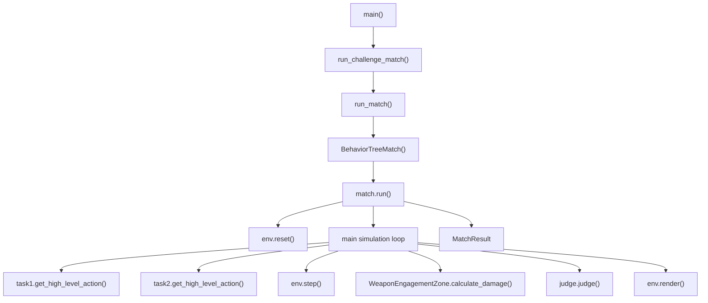

# AI Combat Match 실행 함수 호출 흐름 분석

## 명령어: `run_match.py challenge --agent1 ue4_simple_improved --agent2 aggressive_fighter --rounds 1`

---

## 📋 전체 호출 흐름 그래프



---

## 🔍 단계별 함수 호출 상세 분석

### **Phase 1: 초기화 및 설정**

#### 1. `main()` (scripts/run_match.py:228)
```python
def main():
    parser = argparse.ArgumentParser()
    # 인자 파싱: challenge, agent1, agent2, rounds
    args = parser.parse_args()
    
    if args.mode == 'challenge':
        run_challenge_match(args.agent1, args.agent2, args.rounds)
```

**호출 함수:**
- `argparse.ArgumentParser()` - 인자 파싱
- `parser.parse_args()` - 명령줄 인자 분석
- `run_challenge_match()` - 챌린지 매치 실행

---

#### 2. `run_challenge_match()` (scripts/run_match.py:168)
```python
def run_challenge_match(agent1, agent2, rounds=1):
    for round_num in range(1, rounds + 1):
        result = run_match(agent1, agent2, f"{agent1} vs {agent2} (Round {round_num})")
```

**호출 함수:**
- `time.time()` - 시작 시간 기록
- `run_match()` - 실제 매치 실행 (rounds 횟수만큼 반복)

---

#### 3. `run_match()` (scripts/run_match.py:46)
```python
def run_match(tree1_name, tree2_name, match_name, max_steps=1500, verbose=True):
    tree1 = get_tree_path(tree1_name)  # 파일 경로 찾기
    tree2 = get_tree_path(tree2_name)
    
    match = BehaviorTreeMatch(
        tree1_file=tree1,
        tree2_file=tree2,
        config_name="1v1/NoWeapon/bt_vs_bt",
        max_steps=max_steps,
    )
    
    result = match.run(replay_path=str(replay_path), verbose=verbose)
```

**호출 함수:**
- `get_tree_path()` - 행동트리 파일 경로 결정
- `BehaviorTreeMatch()` - 매치 객체 생성
- `match.run()` - 매치 실행

---

#### 4. `get_tree_path()` (scripts/run_match.py:19)
```python
def get_tree_path(name):
    # 1. submissions 폴더 확인
    submission_path = PROJECT_ROOT / "submissions" / name / "agent.yaml"
    if submission_path.exists():
        return str(submission_path)
    
    # 2. examples 폴더 확인  
    example_path = PROJECT_ROOT / "examples" / f"{name}.yaml"
    if example_path.exists():
        return str(example_path)
    
    # 3. 직접 경로 확인
    direct_path = PROJECT_ROOT / name
    if direct_path.exists():
        return str(direct_path)
```

**파일 경로 우선순위:**
1. `submissions/{name}/agent.yaml`
2. `examples/{name}.yaml` ← ue4_simple_improved.yaml 여기서 발견
3. 직접 경로

---

### **Phase 2: 매치 객체 생성 및 초기화**

#### 5. `BehaviorTreeMatch.__init__()` (src/match/runner.py:28)
```python
def __init__(self, tree1_file, tree2_file, config_name="1v1/NoWeapon/bt_vs_bt", max_steps=1000):
    self.tree1_file = tree1_file
    self.tree2_file = tree2_file  
    self.config_name = config_name
    self.max_steps = max_steps
```

---

#### 6. `BehaviorTreeMatch.run()` (src/match/runner.py:47)
```python
def run(self, replay_path=None, verbose=False):
    start_time = datetime.now()
    
    # 환경 생성
    env = SingleCombatEnv(self.config_name)
    
    # 행동트리 Task 생성
    task1 = BehaviorTreeTask(env.config, tree_file=self.tree1_file)
    task2 = BehaviorTreeTask(env.config, tree_file=self.tree2_file)
    
    # Health Gauge 초기화
    health1 = HealthGauge(initial_health=100.0)
    health2 = HealthGauge(initial_health=100.0)
    
    # Match Judge 초기화
    judge = MatchJudge(max_steps=self.max_steps)
```

**호출 함수:**
- `SingleCombatEnv()` - LAG 환경 생성
- `BehaviorTreeTask()` - 행동트리 태스크 생성 (2개)
- `HealthGauge()` - 체력 관리 객체 (2개)
- `MatchJudge()` - 승패 판정 객체

---

### **Phase 3: 행동트리 로딩 및 초기화**

#### 7. `BehaviorTreeTask.__init__()` (src/behavior_tree/task.py:32)
```python
def __init__(self, config, tree_file=None):
    super().__init__(config)
    
    self.tree_file = tree_file
    self.tree = None
    
    # Blackboard Client 생성
    self.bb_namespace = f"bt_{uuid.uuid4().hex[:8]}"
    self.blackboard = py_trees.blackboard.Client(name=self.bb_namespace)
    
    # 키 등록
    self.blackboard.register_key(key="observation", access=py_trees.common.Access.WRITE)
    self.blackboard.register_key(key="action", access=py_trees.common.Access.WRITE)
    self.blackboard.register_key(key="bfm_situation", access=py_trees.common.Access.WRITE)
```

**호출 함수:**
- `uuid.uuid4()` - 고유 ID 생성
- `py_trees.blackboard.Client()` - 블랙보드 클라이언트
- `HierarchicalSingleCombatTask.__init__()` - 부모 클래스 초기화

---

#### 8. `load_behavior_tree()` (src/behavior_tree/loader.py)
```python
# BehaviorTreeTask 내부에서 호출
self.tree = load_behavior_tree(self.tree_file)
```

**YAML 파일 파싱 과정:**
1. YAML 파일 읽기 (`ue4_simple_improved.yaml`)
2. 트리 구조 파싱 (Selector, Sequence, Condition, Action)
3. 노드 객체 생성 및 연결
4. 블랙보드 키 등록

---

### **Phase 4: 시뮬레이션 메인 루프**

#### 9. `env.reset()` (src/match/runner.py:101)
```python
# Reset
obs = env.reset()
```

**호출되는 함수:**
- LAG 환경 초기화
- 항공기 위치/속도 설정
- JSBSim 시뮬레이터 초기화

---

#### 10. 메인 시뮬레이션 루프 (src/match/runner.py:132)
```python
while not done and step_count < self.max_steps:
    # 1. 행동트리 액션 결정
    action1 = task1.get_high_level_action(env, env.ego_ids[0])
    action2 = task2.get_high_level_action(env, env.enm_ids[0])
    
    # 2. 액션 배열 결합
    action = np.array([action1, action2])
    
    # 3. 환경 스텝 실행
    obs, reward, dones, info = env.step(action)
    
    # 4. WEZ 데미지 계산
    # 5. 승패 판정
    # 6. 리플레이 저장
```

---

#### 11. `get_high_level_action()` (src/behavior_tree/task.py)
```python
def get_high_level_action(self, env, agent_id):
    # 관측 정보 업데이트
    self.update_observation(env, agent_id)
    
    # BFM 상황 분류
    geometry = CombatGeometry(...)
    bfm_situation = self.bfm_classifier.classify(geometry)
    
    # 행동트리 실행
    self.tree.tick_once()
    
    # 액션 반환
    return self.blackboard.action
```

**호출 함수:**
- `update_observation()` - 관측 정보 업데이트
- `CombatGeometry()` - 전투 기하학 계산
- `BFMClassifier.classify()` - BFM 상황 분류
- `tree.tick_once()` - 행동트리 실행
- `blackboard.action` - 액션 획득

---

#### 12. `env.step()` (LAG 환경)
```python
obs, reward, dones, info = env.step(action)
```

**내부 처리:**
- JSBSim 시뮬레이션 스텝 진행
- 항공기 dynamics 계산
- 보상 함수 계산
- 관측 state 업데이트

---

#### 13. `WeaponEngagementZone.calculate_damage()` (src/match/runner.py:172)
```python
# Agent1이 Agent2를 WEZ에 넣었는지 체크
damage_to_2 = WeaponEngagementZone.calculate_damage(combat_geo_1, dt=0.2)
if damage_to_2 > 0:
    health2.take_damage(damage_to_2, step_count)
    health1.deal_damage(damage_to_2)

# Agent2가 Agent1을 WEZ에 넣었는지 체크  
damage_to_1 = WeaponEngagementZone.calculate_damage(combat_geo_2, dt=0.2)
if damage_to_1 > 0:
    health1.take_damage(damage_to_1, step_count)
    health2.deal_damage(damage_to_1)
```

---

#### 14. `judge.judge()` (src/match/runner.py:188)
```python
winner_result, victory_cond = judge.judge(
    health1.current_health,
    health2.current_health, 
    altitude1,
    altitude2,
    step_count
)
```

**승패 조건 확인:**
- 체력 0 체크
- Hard Deck 위반 체크
- 시간 초과 체크

---

#### 15. `env.render()` (src/match/runner.py:210)
```python
# 리플레이 저장
if replay_path:
    env.render(mode="txt", filepath=str(replay_path))
    self._append_combat_info(replay_path, env, action, reward, step_count)
```

---

### **Phase 5: 결과 처리**

#### 16. `MatchResult` 객체 생성 (scripts/run_match.py:105)
```python
class MatchResult:
    def __init__(self):
        self.winner = winner
        self.total_steps = steps
        self.duration_seconds = elapsed_time  
        self.tree1_reward = tree1_reward
        self.tree2_reward = tree2_reward
        self.success = True
```

---

## 📊 함수 호출 빈도 분석

### **초기화 (1회 호출)**
- `main()` - 1회
- `run_challenge_match()` - 1회  
- `run_match()` - 1회
- `BehaviorTreeMatch()` - 1회
- `BehaviorTreeTask()` - 2회 (각 에이전트)
- `load_behavior_tree()` - 2회

### **반복 호출 (매 스텝마다)**
- `get_high_level_action()` - 2회/스텝 (각 에이전트)
- `env.step()` - 1회/스텝
- `WeaponEngagementZone.calculate_damage()` - 2회/스텝
- `judge.judge()` - 1회/스텝
- `env.render()` - 1회/스텝

### **총 호출 횟수 (1500스텝 기준)**
- 초기화 함수: ~10회
- 반복 함수: ~9000회 (1500 × 6)

---

## 🎯 핵심 함수 상세 설명

### **1. get_high_level_action() - 행동 결정 핵심**
```python
# 관측 정보 수집 → BFM 분류 → 행동트리 실행 → 액션 반환
observation → CombatGeometry → BFMClassifier → py_trees.tick → action
```

### **2. WeaponEngagementZone.calculate_damage() - 데미지 계산**
```python
# 전투 기하학 → WEZ 계산 → 데미지 적용
CombatGeometry → WEZ 계산 → HealthGauge.take_damage
```

### **3. judge.judge() - 승패 판정**
```python
# 체력 + 고도 + 스텝 수 → 승패 조건 확인
health + altitude + steps → VictoryCondition
```

---

## 🔧 디버깅 포인트

### **직접 확인할 함수 호출 단계:**
1. **행동트리 로딩**: `load_behavior_tree()` 
2. **관측 정보 업데이트**: `update_observation()`
3. **BFM 상황 분류**: `BFMClassifier.classify()`
4. **행동트리 실행**: `tree.tick_once()`
5. **액션 결정**: `blackboard.action` 확인
6. **데미지 계산**: `WeaponEngagementZone.calculate_damage()`
7. **승패 판정**: `judge.judge()`

### **로그 추가 위치:**
- `get_high_level_action()` 진입/퇴출
- `tree.tick_once()` 전후
- `calculate_damage()` 결과
- `judge.judge()` 조건 확인

---

## 📈 성능 영향 분석

### **가장 많이 호출되는 함수:**
1. `get_high_level_action()` - 3000회 (1500스텝 × 2에이전트)
2. `env.step()` - 1500회
3. `WeaponEngagementZone.calculate_damage()` - 3000회

### **최적화 대상:**
- 행동트리 tick 효율화
- CombatGeometry 계산 캐싱
- 데미지 계산 간소화

---

이 흐름을 기반으로 각 함수 호출 단계에서 디버깅 로그를 추가하거나 성능을 측정할 수 있습니다.
